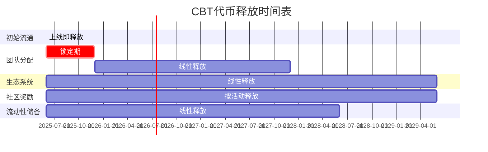

# CultureBridge BNB链代币经济模型详细设计

## 1. 代币基础信息

| 参数 | 值 | 说明 |
|------|-----|------|
| 代币名称 | CultureBridge Token | 完整名称 |
| 代币符号 | CBT | 交易所显示符号 |
| 代币标准 | BEP-20 | BNB链标准 |
| 总供应量 | 1,000,000,000 CBT | 10亿代币总量 |
| 小数位数 | 18 | 标准小数位数 |
| 初始价格 | 0.005 USD | 初始流动性池定价 |

## 2. 代币分配方案

### 2.1 分配比例

| 分配类别 | 数量 | 百分比 | 释放机制 |
|----------|------|--------|----------|
| 初始流通 | 100,000,000 CBT | 10% | 上线即释放 |
| 团队分配 | 150,000,000 CBT | 15% | 24个月线性释放，6个月锁定期 |
| 生态系统 | 350,000,000 CBT | 35% | 48个月线性释放 |
| 社区奖励 | 250,000,000 CBT | 25% | 按活动和贡献释放 |
| 流动性储备 | 150,000,000 CBT | 15% | 36个月线性释放 |

### 2.2 释放时间表



### 2.3 代币锁定机制

- **团队代币锁定合约**：使用时间锁合约，确保团队代币按计划线性释放
- **流动性锁定**：初始流动性将锁定12个月，使用PancakeSwap的锁定功能
- **生态系统资金多签管理**：使用3/5多签钱包管理生态系统资金，确保资金安全

## 3. 代币经济模型核心机制

### 3.1 通缩机制

#### 自动销毁机制
- **销毁比例**：每笔交易的1%自动销毁
- **销毁上限**：最高可调整至5%，由治理投票决定
- **销毁地址**：0x000000000000000000000000000000000000dEaD
- **排除名单**：特定地址可排除在销毁机制外（如流动性池、质押合约）

#### 手动销毁活动
- **季度回购销毁**：平台收入的20%用于回购并销毁代币
- **里程碑销毁**：达到用户增长里程碑时额外销毁代币

### 3.2 质押奖励系统

#### 基础质押池
- **年化收益率**：15-25% APY（根据总质押量动态调整）
- **最短质押期**：7天
- **提前解除惩罚**：收取5%手续费
- **复利选项**：可选择自动复投奖励

#### 流动性挖矿
- **LP代币质押**：CBT-BNB对LP代币质押
- **年化收益率**：30-50% APY（前6个月，之后递减）
- **奖励加速器**：长期质押可获得1.2x-2x奖励乘数
- **双重奖励**：除CBT外，特定活动期间可获得合作项目代币

### 3.3 用户激励机制

#### 学习奖励
- **课程完成奖励**：5-50 CBT（根据课程难度）
- **学习streak奖励**：连续学习可获得额外奖励，最高2x倍数
- **知识测验奖励**：通过测验可获得10-30 CBT
- **成就NFT**：完成特定学习里程碑可铸造成就NFT，持有可增加学习奖励

#### 内容创作激励
- **翻译贡献**：提供高质量翻译可获得10-100 CBT
- **文化内容创作**：创作原创文化内容可获得50-500 CBT
- **内容质量评分**：社区评分影响奖励倍数（0.5x-3x）
- **创作者版税**：内容被使用时可持续获得版税（使用费的5-15%）

#### 社区参与奖励
- **推荐奖励**：成功推荐新用户可获得50 CBT，新用户活跃后再获得50 CBT
- **治理参与**：参与提案投票可获得5-20 CBT
- **社区活动**：参与线上/线下活动可获得10-100 CBT
- **Bug赏金**：报告并验证Bug可获得50-5000 CBT（根据严重程度）

### 3.4 反鲸鱼机制

#### 持有限制
- **最大持有量**：单一地址最多持有总供应量的2%
- **排除名单**：特定地址可排除在限制外（如DEX流动性池、团队多签钱包）
- **渐进式限制**：随着市值增长，限制比例可通过治理调整

#### 交易限制
- **单笔最大交易**：单笔最多交易总供应量的0.5%
- **冷却时间**：大额交易（超过0.1%）后有10分钟冷却期
- **渐进式费用**：大额交易（超过0.2%）额外收取1-3%费用，用于回购销毁

## 4. 代币使用场景

### 4.1 平台功能解锁

| 功能 | 代币需求 | 说明 |
|------|----------|------|
| 高级翻译服务 | 10-50 CBT/月 | 解锁AI高级翻译功能，包括文化背景解释 |
| 专业课程访问 | 100-500 CBT/课程 | 解锁专业语言和文化课程 |
| 私人教师匹配 | 200-1000 CBT/月 | 匹配专业语言教师进行1对1指导 |
| VIP社区访问 | 300 CBT/月 | 访问VIP社区和专属活动 |
| 文化NFT创建 | 50-200 CBT/个 | 创建文化相关NFT的铸造费用 |

### 4.2 治理权益

#### 提案权
- **创建提案**：持有至少100,000 CBT（或质押30天以上）
- **提案押金**：提交提案需质押10,000 CBT（提案通过后返还）
- **加急提案**：质押50,000 CBT可将提案加急处理

#### 投票权
- **基础投票**：1 CBT = 1票
- **质押增益**：质押代币获得1.5x投票权重
- **长期持有增益**：持有时间每增加3个月，投票权重增加0.1x，最高2x
- **投票奖励**：参与投票可获得总投票代币量0.1%的奖励（按比例分配）

### 4.3 生态系统整合

#### 跨平台使用
- **合作伙伴平台**：CBT可在合作伙伴平台使用，享受折扣
- **文化活动门票**：使用CBT购买线上/线下文化活动门票
- **教育机构合作**：与语言教育机构合作，CBT可用于支付课程费用

#### NFT生态系统
- **文化NFT交易**：CBT作为文化NFT市场的主要交易货币
- **NFT质押**：质押文化NFT可获得CBT奖励
- **NFT租赁**：使用CBT租赁教育和文化NFT资产

## 5. 代币价值捕获机制

### 5.1 费用分配

| 费用类型 | 分配方式 | 比例 |
|----------|----------|------|
| 交易销毁 | 永久销毁 | 1% |
| 平台服务费 | 生态系统发展 | 60% |
| 平台服务费 | 回购销毁 | 20% |
| 平台服务费 | 质押奖励池 | 20% |
| NFT交易费 | 创作者 | 70% |
| NFT交易费 | 平台（回购销毁） | 20% |
| NFT交易费 | 质押奖励池 | 10% |

### 5.2 价值增长驱动因素

- **用户增长**：新用户注册和活跃度增长带动代币需求
- **功能解锁**：高级功能需要代币，增加实用需求
- **通缩机制**：自动销毁和回购销毁减少流通供应
- **质押锁定**：质押奖励吸引长期持有，减少流通量
- **生态扩展**：合作伙伴和跨平台使用扩大应用场景

## 6. 智能合约接口设计

### 6.1 代币合约核心接口

```solidity
// SPDX-License-Identifier: MIT
pragma solidity ^0.8.17;

interface ICultureBridgeToken {
    // 基础ERC20功能
    function totalSupply() external view returns (uint256);
    function balanceOf(address account) external view returns (uint256);
    function transfer(address recipient, uint256 amount) external returns (bool);
    function allowance(address owner, address spender) external view returns (uint256);
    function approve(address spender, uint256 amount) external returns (bool);
    function transferFrom(address sender, address recipient, uint256 amount) external returns (bool);
    
    // 销毁功能
    function burn(uint256 amount) external;
    function burnFrom(address account, uint256 amount) external;
    
    // 高级功能
    function setBurnRate(uint256 newBurnRate) external;
    function excludeFromBurn(address account, bool excluded) external;
    function excludeFromMaxHolding(address account, bool excluded) external;
    function setMaxHoldingAmount(uint256 amount) external;
    
    // 事件
    event Transfer(address indexed from, address indexed to, uint256 value);
    event Approval(address indexed owner, address indexed spender, uint256 value);
    event BurnRateUpdated(uint256 oldRate, uint256 newRate);
    event ExcludedFromBurn(address indexed account, bool excluded);
    event ExcludedFromMaxHolding(address indexed account, bool excluded);
    event MaxHoldingAmountUpdated(uint256 oldAmount, uint256 newAmount);
}
```

### 6.2 质押系统接口

```solidity
// SPDX-License-Identifier: MIT
pragma solidity ^0.8.17;

interface ICultureBridgeStaking {
    // 质押功能
    function stake(uint256 amount) external;
    function withdraw(uint256 amount) external;
    function getReward() external;
    function exit() external;
    
    // 查询功能
    function balanceOf(address account) external view returns (uint256);
    function earned(address account) external view returns (uint256);
    function totalSupply() external view returns (uint256);
    function rewardPerToken() external view returns (uint256);
    function lastTimeRewardApplicable() external view returns (uint256);
    
    // 管理功能
    function setRewardsDuration(uint256 _rewardsDuration) external;
    function notifyRewardAmount(uint256 reward) external;
    function recoverERC20(address tokenAddress, uint256 tokenAmount) external;
    
    // 事件
    event Staked(address indexed user, uint256 amount);
    event Withdrawn(address indexed user, uint256 amount);
    event RewardPaid(address indexed user, uint256 reward);
    event RewardAdded(uint256 reward);
    event RewardsDurationUpdated(uint256 newDuration);
}
```

### 6.3 学习奖励接口

```solidity
// SPDX-License-Identifier: MIT
pragma solidity ^0.8.17;

interface ILearningRewards {
    // 奖励功能
    function rewardCourseCompletion(address user, uint256 courseId, uint256 amount) external;
    function rewardQuizCompletion(address user, uint256 quizId, uint256 score, uint256 amount) external;
    function rewardLearningStreak(address user, uint256 days, uint256 amount) external;
    
    // 成就NFT功能
    function mintAchievementNFT(address user, uint256 achievementId) external;
    function getAchievementBoost(address user) external view returns (uint256);
    
    // 管理功能
    function setRewardsDistributor(address distributor) external;
    function setCourseReward(uint256 courseId, uint256 amount) external;
    function setQuizReward(uint256 quizId, uint256 baseAmount) external;
    function setStreakMultiplier(uint256 days, uint256 multiplier) external;
    
    // 事件
    event CourseRewardPaid(address indexed user, uint256 indexed courseId, uint256 amount);
    event QuizRewardPaid(address indexed user, uint256 indexed quizId, uint256 score, uint256 amount);
    event StreakRewardPaid(address indexed user, uint256 days, uint256 amount);
    event AchievementNFTMinted(address indexed user, uint256 indexed achievementId);
}
```

### 6.4 治理接口

```solidity
// SPDX-License-Identifier: MIT
pragma solidity ^0.8.17;

interface ICultureBridgeGovernance {
    // 提案功能
    function propose(string calldata description, bytes[] calldata calldatas, address[] calldata targets) external returns (uint256);
    function queue(uint256 proposalId) external;
    function execute(uint256 proposalId) external;
    function cancel(uint256 proposalId) external;
    
    // 投票功能
    function castVote(uint256 proposalId, bool support) external;
    function castVoteWithReason(uint256 proposalId, bool support, string calldata reason) external;
    function castVoteBySignature(uint256 proposalId, bool support, uint8 v, bytes32 r, bytes32 s) external;
    
    // 查询功能
    function state(uint256 proposalId) external view returns (uint8);
    function getProposalDetails(uint256 proposalId) external view returns (address, string memory, uint256, uint256, uint256, uint256, bool);
    function getReceipt(uint256 proposalId, address voter) external view returns (bool, bool, uint256);
    function getVotingPower(address account) external view returns (uint256);
    
    // 事件
    event ProposalCreated(uint256 indexed proposalId, address indexed proposer, string description);
    event VoteCast(address indexed voter, uint256 indexed proposalId, bool support, uint256 votes);
    event ProposalExecuted(uint256 indexed proposalId);
    event ProposalCanceled(uint256 indexed proposalId);
}
```

## 7. 代币经济模型实施路线图

### 7.1 第一阶段：设计与开发（1-2周）

- **代币合约开发**
  - 实现基础BEP-20功能
  - 添加销毁和反鲸鱼机制
  - 开发单元测试

- **经济模型参数确定**
  - 最终确定代币分配比例
  - 设定初始销毁率和持有限制
  - 制定详细释放计划

- **安全审计准备**
  - 编写合约文档
  - 准备审计清单
  - 设置自动化测试

### 7.2 第二阶段：测试与优化（3-4周）

- **测试网部署**
  - 在BNB测试网部署合约
  - 验证所有功能正常运行
  - 模拟各种交易场景

- **经济模型模拟**
  - 进行代币经济模型压力测试
  - 模拟不同市场条件下的表现
  - 根据测试结果优化参数

- **安全审计**
  - 进行内部安全审查
  - 修复发现的漏洞
  - 准备外部审计（如需要）

### 7.3 第三阶段：部署与上线（5-6周）

- **主网部署**
  - 部署最终版本合约到BNB主网
  - 验证合约并公开源代码
  - 设置多签钱包管理

- **流动性添加**
  - 在PancakeSwap创建流动性池
  - 锁定初始流动性
  - 设置价格监控系统

- **代币分配**
  - 初始代币分配到指定钱包
  - 设置团队代币锁定
  - 准备社区奖励池

### 7.4 第四阶段：运营与增长（7-8周）

- **社区建设**
  - 启动社区奖励计划
  - 组织AMA和社区活动
  - 招募社区大使

- **生态系统扩展**
  - 启动合作伙伴计划
  - 集成更多使用场景
  - 开发跨链桥接（未来计划）

- **数据分析与优化**
  - 监控代币经济指标
  - 分析用户行为数据
  - 根据数据调整激励参数

## 8. 风险管理与应急计划

### 8.1 已识别风险

| 风险类型 | 可能性 | 影响 | 缓解措施 |
|----------|--------|------|----------|
| 合约漏洞 | 中 | 高 | 全面测试和审计，多签管理 |
| 价格波动 | 高 | 中 | 流动性管理，回购计划 |
| 鲸鱼操纵 | 中 | 高 | 反鲸鱼机制，交易限制 |
| 监管变化 | 中 | 高 | 法律合规团队，灵活调整 |
| 用户采用不足 | 中 | 高 | 强化实用性，营销推广 |

### 8.2 应急响应计划

- **安全事件**
  - 暂停合约功能
  - 启动漏洞修复
  - 社区透明沟通
  - 损失补偿计划

- **市场波动**
  - 启动回购计划
  - 调整激励参数
  - 加速生态系统建设
  - 增强代币实用性

- **监管变化**
  - 法律分析与评估
  - 调整代币功能
  - 社区治理投票
  - 合规路线图更新

## 9. 多账号协作开发指南

### 9.1 代币经济模型开发任务分解

| 任务 | 负责账号 | 协作账号 | 时间估计 |
|------|----------|----------|----------|
| 代币合约核心开发 | CB-BACKEND | CB-AI-TEST | 5天 |
| 质押系统开发 | CB-FEATURES | CB-BACKEND | 4天 |
| 学习奖励系统开发 | CB-FEATURES | CB-FRONTEND | 3天 |
| 治理系统开发 | CB-BACKEND | CB-DESIGN | 4天 |
| 经济模型模拟测试 | CB-AI-TEST | CB-DESIGN | 3天 |
| 前端钱包集成 | CB-FRONTEND | CB-MOBILE | 4天 |
| 移动端钱包集成 | CB-MOBILE | CB-FRONTEND | 4天 |
| 安全审计 | CB-AI-TEST | CB-BACKEND | 5天 |
| PancakeSwap上线准备 | CB-DESIGN | CB-BACKEND | 3天 |

### 9.2 开发协作流程

1. **CB-DESIGN**：最终确认经济模型参数
2. **CB-BACKEND**：开发核心合约
3. **CB-AI-TEST**：编写测试用例
4. **CB-FEATURES**：开发激励系统
5. **CB-FRONTEND & CB-MOBILE**：开发用户界面
6. **全体账号**：集成测试
7. **CB-DESIGN & CB-BACKEND**：部署上线

### 9.3 代码规范与文档要求

- **合约命名**：CultureBridge[功能]
- **函数命名**：动词+名词，如setRewardRate
- **注释要求**：所有公共函数必须有NatSpec注释
- **测试覆盖**：核心功能100%覆盖，其他功能>90%
- **文档格式**：Markdown，包含功能说明、参数解释和示例

## 10. 结论与后续步骤

CultureBridge代币经济模型设计旨在创建一个可持续的、激励一致的生态系统，通过学习奖励、创作激励和社区参与来推动平台增长。通过精心设计的通缩机制、质押奖励和反鲸鱼保护，CBT代币将为用户和投资者提供长期价值。

### 后续步骤

1. **确认经济模型参数**：与团队最终确认所有经济参数
2. **启动合约开发**：按照多账号协作计划开始开发
3. **准备营销材料**：基于最终经济模型准备白皮书和营销内容
4. **社区预热**：开始社区建设和预热活动
5. **审计安排**：安排合约安全审计

通过这一全面的代币经济模型，CultureBridge将为全球语言学习和文化交流创建一个繁荣的区块链生态系统，为用户提供实质性价值，同时确保代币经济的长期可持续性。
