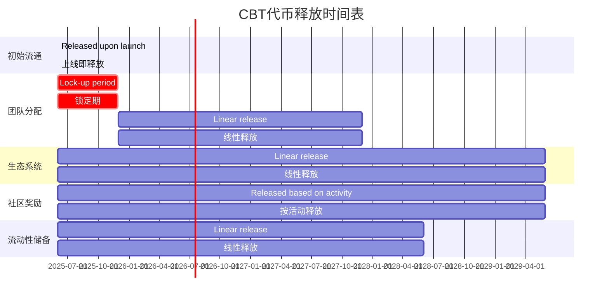

# CultureBridge BNB Chain Token Economic Model Detailed Design
# CultureBridge BNB链代币经济模型详细设计

## 1. Token Basic Information
## 1. 代币基础信息

| Parameter | Value | Description |
|-----------|-------|-------------|
| 参数      | 值    | 说明        |
| Token Name | CultureBridge Token | Full name |
| 代币名称  | CultureBridge Token | 完整名称  |
| Token Symbol | CBT | Exchange display symbol |
| 代币符号  | CBT | 交易所显示符号 |
| Token Standard | BEP-20 | BNB Chain standard |
| 代币标准  | BEP-20 | BNB链标准   |
| Total Supply | 1,000,000,000 CBT | Total supply of 1 billion tokens |
| 总供应量  | 1,000,000,000 CBT | 10亿代币总量 |
| Decimals | 18 | Standard decimal places |
| 小数位数  | 18 | 标准小数位数 |
| Initial Price | 0.005 USD | Initial liquidity pool pricing |
| 初始价格  | 0.005 USD | 初始流动性池定价 |

## 2. Token Distribution Plan
## 2. 代币分配方案

### 2.1 Distribution Ratio
### 2.1 分配比例

| Distribution Category | Quantity | Percentage | Release Mechanism |
|-----------------------|----------|------------|-------------------|
| 分配类别              | 数量     | 百分比     | 释放机制          |
| Initial Circulation | 100,000,000 CBT | 10% | Released upon launch |
| 初始流通              | 100,000,000 CBT | 10% | 上线即释放        |
| Team Allocation | 150,000,000 CBT | 15% | 24-month linear release, 6-month lock-up period |
| 团队分配              | 150,000,000 CBT | 15% | 24个月线性释放，6个月锁定期 |
| Ecosystem | 350,000,000 CBT | 35% | 48-month linear release |
| 生态系统              | 350,000,000 CBT | 35% | 48个月线性释放    |
| Community Rewards | 250,000,000 CBT | 25% | Released based on activity and contribution |
| 社区奖励              | 250,000,000 CBT | 25% | 按活动和贡献释放  |
| Liquidity Reserve | 150,000,000 CBT | 15% | 36-month linear release |
| 流动性储备            | 150,000,000 CBT | 15% | 36个月线性释放    |

### 2.2 Release Schedule
### 2.2 释放时间表



### 2.3 Token Lock-up Mechanism
### 2.3 代币锁定机制

- **Team Token Lock-up Contract**：Use a time-lock contract to ensure linear release of team tokens as planned.
- **团队代币锁定合约**：使用时间锁合约，确保团队代币按计划线性释放。
- **Liquidity Lock-up**：Initial liquidity will be locked for 12 months using PancakeSwap's lock function.
- **流动性锁定**：初始流动性将锁定12个月，使用PancakeSwap的锁定功能。
- **Ecosystem Fund Multi-signature Management**：Use a 3/5 multi-signature wallet to manage ecosystem funds, ensuring fund security.
- **生态系统资金多签管理**：使用3/5多签钱包管理生态系统资金，确保资金安全。

## 3. Token Economic Model Core Mechanisms
## 3. 代币经济模型核心机制

### 3.1 Deflationary Mechanism
### 3.1 通缩机制

#### Automatic Burn Mechanism
#### 自动销毁机制
- **Burn Ratio**：1% of each transaction is automatically burned.
- **销毁比例**：每笔交易的1%自动销毁。
- **Burn Cap**：Adjustable up to 5%, decided by governance vote.
- **销毁上限**：最高可调整至5%，由治理投票决定。
- **Burn Address**：0x000000000000000000000000000000000000dEaD
- **销毁地址**：0x000000000000000000000000000000000000dEaD
- **Exclusion List**：Specific addresses can be excluded from the burn mechanism (e.g., liquidity pools, staking contracts).
- **排除名单**：特定地址可排除在销毁机制外（如流动性池、质押合约）。

#### Manual Burn Activities
#### 手动销毁活动
- **Quarterly Buyback and Burn**：20% of platform revenue is used to buy back and burn tokens.
- **季度回购销毁**：平台收入的20%用于回购并销毁代币。
- **Milestone Burn**：Additional tokens are burned when user growth milestones are reached.
- **里程碑销毁**：达到用户增长里程碑时额外销毁代币。

### 3.2 Staking Reward System
### 3.2 质押奖励系统

#### Basic Staking Pool
#### 基础质押池
- **Annual Percentage Yield (APY)**：15-25% APY (dynamically adjusted based on total staked amount).
- **年化收益率**：15-25% APY（根据总质押量动态调整）。
- **Minimum Staking Period**：7 days.
- **最短质押期**：7天。
- **Early Unstaking Penalty**：5% fee charged.
- **提前解除惩罚**：收取5%手续费。
- **Compounding Option**：Option to automatically reinvest rewards.
- **复利选项**：可选择自动复投奖励。

#### Liquidity Mining
#### 流动性挖矿
- **LP Token Staking**：CBT-BNB pair LP token staking.
- **LP代币质押**：CBT-BNB对LP代币质押。
- **Annual Percentage Yield (APY)**：30-50% APY (for the first 6 months, then decreasing).
- **年化收益率**：30-50% APY（前6个月，之后递减）。
- **Reward Accelerator**：Long-term staking can earn 1.2x-2x reward multiplier.
- **奖励加速器**：长期质押可获得1.2x-2x奖励乘数。
- **Dual Rewards**：In addition to CBT, partner project tokens can be earned during specific events.
- **双重奖励**：除CBT外，特定活动期间可获得合作项目代币。

### 3.3 User Incentive Mechanism
### 3.3 用户激励机制

#### Learning Rewards
#### 学习奖励
- **Course Completion Rewards**：5-50 CBT (depending on course difficulty).
- **课程完成奖励**：5-50 CBT（根据课程难度）。
- **Learning Streak Rewards**：Continuous learning can earn additional rewards, up to 2x multiplier.
- **学习streak奖励**：连续学习可获得额外奖励，最高2x倍数。
- **Quiz Rewards**：Passing quizzes can earn 10-30 CBT.
- **知识测验奖励**：通过测验可获得10-30 CBT。
- **Achievement NFTs**：Completing specific learning milestones can mint achievement NFTs, holding which can increase learning rewards.
- **成就NFT**：完成特定学习里程碑可铸造成就NFT，持有可增加学习奖励。

#### Content Creation Incentives
#### 内容创作激励
- **Translation Contribution**：Providing high-quality translations can earn 10-100 CBT.
- **翻译贡献**：提供高质量翻译可获得10-100 CBT。
- **Cultural Content Creation**：Creating original cultural content can earn 50-500 CBT.
- **文化内容创作**：创作原创文化内容可获得50-500 CBT。
- **Content Quality Score**：Community rating affects reward multiplier (0.5x-3x).
- **内容质量评分**：社区评分影响奖励倍数（0.5x-3x）。
- **Creator Royalties**：Continuously earn royalties when content is used (5-15% of usage fees).
- **创作者版税**：内容被使用时可持续获得版税（使用费的5-15%）。

#### Community Participation Rewards
#### 社区参与奖励
- **Referral Rewards**：Successfully referring new users can earn 50 CBT, and another 50 CBT when the new user becomes active.
- **推荐奖励**：成功推荐新用户可获得50 CBT，新用户活跃后再获得50 CBT。
- **Governance Participation**：Participating in proposal voting can earn 5-20 CBT.
- **治理参与**：参与提案投票可获得5-20 CBT。
- **Community Activities**：Participating in online/offline activities can earn 10-100 CBT.
- **社区活动**：参与线上/线下活动可获得10-100 CBT。
- **Bug Bounty**：Reporting and verifying bugs can earn 50-5000 CBT (depending on severity).
- **Bug赏金**：报告并验证Bug可获得50-5000 CBT（根据严重程度）。

### 3.4 Anti-Whale Mechanism
### 3.4 反鲸鱼机制

#### Holding Limits
#### 持有限制
- **Maximum Holding Amount**：A single address can hold a maximum of 2% of the total supply.
- **最大持有量**：单一地址最多持有总供应量的2%。
- **Exclusion List**：Specific addresses can be excluded from the limit (e.g., DEX liquidity pools, team multi-signature wallets).
- **排除名单**：特定地址可排除在限制外（如DEX流动性池、团队多签钱包）。
- **Progressive Limits**：As market cap grows, the limit ratio can be adjusted through governance.
- **渐进式限制**：随着市值增长，限制比例可通过治理调整。

#### Transaction Limits
#### 交易限制
- **Maximum Single Transaction**：A single transaction can be a maximum of 0.5% of the total supply.
- **单笔最大交易**：单笔最多交易总供应量的0.5%。
- **Cool-down Period**：Large transactions (over 0.1%) have a 10-minute cool-down period.
- **冷却时间**：大额交易（超过0.1%）后有10分钟冷却期。
- **Progressive Fees**：Large transactions (over 0.2%) incur an additional 1-3% fee, used for buyback and burn.
- **渐进式费用**：大额交易（超过0.2%）额外收取1-3%费用，用于回购销毁。

## 4. Token Use Cases
## 4. 代币使用场景

### 4.1 Platform Feature Unlock
### 4.1 平台功能解锁

| Feature | Token Requirement | Description |
|---------|-------------------|-------------|
| 功能    | 代币需求          | 说明        |
| Advanced Translation Service | 10-50 CBT/month | Unlocks AI advanced translation features, including cultural background explanations |
| 高级翻译服务 | 10-50 CBT/月      | 解锁AI高级翻译功能，包括文化背景解释 |
| Professional Course Access | 100-500 CBT/course | Unlocks professional language and cultural courses |
| 专业课程访问 | 100-500 CBT/课程  | 解锁专业语言和文化课程 |
| Private Tutor Matching | 200-1000 CBT/month | Matches professional language tutors for 1-on-1 guidance |
| 私人教师匹配 | 200-1000 CBT/月   | 匹配专业语言教师进行1对1指导 |
| VIP Community Access | 300 CBT/month | Access to VIP community and exclusive events |
| VIP社区访问 | 300 CBT/月        | 访问VIP社区和专属活动 |
| Cultural NFT Creation | 50-200 CBT/NFT | Minting fees for creating cultural NFTs |
| 文化NFT创建 | 50-200 CBT/个     | 创建文化相关NFT的铸造费用 |

### 4.2 Governance Rights
### 4.2 治理权益

#### Proposal Rights
#### 提案权
- **Create Proposal**：Hold at least 100,000 CBT (or stake for more than 30 days).
- **创建提案**：持有至少100,000 CBT（或质押30天以上）。
- **Proposal Deposit**：Submitting a proposal requires staking 10,000 CBT (returned after proposal passes).
- **提案押金**：提交提案需质押10,000 CBT（提案通过后返还）。
- **Expedited Proposal**：Staking 50,000 CBT can expedite proposal processing.
- **加急提案**：质押50,000 CBT可将提案加急处理。

#### Voting Rights
#### 投票权
- **Basic Vote**：1 CBT = 1 vote.
- **基础投票**：1 CBT = 1票。
- **Staking Boost**：Staked tokens gain 1.5x voting weight.
- **质押增益**：质押代币获得1.5x投票权重。
- **Long-term Holding Boost**：For every 3 months of holding, voting weight increases by 0.1x, up to 2x.
- **长期持有增益**：持有时间每增加3个月，投票权重增加0.1x，最高2x。
- **Voting Rewards**：Participating in voting can earn 0.1% of the total voted token amount (distributed proportionally).
- **投票奖励**：参与投票可获得总投票代币量0.1%的奖励（按比例分配）。

### 4.3 Ecosystem Integration
### 4.3 生态系统整合

#### Cross-platform Usage
#### 跨平台使用
- **Partner Platforms**：CBT can be used on partner platforms to enjoy discounts.
- **合作伙伴平台**：CBT可在合作伙伴平台使用，享受折扣。
- **Cultural Event Tickets**：Use CBT to purchase tickets for online/offline cultural events.
- **文化活动门票**：使用CBT购买线上/线下文化活动门票。
- **Educational Institution Collaboration**：Collaborate with language education institutions, CBT can be used to pay for course fees.
- **教育机构合作**：与语言教育机构合作，CBT可用于支付课程费用。

#### NFT Ecosystem
#### NFT生态系统
- **Cultural NFT Trading**：CBT as the primary trading currency in the cultural NFT marketplace.
- **文化NFT交易**：CBT作为文化NFT市场的主要交易货币。
- **NFT Staking**：Staking cultural NFTs can earn CBT rewards.
- **NFT质押**：质押文化NFT可获得CBT奖励。
- **NFT Rental**：Use CBT to rent educational and cultural NFT assets.
- **NFT租赁**：使用CBT租赁教育和文化NFT资产。

## 5. Token Value Capture Mechanism
## 5. 代币价值捕获机制

### 5.1 Fee Distribution
### 5.1 费用分配

| Fee Type | Distribution Method | Percentage |
|----------|---------------------|------------|
| 费用类型 | 分配方式            | 比例       |
| Transaction Burn | Permanent burn | 1% |
| 交易销毁 | 永久销毁            | 1%         |
| Platform Service Fee | Ecosystem development | 60% |
| 平台服务费 | 生态系统发展        | 60%        |
| Platform Service Fee | Buyback and burn | 20% |
| 平台服务费 | 回购销毁            | 20%        |
| Platform Service Fee | Staking reward pool | 20% |
| 平台服务费 | 质押奖励池          | 20%        |
| NFT Transaction Fee | Creator | 70% |
| NFT交易费 | 创作者              | 70%        |
| NFT Transaction Fee | Platform (buyback and burn) | 20% |
| NFT交易费 | 平台（回购销毁）    | 20%        |
| NFT Transaction Fee | Staking reward pool | 10% |
| NFT交易费 | 质押奖励池          | 10%        |

### 5.2 Value Growth Drivers
### 5.2 价值增长驱动因素

- **User Growth**：New user registration and activity growth drive token demand.
- **用户增长**：新用户注册和活跃度增长带动代币需求。
- **Feature Unlock**：Advanced features require tokens, increasing utility demand.
- **功能解锁**：高级功能需要代币，增加实用需求。
- **Deflationary Mechanism**：Automatic burn and buyback burn reduce circulating supply.
- **通缩机制**：自动销毁和回购销毁减少流通供应。
- **Staking Lock-up**：Staking rewards attract long-term holders, reducing circulating supply.
- **质押锁定**：质押奖励吸引长期持有，减少流通量。
- **Ecosystem Expansion**：Partnerships and cross-platform usage expand application scenarios.
- **生态扩展**：合作伙伴和跨平台使用扩大应用场景。

## 6. Smart Contract Interface Design
## 6. 智能合约接口设计

### 6.1 Token Contract Core Interface
### 6.1 代币合约核心接口

```solidity
// SPDX-License-Identifier: MIT
pragma solidity ^0.8.17;

interface ICultureBridgeToken {
    // Basic ERC20 functions
    // 基础ERC20功能
    function totalSupply() external view returns (uint256);
    function balanceOf(address account) external view returns (uint256);
    function transfer(address recipient, uint256 amount) external returns (bool);
    function allowance(address owner, address spender) external view returns (uint256);
    function approve(address spender, uint256 amount) external returns (bool);
    function transferFrom(address sender, address recipient, uint256 amount) external returns (bool);
    
    // Burn functions
    // 销毁功能
    function burn(uint256 amount) external;
    function burnFrom(address account, uint256 amount) external;
    
    // Advanced functions
    // 高级功能
    function setBurnRate(uint256 newBurnRate) external;
    function excludeFromBurn(address account, bool excluded) external;
    function excludeFromMaxHolding(address account, bool excluded) external;
    function setMaxHoldingAmount(uint256 amount) external;
    
    // Events
    // 事件
    event Transfer(address indexed from, address indexed to, uint256 value);
    event Approval(address indexed owner, address indexed spender, uint256 value);
    event BurnRateUpdated(uint256 oldRate, uint256 newRate);
    event ExcludedFromBurn(address indexed account, bool excluded);
    event ExcludedFromMaxHolding(address indexed account, bool excluded);
    event MaxHoldingAmountUpdated(uint256 oldAmount, uint256 newAmount);
}
```

### 6.2 Staking System Interface
### 6.2 质押系统接口

```solidity
// SPDX-License-Identifier: MIT
pragma solidity ^0.8.17;

interface ICultureBridgeStaking {
    // Staking functions
    // 质押功能
    function stake(uint256 amount) external;
    function withdraw(uint256 amount) external;
    function getReward() external;
    function exit() external;
    
    // Query functions
    // 查询功能
    function balanceOf(address account) external view returns (uint256);
    function earned(address account) external view returns (uint256);
    function totalSupply() external view returns (uint256);
    function rewardPerToken() external view returns (uint256);
    function lastTimeRewardApplicable() external view returns (uint256);
    
    // Management functions
    // 管理功能
    function setRewardsDuration(uint256 _rewardsDuration) external;
    function notifyRewardAmount(uint256 reward) external;
    function recoverERC20(address tokenAddress, uint256 tokenAmount) external;
    
    // Events
    // 事件
    event Staked(address indexed user, uint256 amount);
    event Withdrawn(address indexed user, uint256 amount);
    event RewardPaid(address indexed user, uint256 reward);
    event RewardAdded(uint256 reward);
    event RewardsDurationUpdated(uint256 newDuration);
}
```

### 6.3 Learning Reward Interface
### 6.3 学习奖励接口

```solidity
// SPDX-License-Identifier: MIT
pragma solidity ^0.8.17;

interface ILearningRewards {
    // Reward functions
    // 奖励功能
    function rewardCourseCompletion(address user, uint256 courseId, uint256 amount) external;
    function rewardQuizCompletion(address user, uint256 quizId, uint256 score, uint256 amount) external;
    function rewardLearningStreak(address user, uint256 days, uint256 amount) external;
    
    // Achievement NFT functions
    // 成就NFT功能
    function mintAchievementNFT(address user, uint256 achievementId) external;
    function getAchievementBoost(address user) external view returns (uint256);
    
    // Management functions
    // 管理功能
    function setRewardsDistributor(address distributor) external;
    function setCourseReward(uint256 courseId, uint256 amount) external;
    function setQuizReward(uint256 quizId, uint256 baseAmount) external;
    function setStreakMultiplier(uint256 days, uint256 multiplier) external;
    
    // Events
    // 事件
    event CourseRewardPaid(address indexed user, uint256 indexed courseId, uint256 amount);
    event QuizRewardPaid(address indexed user, uint256 indexed quizId, uint256 score, uint256 amount);
    event StreakRewardPaid(address indexed user, uint256 days, uint256 amount);
    event AchievementNFTMinted(address indexed user, uint256 indexed achievementId);
}
```

### 6.4 Governance Interface
### 6.4 治理接口

```solidity
// SPDX-License-Identifier: MIT
pragma solidity ^0.8.17;

interface ICultureBridgeGovernance {
    // Proposal functions
    // 提案功能
    function propose(string calldata description, bytes[] calldatas, address[] calldata targets) external returns (uint256);
    function queue(uint256 proposalId) external;
    function execute(uint256 proposalId) external;
    function cancel(uint256 proposalId) external;
    
    // Voting functions
    // 投票功能
    function castVote(uint256 proposalId, bool support) external;
    function castVoteWithReason(uint256 proposalId, bool support, string calldata reason) external;
    function castVoteBySignature(uint256 proposalId, bool support, uint8 v, bytes32 r, bytes32 s) external;
    
    // Query functions
    // 查询功能
    function state(uint256 proposalId) external view returns (uint8);
    function getProposalDetails(uint256 proposalId) external view returns (address, string memory, uint256, uint256, uint256, uint256, bool);
    function getReceipt(uint256 proposalId, address voter) external view returns (bool, bool, uint256);
    function getVotingPower(address account) external view returns (uint256);
    
    // Events
    // 事件
    event ProposalCreated(uint256 indexed proposalId, address indexed proposer, string description);
    event VoteCast(address indexed voter, uint256 indexed proposalId, bool support, uint256 votes);
    event ProposalExecuted(uint256 indexed proposalId);
    event ProposalCanceled(uint256 indexed proposalId);
}
```

## 7. Token Economic Model Implementation Roadmap
## 7. 代币经济模型实施路线图

### 7.1 Phase 1: Design and Development (1-2 weeks)
### 7.1 第一阶段：设计与开发（1-2周）

- **Token Contract Development**
- **代币合约开发**
  - Implement basic BEP-20 functions
  - 实现基础BEP-20功能
  - Add burn and anti-whale mechanisms
  - 添加销毁和反鲸鱼机制
  - Develop unit tests
  - 开发单元测试

- **Economic Model Parameter Determination**
- **经济模型参数确定**
  - Finalize token distribution ratios
  - 最终确定代币分配比例
  - Set initial burn rate and holding limits
  - 设定初始销毁率和持有限制
  - Develop detailed release plan
  - 制定详细释放计划

- **Security Audit Preparation**
- **安全审计准备**
  - Write contract documentation
  - 编写合约文档
  - Prepare audit checklist
  - 准备审计清单
  - Set up automated testing
  - 设置自动化测试

### 7.2 Phase 2: Testing and Optimization (3-4 weeks)
### 7.2 第二阶段：测试与优化（3-4周）

- **Testnet Deployment**
- **测试网部署**
  - Deploy contracts to BNB Testnet
  - 在BNB测试网部署合约
  - Verify all functions are working correctly
  - 验证所有功能正常运行
  - Simulate various transaction scenarios
  - 模拟各种交易场景

- **Economic Model Simulation**
- **经济模型模拟**
  - Conduct stress tests for the token economic model
  - 进行代币经济模型压力测试
  - Simulate performance under different market conditions
  - 模拟不同市场条件下的表现
  - Optimize parameters based on test results
  - 根据测试结果优化参数

- **Security Audit**
- **安全审计**
  - Conduct internal security review
  - 进行内部安全审查
  - Fix identified vulnerabilities
  - 修复发现的漏洞
  - Prepare for external audit (if required)
  - 准备外部审计（如需要）

### 7.3 Phase 3: Deployment and Launch (5-6 weeks)
### 7.3 第三阶段：部署与上线（5-6周）

- **Mainnet Deployment**
- **主网部署**
  - Deploy final version of contracts to BNB Mainnet
  - 部署最终版本合约到BNB主网
  - Verify contracts and publish source code
  - 验证合约并公开源代码
  - Set up multi-signature wallet management
  - 设置多签钱包管理

- **Liquidity Addition**
- **流动性添加**
  - Create liquidity pool on PancakeSwap
  - 在PancakeSwap创建流动性池
  - Lock initial liquidity
  - 锁定初始流动性
  - Set up price monitoring system
  - 设置价格监控系统

- **Token Distribution**
- **代币分配**
  - Initial token distribution to designated wallets
  - 初始代币分配到指定钱包
  - Set up team token lock-up
  - 设置团队代币锁定
  - Prepare community reward pool
  - 准备社区奖励池

### 7.4 Phase 4: Operations and Growth (7-8 weeks)
### 7.4 第四阶段：运营与增长（7-8周）

- **Community Building**
- **社区建设**
  - Launch community reward program
  - 启动社区奖励计划
  - Organize AMA and community events
  - 组织AMA和社区活动
  - Recruit community ambassadors
  - 招募社区大使

- **Ecosystem Expansion**
- **生态系统扩展**
  - Launch partner program
  - 启动合作伙伴计划
  - Integrate more use cases
  - 集成更多使用场景
  - Develop cross-chain bridge (future plan)
  - 开发跨链桥接（未来计划）

- **Data Analysis and Optimization**
- **数据分析与优化**
  - Monitor token economic indicators
  - 监控代币经济指标
  - Analyze user behavior data
  - 分析用户行为数据
  - Adjust incentive parameters based on data
  - 根据数据调整激励参数

## 8. Risk Management and Contingency Plan
## 8. 风险管理与应急计划

### 8.1 Identified Risks
### 8.1 已识别风险

| Risk Type | Probability | Impact | Mitigation Measures |
|-----------|-------------|--------|---------------------|
| 风险类型  | 可能性      | 影响   | 缓解措施            |
| Contract Vulnerability | Medium | High | Comprehensive testing and auditing, multi-signature management |
| 合约漏洞  | 中          | 高     | 全面测试和审计，多签管理 |
| Price Volatility | High | Medium | Liquidity management, buyback plan |
| 价格波动  | 高          | 中     | 流动性管理，回购计划 |
| Whale Manipulation | Medium | High | Anti-whale mechanism, transaction limits |
| 鲸鱼操纵  | 中          | 高     | 反鲸鱼机制，交易限制 |
| Regulatory Changes | Medium | High | Legal compliance team, flexible adjustments |
| 监管变化  | 中          | 高     | 法律合规团队，灵活调整 |
| Insufficient User Adoption | Medium | High | Enhance utility, marketing and promotion |
| 用户采用不足 | 中          | 高     | 强化实用性，营销推广 |

### 8.2 Contingency Response Plan
### 8.2 应急响应计划

- **Security Incidents**
- **安全事件**
  - Pause contract functions
  - 暂停合约功能
  - Initiate vulnerability fixes
  - 启动漏洞修复
  - Transparent communication with community
  - 社区透明沟通
  - Loss compensation plan
  - 损失补偿计划

- **Market Volatility**
- **市场波动**
  - Initiate buyback plan
  - 启动回购计划
  - Adjust incentive parameters
  - 调整激励参数
  - Accelerate ecosystem development
  - 加速生态系统建设
  - Enhance token utility
  - 增强代币实用性

- **Regulatory Changes**
- **监管变化**
  - Legal analysis and assessment
  - 法律分析与评估
  - Adjust token functions
  - 调整代币功能
  - Community governance voting
  - 社区治理投票
  - Update compliance roadmap
  - 合规路线图更新

## 9. Multi-Account Collaboration Development Guide
## 9. 多账号协作开发指南

### 9.1 Token Economic Model Development Task Breakdown
### 9.1 代币经济模型开发任务分解

| Task | Responsible Account | Collaborating Account | Time Estimate |
|------|---------------------|-----------------------|---------------|
| 任务 | 负责账号            | 协作账号              | 时间估计      |
| Token Contract Core Development | CB-BACKEND | CB-AI-TEST | 5 days |
| 代币合约核心开发 | CB-BACKEND          | CB-AI-TEST            | 5天           |
| Staking System Development | CB-FEATURES | CB-BACKEND | 4 days |
| 质押系统开发 | CB-FEATURES         | CB-BACKEND            | 4天           |
| Learning Reward System Development | CB-FEATURES | CB-FRONTEND | 3 days |
| 学习奖励系统开发 | CB-FEATURES         | CB-FRONTEND           | 3天           |
| Governance System Development | CB-BACKEND | CB-DESIGN | 4 days |
| 治理系统开发 | CB-BACKEND          | CB-DESIGN             | 4天           |
| Economic Model Simulation Testing | CB-AI-TEST | CB-DESIGN | 3 days |
| 经济模型模拟测试 | CB-AI-TEST          | CB-DESIGN             | 3天           |
| Frontend Wallet Integration | CB-FRONTEND | CB-MOBILE | 4 days |
| 前端钱包集成 | CB-FRONTEND         | CB-MOBILE             | 4天           |
| Mobile Wallet Integration | CB-MOBILE | CB-FRONTEND | 4 days |
| 移动端钱包集成 | CB-MOBILE           | CB-FRONTEND           | 4天           |
| Security Audit | CB-AI-TEST | CB-BACKEND | 5 days |
| 安全审计 | CB-AI-TEST          | CB-BACKEND            | 5天           |
| PancakeSwap Launch Preparation | CB-DESIGN | CB-BACKEND | 3 days |
| PancakeSwap上线准备 | CB-DESIGN           | CB-BACKEND            | 3天           |

### 9.2 Development Collaboration Process
### 9.2 开发协作流程

1. **CB-DESIGN**：Final confirmation of economic model parameters.
1. **CB-DESIGN**：最终确认经济模型参数。
2. **CB-BACKEND**：Develop core contracts.
2. **CB-BACKEND**：开发核心合约。
3. **CB-AI-TEST**：Write test cases.
3. **CB-AI-TEST**：编写测试用例。
4. **CB-FEATURES**：Develop incentive systems.
4. **CB-FEATURES**：开发激励系统。
5. **CB-FRONTEND & CB-MOBILE**：Develop user interfaces.
5. **CB-FRONTEND & CB-MOBILE**：开发用户界面。
6. **All Accounts**：Integration testing.
6. **全体账号**：集成测试。
7. **CB-DESIGN & CB-BACKEND**：Deployment and launch.
7. **CB-DESIGN & CB-BACKEND**：部署上线。

### 9.3 Code Specification and Documentation Requirements
### 9.3 代码规范与文档要求

- **Contract Naming**：CultureBridge[Function]
- **合约命名**：CultureBridge[功能]
- **Function Naming**：Verb+Noun, e.g., setRewardRate
- **函数命名**：动词+名词，如setRewardRate
- **Comment Requirements**：All public functions must have NatSpec comments.
- **注释要求**：所有公共函数必须有NatSpec注释。
- **Test Coverage**：100% coverage for core functions, >90% for other functions.
- **测试覆盖**：核心功能100%覆盖，其他功能>90%。
- **Documentation Format**：Markdown, including function description, parameter explanation, and examples.
- **文档格式**：Markdown，包含功能说明、参数解释和示例。

## 10. Conclusion and Next Steps
## 10. 结论与后续步骤

The CultureBridge token economic model is designed to create a sustainable and incentive-aligned ecosystem, driving platform growth through learning rewards, creation incentives, and community participation. With carefully designed deflationary mechanisms, staking rewards, and anti-whale protection, CBT tokens will provide long-term value to users and investors.
CultureBridge代币经济模型设计旨在创建一个可持续的、激励一致的生态系统，通过学习奖励、创作激励和社区参与来推动平台增长。通过精心设计的通缩机制、质押奖励和反鲸鱼保护，CBT代币将为用户和投资者提供长期价值。

### Next Steps
### 后续步骤

1. **Confirm Economic Model Parameters**：Final confirmation of all economic parameters with the team.
1. **确认经济模型参数**：与团队最终确认所有经济参数。
2. **Initiate Contract Development**：Start development according to the multi-account collaboration plan.
2. **启动合约开发**：按照多账号协作计划开始开发。
3. **Prepare Marketing Materials**：Prepare whitepaper and marketing content based on the final economic model.
3. **准备营销材料**：基于最终经济模型准备白皮书和营销内容。
4. **Community Warm-up**：Start community building and warm-up activities.
4. **社区预热**：开始社区建设和预热活动。
5. **Arrange Audit**：Arrange smart contract security audit.
5. **审计安排**：安排合约安全审计。

Through this comprehensive token economic model, CultureBridge will create a thriving blockchain ecosystem for global language learning and cultural exchange, providing substantial value to users while ensuring the long-term sustainability of the token economy.
通过这一全面的代币经济模型，CultureBridge将为全球语言学习和文化交流创建一个繁荣的区块链生态系统，为用户提供实质性价值，同时确保代币经济的长期可持续性。


