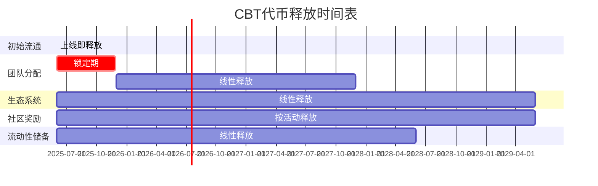

# CultureBridge BNB链代币经济模型最终版

## 1. 代币基础信息

| 参数 | 值 | 说明 |
|------|-----|------|
| 代币名称 | CultureBridge Token | 完整名称 |
| 代币符号 | CBT | 交易所显示符号 |
| 代币标准 | BEP-20 | BNB链标准 |
| 总供应量 | 1,000,000,000 CBT | 10亿代币总量 |
| 小数位数 | 18 | 标准小数位数 |
| 初始价格 | 0.005 USD | 初始流动性池定价 |
| 初始市值 | 500万 USD | 基于初始流通量计算 |
| 合约部署网络 | BNB Chain | 主网部署 |

## 2. 代币分配方案

### 2.1 分配比例

| 分配类别 | 数量 | 百分比 | 释放机制 | 用途说明 |
|----------|------|--------|----------|---------|
| 初始流通 | 100,000,000 CBT | 10% | 上线即释放 | 初始流动性提供、早期用户激励 |
| 团队分配 | 150,000,000 CBT | 15% | 24个月线性释放，6个月锁定期 | 团队激励、长期发展保障 |
| 生态系统 | 350,000,000 CBT | 35% | 48个月线性释放 | 生态建设、合作伙伴激励、市场拓展 |
| 社区奖励 | 250,000,000 CBT | 25% | 按活动和贡献释放 | 学习奖励、创作激励、社区参与奖励 |
| 流动性储备 | 150,000,000 CBT | 15% | 36个月线性释放 | 流动性管理、市场稳定、回购计划 |

### 2.2 释放时间表



### 2.3 详细释放计划

| 时间点 | 累计释放量 | 流通比例 | 主要释放来源 |
|--------|------------|----------|------------|
| 上线日 | 100,000,000 | 10% | 初始流通 |
| 上线后3个月 | 143,750,000 | 14.38% | 生态系统、流动性储备 |
| 上线后6个月 | 187,500,000 | 18.75% | 生态系统、流动性储备、社区奖励 |
| 上线后9个月 | 237,500,000 | 23.75% | 生态系统、流动性储备、社区奖励、团队分配开始 |
| 上线后12个月 | 293,750,000 | 29.38% | 所有类别同步释放 |
| 上线后18个月 | 406,250,000 | 40.63% | 所有类别同步释放 |
| 上线后24个月 | 518,750,000 | 51.88% | 所有类别同步释放，团队分配完成 |
| 上线后36个月 | 743,750,000 | 74.38% | 生态系统、社区奖励，流动性储备完成 |
| 上线后48个月 | 1,000,000,000 | 100% | 全部释放完成 |

### 2.4 代币锁定机制

- **团队代币锁定合约**：使用时间锁合约，确保团队代币按计划线性释放
  - 锁定地址：多签时间锁合约（部署后公布）
  - 解锁条件：6个月后开始，每30天解锁6,250,000 CBT（总量的0.625%）
  - 提前解锁保护：无法提前解锁，智能合约强制执行

- **流动性锁定**：初始流动性将锁定12个月，使用PancakeSwap的锁定功能
  - 初始流动性规模：等值200万美元（CBT + BNB）
  - 锁定证明：PancakeSwap锁定交易哈希（部署后公布）
  - 续期机制：首次锁定期满后，通过治理投票决定续期

- **生态系统资金多签管理**：使用3/5多签钱包管理生态系统资金，确保资金安全
  - 多签成员：2名核心团队 + 2名社区代表 + 1名独立顾问
  - 资金使用透明度：所有支出公开记录，每月发布资金使用报告
  - 大额支出（>500万CBT）需通过社区治理投票批准

## 3. 代币经济模型核心机制

### 3.1 通缩机制

#### 自动销毁机制
- **销毁比例**：每笔交易的1%自动销毁
- **销毁上限**：最高可调整至5%，由治理投票决定
- **销毁地址**：0x000000000000000000000000000000000000dEaD
- **排除名单**：特定地址可排除在销毁机制外（如流动性池、质押合约）
- **销毁透明度**：所有销毁交易公开可查，每月发布销毁报告
- **销毁目标**：计划4年内累计销毁总供应量的10-15%

#### 手动销毁活动
- **季度回购销毁**：平台收入的20%用于回购并销毁代币
  - 回购方式：通过去中心化交易所公开回购
  - 回购频率：每季度末进行
  - 回购规模上限：单次不超过流通量的0.5%，避免市场冲击

- **里程碑销毁**：达到用户增长里程碑时额外销毁代币
  - 里程碑1（10万用户）：额外销毁500万CBT
  - 里程碑2（50万用户）：额外销毁1000万CBT
  - 里程碑3（100万用户）：额外销毁2000万CBT
  - 里程碑4（500万用户）：额外销毁5000万CBT

### 3.2 质押奖励系统

#### 基础质押池
- **年化收益率**：15-25% APY（根据总质押量动态调整）
  - 调整公式：基础收益率(20%) - (总质押量/1000万) × 0.5%
  - 最低保障：无论总质押量多大，收益率不低于15%
  - 最高上限：无论总质押量多小，收益率不超过25%

- **最短质押期**：7天
  - 灵活质押：无锁定期，随时可取出
  - 定期质押：7/30/90/180/365天可选，期限越长收益越高

- **提前解除惩罚**：收取5%手续费
  - 惩罚分配：3%回购销毁，2%分配给其他质押者
  - 豁免条件：紧急情况下通过治理投票可临时取消惩罚

- **复利选项**：可选择自动复投奖励
  - 复利频率：每24小时自动复投一次
  - 复利奖励：选择自动复投可获得额外2%收益率
  - 复利税收：复利操作免收交易销毁费

#### 流动性挖矿
- **LP代币质押**：CBT-BNB对LP代币质押
  - 支持池：初期仅支持CBT-BNB池，后续可通过治理添加其他交易对
  - 质押方式：将PancakeSwap LP代币质押到专用合约

- **年化收益率**：30-50% APY（前6个月，之后递减）
  - 递减机制：6个月后每月递减5%，直至稳定在15%
  - 调整机制：通过治理投票可调整递减速率和最终稳定收益率

- **奖励加速器**：长期质押可获得1.2x-2x奖励乘数
  - 30-90天：1.2x奖励乘数
  - 90-180天：1.5x奖励乘数
  - 180天以上：2.0x奖励乘数

- **双重奖励**：除CBT外，特定活动期间可获得合作项目代币
  - 合作奖励比例：额外合作代币奖励占总奖励的10%
  - 合作项目选择：通过治理投票决定合作项目
  - 合作期限：每个合作项目奖励期限为30天

### 3.3 用户激励机制

#### 学习奖励
- **课程完成奖励**：5-50 CBT（根据课程难度）
  - 初级课程：5 CBT
  - 中级课程：15 CBT
  - 高级课程：30 CBT
  - 专家课程：50 CBT

- **学习streak奖励**：连续学习可获得额外奖励，最高2x倍数
  - 连续3天：1.1x奖励乘数
  - 连续7天：1.3x奖励乘数
  - 连续14天：1.5x奖励乘数
  - 连续30天：2.0x奖励乘数

- **知识测验奖励**：通过测验可获得10-30 CBT
  - 及格(60-80%)：10 CBT
  - 优秀(80-95%)：20 CBT
  - 满分(95-100%)：30 CBT

- **成就NFT**：完成特定学习里程碑可铸造成就NFT，持有可增加学习奖励
  - 初级成就：完成10门课程，奖励加成5%
  - 中级成就：完成50门课程，奖励加成10%
  - 高级成就：完成100门课程，奖励加成15%
  - 专家成就：完成200门课程，奖励加成20%

- **奖励上限**：
  - 每日学习奖励上限：100 CBT
  - 每月学习奖励上限：2000 CBT

#### 内容创作激励
- **翻译贡献**：提供高质量翻译可获得10-100 CBT
  - 短文本(100字以内)：10 CBT
  - 中等文本(100-500字)：25 CBT
  - 长文本(500字以上)：50 CBT
  - 专业领域内容：100 CBT

- **文化内容创作**：创作原创文化内容可获得50-500 CBT
  - 基础文化内容：50 CBT
  - 中等质量文化内容：150 CBT
  - 高质量文化内容：300 CBT
  - 专业级文化内容：500 CBT

- **内容质量评分**：社区评分影响奖励倍数（0.5x-3x）
  - 1-2星(低质量)：0.5x奖励乘数
  - 3星(中等质量)：1.0x奖励乘数
  - 4星(良好质量)：1.5x奖励乘数
  - 5星(优秀质量)：3.0x奖励乘数

- **创作者版税**：内容被使用时可持续获得版税（使用费的5-15%）
  - 普通创作者：5%版税比例
  - 认证创作者：10%版税比例
  - 专家创作者：15%版税比例

- **奖励上限**：
  - 每日创作奖励上限：1000 CBT
  - 每月创作奖励上限：20000 CBT

#### 社区参与奖励
- **推荐奖励**：成功推荐新用户可获得50 CBT，新用户活跃后再获得50 CBT
  - 活跃标准：新用户连续使用7天
  - 防作弊机制：IP检测、设备指纹、活跃度验证

- **治理参与**：参与提案投票可获得5-20 CBT
  - 一般提案：5 CBT
  - 重要提案：20 CBT

- **社区活动**：参与线上/线下活动可获得10-100 CBT
  - 线上活动：10-50 CBT
  - 线下活动：50-100 CBT

- **Bug赏金**：报告并验证Bug可获得50-5000 CBT（根据严重程度）
  - 低级Bug：50 CBT
  - 中级Bug：200 CBT
  - 高级Bug：1000 CBT
  - 关键安全Bug：5000 CBT

- **奖励上限**：
  - 每日社区奖励上限：200 CBT
  - 每月社区奖励上限：3000 CBT

### 3.4 反鲸鱼机制

#### 持有限制
- **最大持有量**：单一地址最多持有总供应量的2%
  - 初始市值(<100万美元)：最大持有比例2%
  - 中等市值(100万-1000万美元)：最大持有比例3%
  - 高市值(>5000万美元)：最大持有比例5%

- **排除名单**：特定地址可排除在限制外（如流动性池、团队多签钱包）
  - 排除条件：必须通过治理投票批准
  - 排除透明度：所有排除地址公开可查

- **渐进式限制**：随着市值增长，限制比例可通过治理调整
  - 调整频率：每季度可评估一次
  - 调整幅度：单次调整不超过1个百分点

#### 交易限制
- **单笔最大交易**：单笔最多交易总供应量的0.5%
  - 交易拒绝：超过限制的交易将被智能合约自动拒绝
  - 分批交易：大额交易需分批进行，每批间隔至少10分钟

- **冷却时间**：大额交易（超过0.1%）后有10分钟冷却期
  - 冷却机制：同一地址在冷却期内的交易将被拒绝
  - 紧急豁免：多签管理团队可在紧急情况下临时解除冷却

- **渐进式费用**：大额交易额外收取费用，用于回购销毁
  - 特大交易(0.2%)：额外1%费用
  - 巨额交易(0.3%)：额外2%费用
  - 极额交易(0.4%)：额外3%费用
  - 费用分配：100%用于回购销毁

## 4. 代币使用场景

### 4.1 平台功能解锁

| 功能 | 代币需求 | 说明 | 市场价值 |
|------|----------|------|---------|
| 基础翻译服务 | 免费 | 基础翻译功能免费使用 | - |
| 高级翻译服务(基础) | 10 CBT/月 | 解锁AI高级翻译功能，包括文化背景解释 | $5-10/月 |
| 高级翻译服务(标准) | 25 CBT/月 | 标准高级翻译功能订阅费 | $15-20/月 |
| 高级翻译服务(专业) | 50 CBT/月 | 专业高级翻译功能订阅费 | $30-40/月 |
| 初级课程访问 | 免费 | 初级课程免费访问 | - |
| 中级课程访问 | 100 CBT/课程 | 解锁专业语言和文化课程 | $50-100/课程 |
| 高级课程访问 | 250 CBT/课程 | 高级课程解锁费用 | $150-200/课程 |
| 专家课程访问 | 500 CBT/课程 | 专家课程解锁费用 | $300-500/课程 |
| 初级教师匹配 | 200 CBT/月 | 匹配专业语言教师进行1对1指导 | $100-150/月 |
| 中级教师匹配 | 500 CBT/月 | 匹配中级教师的月费 | $250-350/月 |
| 高级教师匹配 | 1000 CBT/月 | 匹配高级教师的月费 | $500-800/月 |
| VIP社区访问(基础) | 100 CBT/月 | 访问VIP社区和专属活动 | $50-80/月 |
| VIP社区访问(高级) | 300 CBT/月 | 高级VIP社区访问月费 | $150-200/月 |
| 基础文化NFT创建 | 50 CBT/个 | 创建文化相关NFT的铸造费用 | $25-40/个 |
| 高级文化NFT创建 | 100 CBT/个 | 创建高级文化NFT的费用 | $50-80/个 |
| 专业文化NFT创建 | 200 CBT/个 | 创建专业文化NFT的费用 | $100-150/个 |

### 4.2 治理权益

#### 提案权
- **创建提案**：持有至少100,000 CBT（或质押30天以上）
  - 质押替代方案：质押50,000 CBT至少30天也可获得提案权
  - 提案类型：参数调整、功能升级、资金分配、社区活动等

- **提案押金**：提交提案需质押10,000 CBT（提案通过后返还）
  - 返还规则：提案通过返还100%，提案失败返还50%
  - 恶意提案：被判定为恶意的提案将没收100%押金

- **加急提案**：质押50,000 CBT可将提案加急处理
  - 处理时间：常规提案7天，加急提案48小时
  - 加急条件：除质押外，需说明加急理由并获得治理委员会批准

#### 投票权
- **基础投票**：1 CBT = 1票
  - 投票权重计算：投票权重 = 持有代币数量 × (1 + 质押乘数 + 持有时间乘数)
  - 质押乘数 = 质押状态 ? 0.5 : 0
  - 持有时间乘数 = min(持有月数 × 0.033, 1.0)

- **质押增益**：质押代币获得1.5x投票权重
  - 质押期限要求：至少锁定7天以上才能获得增益
  - 提前解锁：提前解锁将失去增益权重

- **长期持有增益**：持有时间每增加3个月，投票权重增加0.1x，最高2x
  - 3个月：+0.1x
  - 6个月：+0.2x
  - 9个月：+0.3x
  - 12个月：+0.4x
  - 18个月：+0.6x
  - 24个月：+0.8x
  - 36个月：+1.0x

- **投票奖励**：参与投票可获得总投票代币量0.1%的奖励（按比例分配）
  - 分配方式：按投票权重比例分配奖励
  - 奖励来源：社区奖励池
  - 领取方式：投票结束后自动发放

#### 提案类型与参数

| 提案类型 | 通过阈值 | 执行延迟 | 说明 |
|---------|---------|---------|------|
| 参数调整提案 | 50% | 24小时 | 调整经济模型参数的提案 |
| 功能升级提案 | 67% | 48小时 | 升级合约功能的提案 |
| 资金分配提案 | 67% | 48小时 | 分配生态系统资金的提案 |
| 紧急安全提案 | 75% | 6小时 | 处理安全问题的紧急提案 |
| 社区活动提案 | 50% | 24小时 | 组织社区活动的提案 |
| 合作伙伴提案 | 67% | 48小时 | 与外部项目合作的提案 |
| 治理规则修改提案 | 75% | 72小时 | 修改治理规则的提案 |

### 4.3 生态系统整合

#### 跨平台使用
- **合作伙伴平台**：CBT可在合作伙伴平台使用，享受折扣
  - 折扣幅度：使用CBT支付可享受5-20%折扣
  - 合作类型：语言学习平台、文化交流平台、教育机构

- **文化活动门票**：使用CBT购买线上/线下文化活动门票
  - 活动类型：语言交流会、文化展览、国际文化节
  - 折扣幅度：使用CBT购票可享受10-30%折扣

- **教育机构合作**：与语言教育机构合作，CBT可用于支付课程费用
  - 合作机构：语言学校、在线教育平台、国际文化交流中心
  - 认证机制：完成平台课程可获得合作机构认证证书

#### NFT生态系统
- **文化NFT交易**：CBT作为文化NFT市场的主要交易货币
  - NFT类型：语言学习成就、文化艺术品、数字文化资产
  - 交易费用：交易额的2.5%，其中70%给创作者，20%回购销毁，10%进入质押奖励池

- **NFT质押**：质押文化NFT可获得CBT奖励
  - 质押奖励：根据NFT稀有度和价值，年化收益率5-15%
  - 质押期限：最短30天，期限越长奖励越高

- **NFT租赁**：使用CBT租赁教育和文化NFT资产
  - 租赁期限：1天至30天可选
  - 租赁费用：NFT价值的0.1-1%/天
  - 收益分配：70%给NFT所有者，20%平台，10%质押奖励池

## 5. 代币价值捕获机制

### 5.1 费用分配

| 费用类型 | 分配方式 | 比例 | 预期月收入(稳定期) |
|----------|----------|------|-------------------|
| 交易销毁 | 永久销毁 | 1% | 50-100万CBT |
| 平台服务费-生态系统 | 生态系统发展 | 60% | 30-60万CBT |
| 平台服务费-回购销毁 | 回购销毁 | 20% | 10-20万CBT |
| 平台服务费-质押奖励 | 质押奖励池 | 20% | 10-20万CBT |
| NFT交易费-创作者 | 创作者 | 70% | 7-14万CBT |
| NFT交易费-平台 | 平台（回购销毁） | 20% | 2-4万CBT |
| NFT交易费-质押奖励 | 质押奖励池 | 10% | 1-2万CBT |
| NFT初次销售费-创作者 | 创作者 | 85% | 8.5-17万CBT |
| NFT初次销售费-平台 | 平台 | 15% | 1.5-3万CBT |
| 课程销售费-创作者 | 创作者 | 80% | 16-32万CBT |
| 课程销售费-平台 | 平台 | 20% | 4-8万CBT |

### 5.2 价值增长驱动因素

- **用户增长**：新用户注册和活跃度增长带动代币需求
  - 目标用户增长率：前6个月月均20%，后续稳定在月均10%
  - 活跃用户比例目标：总用户的40%以上
  - 用户留存率目标：月均60%以上

- **功能解锁**：高级功能需要代币，增加实用需求
  - 功能使用率目标：活跃用户的50%使用至少一项付费功能
  - 平均用户支出目标：活跃用户月均支出50-100 CBT

- **通缩机制**：自动销毁和回购销毁减少流通供应
  - 销毁目标：4年内累计销毁总供应量的10-15%
  - 销毁来源：交易销毁(40%)、回购销毁(40%)、里程碑销毁(20%)

- **质押锁定**：质押奖励吸引长期持有，减少流通量
  - 质押率目标：流通量的30-60%处于质押状态
  - 平均质押期目标：60天以上
  - 质押分布目标：前10地址质押集中度<20%

- **生态扩展**：合作伙伴和跨平台使用扩大应用场景
  - 合作伙伴目标：每季度新增2-3个战略合作伙伴
  - 跨平台交易目标：平台外交易占总交易量的20%以上
  - 生态系统多样性：支持至少5种不同类型的应用场景

## 6. 智能合约接口设计

### 6.1 代币合约核心接口

```solidity
// SPDX-License-Identifier: MIT
pragma solidity ^0.8.17;

interface ICultureBridgeToken {
    // 基础ERC20功能
    function totalSupply() external view returns (uint256);
    function balanceOf(address account) external view returns (uint256);
    function transfer(address recipient, uint256 amount) external returns (bool);
    function allowance(address owner, address spender) external view returns (uint256);
    function approve(address spender, uint256 amount) external returns (bool);
    function transferFrom(address sender, address recipient, uint256 amount) external returns (bool);
    
    // 销毁功能
    function burn(uint256 amount) external;
    function burnFrom(address account, uint256 amount) external;
    
    // 高级功能
    function setBurnRate(uint256 newBurnRate) external;
    function excludeFromBurn(address account, bool excluded) external;
    function excludeFromMaxHolding(address account, bool excluded) external;
    function setMaxHoldingAmount(uint256 amount) external;
    function setCooldownTime(uint256 newCooldownTime) external;
    function setExtraFeeThresholds(uint256[] calldata thresholds, uint256[] calldata fees) external;
    
    // 查询功能
    function getBurnRate() external view returns (uint256);
    function isExcludedFromBurn(address account) external view returns (bool);
    function isExcludedFromMaxHolding(address account) external view returns (bool);
    function getMaxHoldingAmount() external view returns (uint256);
    function getCooldownTime() external view returns (uint256);
    function getLastTransactionTime(address account) external view returns (uint256);
    function getExtraFeeThresholds() external view returns (uint256[] memory, uint256[] memory);
    function getTotalBurned() external view returns (uint256);
    
    // 事件
    event Transfer(address indexed from, address indexed to, uint256 value);
    event Approval(address indexed owner, address indexed spender, uint256 value);
    event BurnRateUpdated(uint256 oldRate, uint256 newRate);
    event ExcludedFromBurn(address indexed account, bool excluded);
    event ExcludedFromMaxHolding(address indexed account, bool excluded);
    event MaxHoldingAmountUpdated(uint256 oldAmount, uint256 newAmount);
    event CooldownTimeUpdated(uint256 oldTime, uint256 newTime);
    event ExtraFeeThresholdsUpdated();
    event TokensBurned(address indexed from, uint256 amount, string reason);
}
```

### 6.2 质押系统接口

```solidity
// SPDX-License-Identifier: MIT
pragma solidity ^0.8.17;

interface ICultureBridgeStaking {
    // 质押功能
    function stake(uint256 amount) external;
    function stakeWithLock(uint256 amount, uint256 lockDuration) external;
    function withdraw(uint256 amount) external;
    function withdrawWithPenalty(uint256 amount) external;
    function getReward() external;
    function exit() external;
    function compound() external;
    
    // 查询功能
    function balanceOf(address account) external view returns (uint256);
    function lockedBalanceOf(address account) external view returns (uint256);
    function lockTimeOf(address account) external view returns (uint256);
    function earned(address account) external view returns (uint256);
    function totalSupply() external view returns (uint256);
    function rewardPerToken() external view returns (uint256);
    function lastTimeRewardApplicable() external view returns (uint256);
    function getRewardRate() external view returns (uint256);
    function getBoostMultiplier(address account) external view returns (uint256);
    function getWithdrawPenalty() external view returns (uint256);
    function getCompoundEnabled() external view returns (bool);
    function getCompoundBoost() external view returns (uint256);
    
    // 管理功能
    function setRewardRate(uint256 newRewardRate) external;
    function setRewardsDuration(uint256 _rewardsDuration) external;
    function notifyRewardAmount(uint256 reward) external;
    function setMinimumStakeAmount(uint256 amount) external;
    function setWithdrawPenalty(uint256 penalty) external;
    function setCompoundEnabled(bool enabled) external;
    function setCompoundBoost(uint256 boost) external;
    function setBoostMultipliers(uint256[] calldata durations, uint256[] calldata multipliers) external;
    function recoverERC20(address tokenAddress, uint256 tokenAmount) external;
    
    // 事件
    event Staked(address indexed user, uint256 amount, uint256 lockDuration);
    event StakeLocked(address indexed user, uint256 amount, uint256 lockDuration);
    event Withdrawn(address indexed user, uint256 amount, bool penaltyApplied);
    event RewardPaid(address indexed user, uint256 reward);
    event RewardAdded(uint256 reward);
    event RewardRateUpdated(uint256 newRate);
    event RewardsDurationUpdated(uint256 newDuration);
    event Compounded(address indexed user, uint256 amount, uint256 newBalance);
    event BoostMultipliersUpdated();
    event WithdrawPenaltyUpdated(uint256 newPenalty);
    event MinimumStakeAmountUpdated(uint256 newAmount);
}
```

### 6.3 学习奖励接口

```solidity
// SPDX-License-Identifier: MIT
pragma solidity ^0.8.17;

interface ILearningRewards {
    // 奖励功能
    function rewardCourseCompletion(address user, uint256 courseId, uint256 amount) external;
    function rewardQuizCompletion(address user, uint256 quizId, uint256 score, uint256 amount) external;
    function rewardLearningStreak(address user, uint256 days, uint256 amount) external;
    function rewardContentCreation(address user, uint256 contentId, uint256 contentType, uint256 amount) external;
    function updateContentRating(uint256 contentId, uint256 rating) external;
    function distributeRoyalty(address creator, uint256 contentId, uint256 amount) external;
    
    // 成就NFT功能
    function mintAchievementNFT(address user, uint256 achievementId) external;
    function getAchievementBoost(address user) external view returns (uint256);
    function getAchievementOwnership(address user, uint256 achievementId) external view returns (bool);
    function getAchievementMetadata(uint256 achievementId) external view returns (string memory);
    
    // 限额管理
    function checkDailyLimit(address user, uint8 rewardType) external view returns (bool, uint256);
    function checkMonthlyLimit(address user, uint8 rewardType) external view returns (bool, uint256);
    function updateDailyLimit(address user, uint8 rewardType, uint256 amount) external;
    function updateMonthlyLimit(address user, uint8 rewardType, uint256 amount) external;
    
    // 管理功能
    function setRewardsDistributor(address distributor, bool authorized) external;
    function setCourseReward(uint256 courseId, uint256 amount) external;
    function setQuizReward(uint256 quizId, uint256 baseAmount) external;
    function setStreakMultiplier(uint256 days, uint256 multiplier) external;
    function setContentCreationReward(uint256 contentType, uint256 amount) external;
    function setRatingMultiplier(uint256 rating, uint256 multiplier) external;
    function setRoyaltyRate(address creator, uint256 rate) external;
    function setDailyLimit(uint8 rewardType, uint256 amount) external;
    function setMonthlyLimit(uint8 rewardType, uint256 amount) external;
    
    // 查询功能
    function getCourseReward(uint256 courseId) external view returns (uint256);
    function getQuizReward(uint256 quizId, uint256 score) external view returns (uint256);
    function getStreakMultiplier(uint256 days) external view returns (uint256);
    function getContentCreationReward(uint256 contentType) external view returns (uint256);
    function getRatingMultiplier(uint256 rating) external view returns (uint256);
    function getRoyaltyRate(address creator) external view returns (uint256);
    function getDailyLimit(uint8 rewardType) external view returns (uint256);
    function getMonthlyLimit(uint8 rewardType) external view returns (uint256);
    function isRewardsDistributor(address distributor) external view returns (bool);
    
    // 事件
    event CourseRewardPaid(address indexed user, uint256 indexed courseId, uint256 amount);
    event QuizRewardPaid(address indexed user, uint256 indexed quizId, uint256 score, uint256 amount);
    event StreakRewardPaid(address indexed user, uint256 days, uint256 amount);
    event ContentCreationRewarded(address indexed user, uint256 indexed contentId, uint256 contentType, uint256 amount);
    event ContentRatingUpdated(uint256 indexed contentId, uint256 oldRating, uint256 newRating);
    event RoyaltyDistributed(address indexed creator, uint256 indexed contentId, uint256 amount);
    event AchievementNFTMinted(address indexed user, uint256 indexed achievementId);
    event RewardsDistributorUpdated(address indexed distributor, bool authorized);
    event RewardParameterUpdated(string paramType, uint256 id, uint256 value);
    event LimitUpdated(uint8 rewardType, uint256 newLimit, bool isDaily);
    event LimitReached(address indexed user, uint8 rewardType, bool isDaily);
}
```

### 6.4 治理接口

```solidity
// SPDX-License-Identifier: MIT
pragma solidity ^0.8.17;

interface ICultureBridgeGovernance {
    // 提案功能
    function propose(
        string calldata title,
        string calldata description,
        bytes[] calldata calldatas,
        address[] calldata targets,
        uint8 proposalType
    ) external returns (uint256);
    function queue(uint256 proposalId) external;
    function execute(uint256 proposalId) external;
    function cancel(uint256 proposalId) external;
    function expedite(uint256 proposalId) external;
    
    // 投票功能
    function castVote(uint256 proposalId, uint8 support) external;
    function castVoteWithReason(uint256 proposalId, uint8 support, string calldata reason) external;
    function castVoteBySignature(uint256 proposalId, uint8 support, uint8 v, bytes32 r, bytes32 s) external;
    function claimVotingReward(uint256 proposalId) external;
    
    // 委托功能
    function delegate(address delegatee) external;
    function delegateBySig(address delegatee, uint256 nonce, uint256 expiry, uint8 v, bytes32 r, bytes32 s) external;
    
    // 查询功能
    function state(uint256 proposalId) external view returns (uint8);
    function getProposalDetails(uint256 proposalId) external view returns (
        address proposer,
        string memory title,
        string memory description,
        uint256 startBlock,
        uint256 endBlock,
        uint256 forVotes,
        uint256 againstVotes,
        uint256 abstainVotes,
        bool executed,
        bool canceled,
        uint8 proposalType
    );
    function getReceipt(uint256 proposalId, address voter) external view returns (bool, uint8, uint256, bool);
    function getVotingPower(address account) external view returns (uint256);
    function getProposalThreshold(uint8 proposalType) external view returns (uint256);
    function getVotingPeriod(uint8 proposalType) external view returns (uint256);
    function getVotingDelay() external view returns (uint256);
    function getQuorumVotes(uint8 proposalType) external view returns (uint256);
    function getProposalCount() external view returns (uint256);
    function getActiveProposalIds() external view returns (uint256[] memory);
    function getExecutionDelay(uint8 proposalType) external view returns (uint256);
    function getVotingReward(uint256 proposalId) external view returns (uint256);
    function delegates(address delegator) external view returns (address);
    
    // 管理功能
    function setVotingDelay(uint256 newVotingDelay) external;
    function setVotingPeriod(uint8 proposalType, uint256 newVotingPeriod) external;
    function setProposalThreshold(uint8 proposalType, uint256 newProposalThreshold) external;
    function setQuorumVotes(uint8 proposalType, uint256 newQuorumVotes) external;
    function setExecutionDelay(uint8 proposalType, uint256 newExecutionDelay) external;
    function setExpediteThreshold(uint256 newExpediteThreshold) external;
    function setVotingRewardRate(uint256 newRewardRate) external;
    
    // 事件
    event ProposalCreated(
        uint256 indexed proposalId,
        address indexed proposer,
        string title,
        string description,
        uint8 proposalType,
        uint256 startBlock,
        uint256 endBlock
    );
    event VoteCast(
        address indexed voter,
        uint256 indexed proposalId,
        uint8 support,
        uint256 weight,
        string reason
    );
    event ProposalCanceled(uint256 indexed proposalId);
    event ProposalQueued(uint256 indexed proposalId, uint256 eta);
    event ProposalExecuted(uint256 indexed proposalId);
    event ProposalExpedited(uint256 indexed proposalId, address expediter);
    event VotingRewardClaimed(address indexed voter, uint256 indexed proposalId, uint256 amount);
    event DelegateChanged(address indexed delegator, address indexed fromDelegate, address indexed toDelegate);
    event DelegateVotesChanged(address indexed delegate, uint256 previousBalance, uint256 newBalance);
    event GovernanceParameterUpdated(string paramName, uint8 proposalType, uint256 oldValue, uint256 newValue);
}
```

## 7. 代币经济模型实施路线图

### 7.1 第一阶段：设计与开发（1-2周）

- **代币合约开发**
  - 实现基础BEP-20功能
  - 添加销毁和反鲸鱼机制
  - 开发单元测试
  - 完成时间：第1周结束

- **经济模型参数确定**
  - 最终确定代币分配比例
  - 设定初始销毁率和持有限制
  - 制定详细释放计划
  - 完成时间：第1周结束

- **安全审计准备**
  - 编写合约文档
  - 准备审计清单
  - 设置自动化测试
  - 完成时间：第2周结束

### 7.2 第二阶段：测试与优化（3-4周）

- **测试网部署**
  - 在BNB测试网部署合约
  - 验证所有功能正常运行
  - 模拟各种交易场景
  - 完成时间：第3周结束

- **经济模型模拟**
  - 进行代币经济模型压力测试
  - 模拟不同市场条件下的表现
  - 根据测试结果优化参数
  - 完成时间：第4周结束

- **安全审计**
  - 进行内部安全审查
  - 修复发现的漏洞
  - 准备外部审计（如需要）
  - 完成时间：第4周结束

### 7.3 第三阶段：部署与上线（5-6周）

- **主网部署**
  - 部署最终版本合约到BNB主网
  - 验证合约并公开源代码
  - 设置多签钱包管理
  - 完成时间：第5周结束

- **流动性添加**
  - 在PancakeSwap创建流动性池
  - 锁定初始流动性
  - 设置价格监控系统
  - 完成时间：第5周结束

- **代币分配**
  - 初始代币分配到指定钱包
  - 设置团队代币锁定
  - 准备社区奖励池
  - 完成时间：第6周结束

### 7.4 第四阶段：运营与增长（7-8周）

- **社区建设**
  - 启动社区奖励计划
  - 组织AMA和社区活动
  - 招募社区大使
  - 完成时间：第7周结束

- **生态系统扩展**
  - 启动合作伙伴计划
  - 集成更多使用场景
  - 开发跨链桥接（未来计划）
  - 完成时间：第8周结束

- **数据分析与优化**
  - 监控代币经济指标
  - 分析用户行为数据
  - 根据数据调整激励参数
  - 完成时间：持续进行

### 7.5 详细实施时间表

| 阶段 | 任务 | 开始时间 | 结束时间 | 负责账号 | 协作账号 |
|------|------|----------|----------|----------|----------|
| 1.1 | 代币合约核心开发 | 第1天 | 第5天 | CB-BACKEND | CB-AI-TEST |
| 1.2 | 经济模型参数确定 | 第1天 | 第3天 | CB-DESIGN | CB-FEATURES |
| 1.3 | 质押系统开发 | 第4天 | 第7天 | CB-FEATURES | CB-BACKEND |
| 1.4 | 学习奖励系统开发 | 第6天 | 第8天 | CB-FEATURES | CB-FRONTEND |
| 1.5 | 治理系统开发 | 第8天 | 第11天 | CB-BACKEND | CB-DESIGN |
| 2.1 | 测试网部署准备 | 第12天 | 第14天 | CB-BACKEND | CB-AI-TEST |
| 2.2 | 经济模型模拟测试 | 第15天 | 第17天 | CB-AI-TEST | CB-DESIGN |
| 2.3 | 内部安全审计 | 第18天 | 第22天 | CB-AI-TEST | CB-BACKEND |
| 2.4 | 外部安全审计 | 第23天 | 第28天 | CB-BACKEND | CB-AI-TEST |
| 3.1 | 主网部署准备 | 第29天 | 第31天 | CB-BACKEND | CB-DESIGN |
| 3.2 | 流动性池设置 | 第32天 | 第33天 | CB-DESIGN | CB-BACKEND |
| 3.3 | 代币分配实施 | 第34天 | 第35天 | CB-DESIGN | CB-BACKEND |
| 4.1 | 社区奖励启动 | 第36天 | 第42天 | CB-DESIGN | CB-FEATURES |
| 4.2 | 合作伙伴计划 | 第43天 | 第49天 | CB-DESIGN | CB-FRONTEND |
| 4.3 | 数据分析系统 | 第50天 | 第56天 | CB-AI-TEST | CB-DESIGN |

## 8. 风险管理与应急计划

### 8.1 已识别风险

| 风险类型 | 可能性 | 影响 | 缓解措施 | 应急计划 |
|----------|--------|------|----------|---------|
| 合约漏洞 | 中 | 高 | 全面测试和审计，多签管理 | 紧急暂停功能，快速修复部署 |
| 价格波动 | 高 | 中 | 流动性管理，回购计划 | 触发自动回购，增加流动性深度 |
| 鲸鱼操纵 | 中 | 高 | 反鲸鱼机制，交易限制 | 临时调整持有限制，增强监控 |
| 监管变化 | 中 | 高 | 法律合规团队，灵活调整 | 合规调整方案，社区沟通 |
| 用户采用不足 | 中 | 高 | 强化实用性，营销推广 | 增加激励，调整功能优先级 |
| 质押过度集中 | 低 | 中 | 质押奖励动态调整 | 引入质押上限，调整奖励结构 |
| 治理攻击 | 低 | 高 | 投票权重限制，时间锁 | 紧急治理委员会干预 |
| 流动性枯竭 | 低 | 高 | 流动性激励，储备管理 | 紧急流动性注入，临时交易限制 |

### 8.2 应急响应计划

- **安全事件**
  - 暂停合约功能
    - 触发条件：发现严重漏洞或异常交易
    - 执行方式：多签钱包调用紧急暂停功能
    - 最大响应时间：2小时内

  - 启动漏洞修复
    - 修复团队：CB-BACKEND + 安全顾问
    - 修复时限：严重漏洞24小时内，一般漏洞72小时内
    - 验证流程：内部测试 → 外部审计 → 社区审核

  - 社区透明沟通
    - 初始公告：发现问题后4小时内
    - 进度更新：每12小时
    - 沟通渠道：官方社交媒体、社区论坛、电报群

  - 损失补偿计划
    - 补偿来源：应急基金（生态系统资金的5%）
    - 补偿方式：按损失比例分配
    - 申请流程：提交证明 → 验证 → 多签批准 → 发放

- **市场波动**
  - 启动回购计划
    - 触发条件：价格24小时内下跌超过30%
    - 回购规模：流动性储备的5-10%
    - 执行方式：分批次、低调执行，避免市场冲击

  - 调整激励参数
    - 质押奖励：临时提高10-20%
    - 锁定期奖励：增加长期锁定额外奖励
    - 功能费用：临时降低20-30%

  - 加速生态系统建设
    - 提前发布路线图上的功能
    - 增加合作伙伴激励
    - 启动额外社区活动

  - 增强代币实用性
    - 临时增加代币使用场景
    - 提供限时特别优惠
    - 增加跨平台整合力度

- **监管变化**
  - 法律分析与评估
    - 法律团队：48小时内提供初步分析
    - 合规评估：确定影响范围和必要调整
    - 多区域分析：评估不同司法管辖区的影响

  - 调整代币功能
    - 功能修改：移除或修改不合规功能
    - 地域限制：必要时实施地域访问控制
    - 合规增强：添加KYC/AML等必要措施

  - 社区治理投票
    - 提案准备：法律团队提供合规方案
    - 加急投票：48小时内完成
    - 执行延迟：通过后24小时内实施

  - 合规路线图更新
    - 短期调整：立即实施的必要变更
    - 中期计划：30-90天内完成的调整
    - 长期战略：合规发展的长期规划

## 9. 多账号协作开发指南

### 9.1 代币经济模型开发任务分解

| 任务 | 负责账号 | 协作账号 | 时间估计 | 交付物 |
|------|----------|----------|----------|--------|
| 代币合约核心开发 | CB-BACKEND | CB-AI-TEST | 5天 | 基础代币合约、销毁机制、反鲸鱼机制 |
| 质押系统开发 | CB-FEATURES | CB-BACKEND | 4天 | 质押合约、奖励分发机制、锁定机制 |
| 学习奖励系统开发 | CB-FEATURES | CB-FRONTEND | 3天 | 学习奖励合约、成就NFT合约、奖励分发机制 |
| 治理系统开发 | CB-BACKEND | CB-DESIGN | 4天 | 治理合约、投票机制、提案系统 |
| 经济模型模拟测试 | CB-AI-TEST | CB-DESIGN | 3天 | 模拟测试报告、参数优化建议 |
| 前端钱包集成 | CB-FRONTEND | CB-MOBILE | 4天 | 钱包连接界面、交易界面、余额显示 |
| 移动端钱包集成 | CB-MOBILE | CB-FRONTEND | 4天 | 移动端钱包界面、推送通知系统 |
| 安全审计 | CB-AI-TEST | CB-BACKEND | 5天 | 安全审计报告、漏洞修复建议 |
| PancakeSwap上线准备 | CB-DESIGN | CB-BACKEND | 3天 | 流动性池设置指南、上线检查清单 |

### 9.2 开发协作流程

1. **CB-DESIGN**：最终确认经济模型参数
   - 输入：市场研究、用户需求分析
   - 输出：最终经济模型文档、参数配置表
   - 协作点：与CB-BACKEND确认技术可行性

2. **CB-BACKEND**：开发核心合约
   - 输入：经济模型文档、参数配置表
   - 输出：智能合约代码、部署脚本
   - 协作点：与CB-AI-TEST协调测试计划

3. **CB-AI-TEST**：编写测试用例
   - 输入：智能合约代码、经济模型文档
   - 输出：测试用例、自动化测试脚本
   - 协作点：与CB-BACKEND反馈测试结果

4. **CB-FEATURES**：开发激励系统
   - 输入：经济模型文档、核心合约接口
   - 输出：激励系统合约、集成示例
   - 协作点：与CB-FRONTEND协调UI需求

5. **CB-FRONTEND & CB-MOBILE**：开发用户界面
   - 输入：合约接口文档、UI设计规范
   - 输出：前端代码、移动端应用
   - 协作点：与CB-FEATURES确认功能集成

6. **全体账号**：集成测试
   - 输入：所有组件和系统
   - 输出：集成测试报告、问题修复
   - 协作点：全体协作解决跨组件问题

7. **CB-DESIGN & CB-BACKEND**：部署上线
   - 输入：测试通过的合约和系统
   - 输出：部署记录、上线报告
   - 协作点：确保所有系统协同工作

### 9.3 代码规范与文档要求

- **合约命名**：CultureBridge[功能]
  - 示例：CultureBridgeToken, CultureBridgeStaking
  - 一致性：所有合约使用相同前缀

- **函数命名**：动词+名词，如setRewardRate
  - 公共函数：使用描述性名称
  - 内部函数：使用_前缀
  - 事件：使用过去时态

- **注释要求**：所有公共函数必须有NatSpec注释
  - 格式：@notice, @param, @return, @dev
  - 示例：
    ```solidity
    /// @notice Stakes tokens for the specified duration
    /// @param amount Amount of tokens to stake
    /// @param duration Staking duration in days
    /// @return success True if staking was successful
    /// @dev Emits Staked event on success
    ```

- **测试覆盖**：核心功能100%覆盖，其他功能>90%
  - 单元测试：每个函数的基本功能
  - 集成测试：跨合约交互
  - 边界测试：极限条件和错误情况

- **文档格式**：Markdown，包含功能说明、参数解释和示例
  - 合约文档：每个合约一个md文件
  - API文档：所有公共接口的详细说明
  - 示例代码：常见使用场景的代码示例

## 10. 结论与后续步骤

CultureBridge代币经济模型设计旨在创建一个可持续的、激励一致的生态系统，通过学习奖励、创作激励和社区参与来推动平台增长。通过精心设计的通缩机制、质押奖励和反鲸鱼保护，CBT代币将为用户和投资者提供长期价值。

### 10.1 经济模型关键优势

- **可持续性**：通过通缩机制和价值捕获确保长期可持续发展
- **激励一致性**：用户、创作者和投资者利益一致，共同推动生态系统增长
- **实用价值**：多样化的代币使用场景确保持续需求
- **风险管理**：全面的风险识别和应对机制保障系统安全
- **社区治理**：透明、公正的治理机制确保社区参与决策

### 10.2 后续步骤

1. **确认经济模型参数**：与团队最终确认所有经济参数
   - 负责人：CB-DESIGN
   - 截止日期：第3天结束
   - 交付物：最终经济模型文档、参数配置表

2. **启动合约开发**：按照多账号协作计划开始开发
   - 负责人：CB-BACKEND
   - 开始日期：第3天
   - 交付物：智能合约代码、部署脚本

3. **准备营销材料**：基于最终经济模型准备白皮书和营销内容
   - 负责人：CB-DESIGN
   - 开始日期：第4天
   - 交付物：白皮书、营销材料包

4. **社区预热**：开始社区建设和预热活动
   - 负责人：CB-DESIGN
   - 开始日期：第10天
   - 交付物：社区活动计划、预热活动日程

5. **审计安排**：安排合约安全审计
   - 负责人：CB-AI-TEST
   - 开始日期：第18天
   - 交付物：审计报告、安全认证

通过这一全面的代币经济模型，CultureBridge将为全球语言学习和文化交流创建一个繁荣的区块链生态系统，为用户提供实质性价值，同时确保代币经济的长期可持续性。
