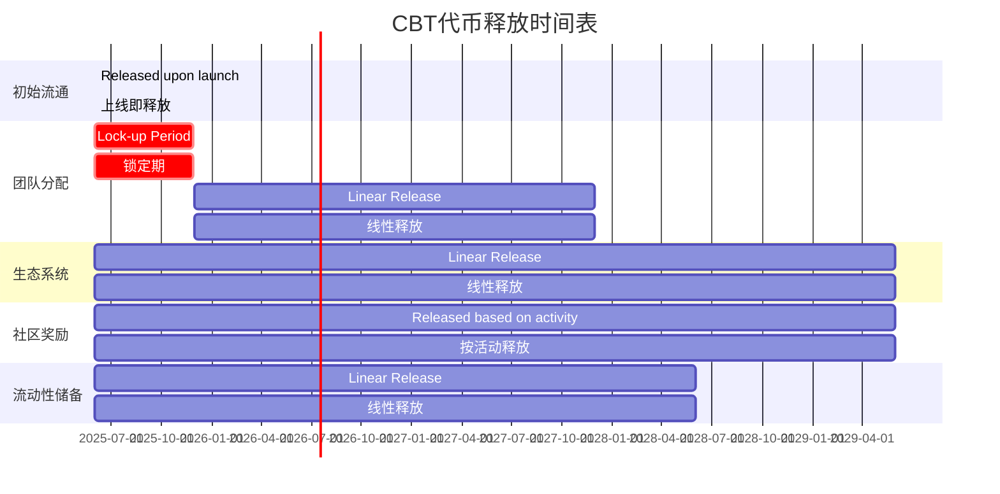

# CultureBridge BNB Chain Token Economic Model Final Version
# CultureBridge BNB链代币经济模型最终版

## 1. Token Basic Information
## 1. 代币基础信息

| Parameter | Value | Description |
|-----------|-------|-------------|
| 参数      | 值    | 说明        |
| Token Name | CultureBridge Token | Full name |
| 代币名称   | CultureBridge Token | 完整名称    |
| Token Symbol | CBT | Exchange display symbol |
| 代币符号   | CBT | 交易所显示符号 |
| Token Standard | BEP-20 | BNB Chain standard |
| 代币标准   | BEP-20 | BNB链标准   |
| Total Supply | 1,000,000,000 CBT | Total 1 billion tokens |
| 总供应量   | 1,000,000,000 CBT | 10亿代币总量 |
| Decimals | 18 | Standard decimal places |
| 小数位数   | 18 | 标准小数位数 |
| Initial Price | 0.005 USD | Initial liquidity pool pricing |
| 初始价格   | 0.005 USD | 初始流动性池定价 |
| Initial Market Cap | 5 million USD | Calculated based on initial circulation |
| 初始市值   | 500万 USD | 基于初始流通量计算 |
| Contract Deployment Network | BNB Chain | Mainnet deployment |
| 合约部署网络 | BNB Chain | 主网部署    |

## 2. Token Distribution Plan
## 2. 代币分配方案

### 2.1 Distribution Ratio
### 2.1 分配比例

| Distribution Category | Quantity | Percentage | Release Mechanism | Usage Description |
|-----------------------|----------|------------|-------------------|-------------------|
| 分配类别              | 数量     | 百分比     | 释放机制          | 用途说明          |
| Initial Circulation | 100,000,000 CBT | 10% | Released upon launch | Initial liquidity provision, early user incentives |
| 初始流通              | 100,000,000 CBT | 10% | 上线即释放        | 初始流动性提供、早期用户激励 |
| Team Allocation | 150,000,000 CBT | 15% | 24-month linear release, 6-month lock-up period | Team incentives, long-term development guarantee |
| 团队分配              | 150,000,000 CBT | 15% | 24个月线性释放，6个月锁定期 | 团队激励、长期发展保障 |
| Ecosystem | 350,000,000 CBT | 35% | 48-month linear release | Ecosystem building, partner incentives, market expansion |
| 生态系统              | 350,000,000 CBT | 35% | 48个月线性释放    | 生态建设、合作伙伴激励、市场拓展 |
| Community Rewards | 250,000,000 CBT | 25% | Released based on activity and contribution | Learning rewards, creation incentives, community participation rewards |
| 社区奖励              | 250,000,000 CBT | 25% | 按活动和贡献释放  | 学习奖励、创作激励、社区参与奖励 |
| Liquidity Reserve | 150,000,000 CBT | 15% | 36-month linear release | Liquidity management, market stability, buyback plan |
| 流动性储备            | 150,000,000 CBT | 15% | 36个月线性释放    | 流动性管理、市场稳定、回购计划 |

### 2.2 Release Schedule
### 2.2 释放时间表



### 2.3 Detailed Release Plan
### 2.3 详细释放计划

| Time Point | Cumulative Release | Circulation Ratio | Main Release Source |
|------------|--------------------|-------------------|---------------------|
| 时间点     | 累计释放量         | 流通比例          | 主要释放来源        |
| Launch Day | 100,000,000 | 10% | Initial Circulation |
| 上线日     | 100,000,000 | 10% | 初始流通          |
| 3 Months After Launch | 143,750,000 | 14.38% | Ecosystem, Liquidity Reserve |
| 上线后3个月 | 143,750,000 | 14.38% | 生态系统、流动性储备 |
| 6 Months After Launch | 187,500,000 | 18.75% | Ecosystem, Liquidity Reserve, Community Rewards |
| 上线后6个月 | 187,500,000 | 18.75% | 生态系统、流动性储备、社区奖励 |
| 9 Months After Launch | 237,500,000 | 23.75% | Ecosystem, Liquidity Reserve, Community Rewards, Team Allocation starts |
| 上线后9个月 | 237,500,000 | 23.75% | 生态系统、流动性储备、社区奖励、团队分配开始 |
| 12 Months After Launch | 293,750,000 | 29.38% | All categories released simultaneously |
| 上线后12个月 | 293,750,000 | 29.38% | 所有类别同步释放    |
| 18 Months After Launch | 406,250,000 | 40.63% | All categories released simultaneously |
| 上线后18个月 | 406,250,000 | 40.63% | 所有类别同步释放    |
| 24 Months After Launch | 518,750,000 | 51.88% | All categories released simultaneously, Team Allocation completed |
| 上线后24个月 | 518,750,000 | 51.88% | 所有类别同步释放，团队分配完成 |
| 36 Months After Launch | 743,750,000 | 74.38% | Ecosystem, Community Rewards, Liquidity Reserve completed |
| 上线后36个月 | 743,750,000 | 74.38% | 生态系统、社区奖励，流动性储备完成 |
| 48 Months After Launch | 1,000,000,000 | 100% | All releases completed |
| 上线后48个月 | 1,000,000,000 | 100% | 全部释放完成        |

### 2.4 Token Lock-up Mechanism
### 2.4 代币锁定机制

- **Team Token Lock-up Contract**: Use a time-lock contract to ensure linear release of team tokens as planned
- **团队代币锁定合约**：使用时间锁合约，确保团队代币按计划线性释放
  - Lock-up Address: Multi-signature time-lock contract (to be announced after deployment)
  - 锁定地址：多签时间锁合约（部署后公布）
  - Unlock Conditions: Starts after 6 months, unlocks 6,250,000 CBT (0.625% of total) every 30 days
  - 解锁条件：6个月后开始，每30天解锁6,250,000 CBT（总量的0.625%）
  - Early Unlock Protection: Cannot be unlocked early, enforced by smart contract
  - 提前解锁保护：无法提前解锁，智能合约强制执行

- **Liquidity Lock-up**: Initial liquidity will be locked for 12 months using PancakeSwap's lock function
- **流动性锁定**：初始流动性将锁定12个月，使用PancakeSwap的锁定功能
  - Initial Liquidity Size: Equivalent to 2 million USD (CBT + BNB)
  - 初始流动性规模：等值200万美元（CBT + BNB）
  - Lock-up Proof: PancakeSwap lock transaction hash (to be announced after deployment)
  - 锁定证明：PancakeSwap锁定交易哈希（部署后公布）
  - Renewal Mechanism: After the initial lock-up period, renewal will be decided by governance vote
  - 续期机制：首次锁定期满后，通过治理投票决定续期

- **Ecosystem Fund Multi-signature Management**: Use a 3/5 multi-signature wallet to manage ecosystem funds, ensuring fund security
- **生态系统资金多签管理**：使用3/5多签钱包管理生态系统资金，确保资金安全
  - Multi-signature Members: 2 core team members + 2 community representatives + 1 independent advisor
  - 多签成员：2名核心团队 + 2名社区代表 + 1名独立顾问
  - Fund Usage Transparency: All expenditures are publicly recorded, monthly fund usage reports are published
  - 资金使用透明度：所有支出公开记录，每月发布资金使用报告
  - Large Expenditures (>5 million CBT) require approval via community governance vote
  - 大额支出（>500万CBT）需通过社区治理投票批准

## 3. Core Mechanisms of Token Economic Model
## 3. 代币经济模型核心机制

### 3.1 Deflationary Mechanism
### 3.1 通缩机制

#### Automatic Burn Mechanism
#### 自动销毁机制
- **Burn Ratio**: 1% of each transaction is automatically burned
- **销毁比例**：每笔交易的1%自动销毁
- **Burn Cap**: Can be adjusted up to 5%, decided by governance vote
- **销毁上限**：最高可调整至5%，由治理投票决定
- **Burn Address**: 0x000000000000000000000000000000000000dEaD
- **销毁地址**：0x000000000000000000000000000000000000dEaD
- **Exclusion List**: Specific addresses can be excluded from the burn mechanism (e.g., liquidity pools, staking contracts)
- **排除名单**：特定地址可排除在销毁机制外（如流动性池、质押合约）
- **Burn Transparency**: All burn transactions are publicly verifiable, monthly burn reports are published
- **销毁透明度**：所有销毁交易公开可查，每月发布销毁报告
- **Burn Target**: Planned to cumulatively burn 10-15% of total supply within 4 years
- **销毁目标**：计划4年内累计销毁总供应量的10-15%

#### Manual Burn Activities
#### 手动销毁活动
- **Quarterly Buyback and Burn**: 20% of platform revenue is used to buy back and burn tokens
- **季度回购销毁**：平台收入的20%用于回购并销毁代币
  - Buyback Method: Public buyback through decentralized exchanges
  - 回购方式：通过去中心化交易所公开回购
  - Buyback Frequency: End of each quarter
  - 回购频率：每季度末进行
  - Buyback Scale Cap: Single buyback not exceeding 0.5% of circulation, to avoid market impact
  - 回购规模上限：单次不超过流通量的0.5%，避免市场冲击

- **Milestone Burn**: Additional tokens burned when user growth milestones are reached
- **里程碑销毁**：达到用户增长里程碑时额外销毁代币
  - Milestone 1 (100k users): Additional 5 million CBT burned
  - 里程碑1（10万用户）：额外销毁500万CBT
  - Milestone 2 (500k users): Additional 10 million CBT burned
  - 里程碑2（50万用户）：额外销毁1000万CBT
  - Milestone 3 (1 million users): Additional 20 million CBT burned
  - 里程碑3（100万用户）：额外销毁2000万CBT
  - Milestone 4 (5 million users): Additional 50 million CBT burned
  - 里程碑4（500万用户）：额外销毁5000万CBT

### 3.2 Staking Reward System
### 3.2 质押奖励系统

#### Basic Staking Pool
#### 基础质押池
- **Annual Percentage Yield (APY)**: 15-25% APY (dynamically adjusted based on total staked amount)
- **年化收益率**：15-25% APY（根据总质押量动态调整）
  - Adjustment Formula: Base APY (20%) - (Total Staked Amount / 10 million) × 0.5%
  - 调整公式：基础收益率(20%) - (总质押量/1000万) × 0.5%
  - Minimum Guarantee: APY not less than 15% regardless of total staked amount
  - 最低保障：无论总质押量多大，收益率不低于15%
  - Maximum Cap: APY not exceeding 25% regardless of total staked amount
  - 最高上限：无论总质押量多小，收益率不超过25%

- **Minimum Staking Period**: 7 days
- **最短质押期**：7天
  - Flexible Staking: No lock-up period, can be withdrawn anytime
  - 灵活质押：无锁定期，随时可取出
  - Fixed-term Staking: 7/30/90/180/365 days options, higher returns for longer terms
  - 定期质押：7/30/90/180/365天可选，期限越长收益越高

- **Early Unstaking Penalty**: 5% fee charged
- **提前解除惩罚**：收取5%手续费
  - Penalty Distribution: 3% for buyback and burn, 2% distributed to other stakers
  - 惩罚分配：3%回购销毁，2%分配给其他质押者
  - Exemption Conditions: Penalty can be temporarily waived in emergencies via governance vote
  - 豁免条件：紧急情况下通过治理投票可临时取消惩罚

- **Compounding Option**: Option to automatically re-invest rewards
- **复利选项**：可选择自动复投奖励
  - Compounding Frequency: Automatically re-invested every 24 hours
  - 复利频率：每24小时自动复投一次
  - Compounding Rewards: Additional 2% APY for choosing automatic compounding
  - 复利奖励：选择自动复投可获得额外2%收益率
  - Compounding Tax: Compounding operations are exempt from transaction burn fees
  - 复利税收：复利操作免收交易销毁费

#### Liquidity Mining
#### 流动性挖矿
- **LP Token Staking**: CBT-BNB pair LP token staking
- **LP代币质押**：CBT-BNB对LP代币质押
  - Supported Pools: Initially only CBT-BNB pool, other pairs can be added later via governance
  - 支持池：初期仅支持CBT-BNB池，后续可通过治理添加其他交易对
  - Staking Method: Stake PancakeSwap LP tokens into a dedicated contract
  - 质押方式：将PancakeSwap LP代币质押到专用合约

- **Annual Percentage Yield (APY)**: 30-50% APY (for the first 6 months, then decreasing)
- **年化收益率**：30-50% APY（前6个月，之后递减）
  - Decreasing Mechanism: Decreases by 5% monthly after 6 months until stabilizing at 15%
  - 递减机制：6个月后每月递减5%，直至稳定在15%
  - Adjustment Mechanism: Decreasing rate and final stable APY can be adjusted via governance vote
  - 调整机制：通过治理投票可调整递减速率和最终稳定收益率

- **Reward Accelerator**: Long-term staking can get 1.2x-2x reward multiplier
- **奖励加速器**：长期质押可获得1.2x-2x奖励乘数
  - 30-90 days: 1.2x reward multiplier
  - 30-90天：1.2x奖励乘数
  - 90-180 days: 1.5x reward multiplier
  - 90-180天：1.5x奖励乘数
  - 180+ days: 2.0x reward multiplier
  - 180天以上：2.0x奖励乘数

- **Dual Rewards**: In addition to CBT, specific event periods may offer partner project tokens
- **双重奖励**：除CBT外，特定活动期间可获得合作项目代币
  - Partner Reward Ratio: Additional partner token rewards account for 10% of total rewards
  - 合作奖励比例：额外合作代币奖励占总奖励的10%
  - Partner Project Selection: Decided by governance vote
  - 合作项目选择：通过治理投票决定合作项目
  - Partnership Duration: Each partner project reward period is 30 days
  - 合作期限：每个合作项目奖励期限为30天

### 3.3 User Incentive Mechanism
### 3.3 用户激励机制

#### Learning Rewards
#### 学习奖励
- **Course Completion Rewards**: 5-50 CBT (based on course difficulty)
- **课程完成奖励**：5-50 CBT（根据课程难度）
  - Beginner Course: 5 CBT
  - 初级课程：5 CBT
  - Intermediate Course: 15 CBT
  - 中级课程：15 CBT
  - Advanced Course: 30 CBT
  - 高级课程：30 CBT
  - Expert Course: 50 CBT
  - 专家课程：50 CBT

- **Learning Streak Rewards**: Continuous learning can earn additional rewards, up to 2x multiplier
- **学习streak奖励**：连续学习可获得额外奖励，最高2x倍数
  - 3 consecutive days: 1.1x reward multiplier
  - 连续3天：1.1x奖励乘数
  - 7 consecutive days: 1.3x reward multiplier
  - 连续7天：1.3x奖励乘数
  - 14 consecutive days: 1.5x reward multiplier
  - 连续14天：1.5x奖励乘数
  - 30 consecutive days: 2.0x reward multiplier
  - 连续30天：2.0x奖励乘数

- **Knowledge Quiz Rewards**: Pass quizzes to earn 10-30 CBT
- **知识测验奖励**：通过测验可获得10-30 CBT
  - Pass (60-80%): 10 CBT
  - 及格(60-80%)：10 CBT
  - Excellent (80-95%): 20 CBT
  - 优秀(80-95%)：20 CBT
  - Full Score (95-100%): 30 CBT
  - 满分(95-100%)：30 CBT

- **Achievement NFTs**: Complete specific learning milestones to mint achievement NFTs, holding them can increase learning rewards
- **成就NFT**：完成特定学习里程碑可铸造成就NFT，持有可增加学习奖励
  - Beginner Achievement: Complete 10 courses, 5% reward bonus
  - 初级成就：完成10门课程，奖励加成5%
  - Intermediate Achievement: Complete 50 courses, 10% reward bonus
  - 中级成就：完成50门课程，奖励加成10%
  - Advanced Achievement: Complete 100 courses, 15% reward bonus
  - 高级成就：完成100门课程，奖励加成15%
  - Expert Achievement: Complete 200 courses, 20% reward bonus
  - 专家成就：完成200门课程，奖励加成20%

- **Reward Cap**:
- **奖励上限**：
  - Daily learning reward cap: 100 CBT
  - 每日学习奖励上限：100 CBT
  - Monthly learning reward cap: 2000 CBT
  - 每月学习奖励上限：2000 CBT

#### Content Creation Incentives
#### 内容创作激励
- **Translation Contribution**: Provide high-quality translations to earn 10-100 CBT
- **翻译贡献**：提供高质量翻译可获得10-100 CBT
  - Short text (within 100 words): 10 CBT
  - 短文本(100字以内)：10 CBT
  - Medium text (100-500 words): 25 CBT
  - 中等文本(100-500字)：25 CBT
  - Long text (over 500 words): 50 CBT
  - 长文本(500字以上)：50 CBT
  - Professional field content: 100 CBT
  - 专业领域内容：100 CBT

- **Cultural Content Creation**: Create original cultural content to earn 50-500 CBT
- **文化内容创作**：创作原创文化内容可获得50-500 CBT
  - Basic cultural content: 50 CBT
  - 基础文化内容：50 CBT
  - Medium quality cultural content: 150 CBT
  - 中等质量文化内容：150 CBT
  - High quality cultural content: 300 CBT
  - 高质量文化内容：300 CBT
  - Professional cultural content: 500 CBT
  - 专业级文化内容：500 CBT

- **Content Quality Score**: Community rating affects reward multiplier (0.5x-3x)
- **内容质量评分**：社区评分影响奖励倍数（0.5x-3x）
  - 1-2 stars (low quality): 0.5x reward multiplier
  - 1-2星(低质量)：0.5x奖励乘数
  - 3 stars (medium quality): 1.0x reward multiplier
  - 3星(中等质量)：1.0x奖励乘数
  - 4 stars (good quality): 1.5x reward multiplier
  - 4星(良好质量)：1.5x奖励乘数
  - 5 stars (excellent quality): 3.0x reward multiplier
  - 5星(优秀质量)：3.0x奖励乘数

- **Creator Royalties**: Continuously earn royalties when content is used (5-15% of usage fee)
- **创作者版税**：内容被使用时可持续获得版税（使用费的5-15%）
  - General creator: 5% royalty rate
  - 普通创作者：5%版税比例
  - Certified creator: 10% royalty rate
  - 认证创作者：10%版税比例
  - Expert creator: 15% royalty rate
  - 专家创作者：15%版税比例

- **Reward Cap**:
- **奖励上限**：
  - Daily creation reward cap: 1000 CBT
  - 每日创作奖励上限：1000 CBT
  - Monthly creation reward cap: 20000 CBT
  - 每月创作奖励上限：20000 CBT

#### Community Participation Rewards
#### 社区参与奖励
- **Referral Rewards**: Successfully refer new users to earn 50 CBT, and another 50 CBT after new user becomes active
- **推荐奖励**：成功推荐新用户可获得50 CBT，新用户活跃后再获得50 CBT
  - Activity Standard: New user continuously uses for 7 days
  - 活跃标准：新用户连续使用7天
  - Anti-cheating Mechanism: IP detection, device fingerprinting, activity verification
  - 防作弊机制：IP检测、设备指纹、活跃度验证

- **Governance Participation**: Participate in proposal voting to earn 5-20 CBT
- **治理参与**：参与提案投票可获得5-20 CBT
  - General Proposal: 5 CBT
  - 一般提案：5 CBT
  - Important Proposal: 20 CBT
  - 重要提案：20 CBT

- **Community Activities**: Participate in online/offline activities to earn 10-100 CBT
- **社区活动**：参与线上/线下活动可获得10-100 CBT
  - Online Activities: 10-50 CBT
  - 线上活动：10-50 CBT
  - Offline Activities: 50-100 CBT
  - 线下活动：50-100 CBT

- **Bug Bounty**: Report and verify bugs to earn 50-5000 CBT (based on severity)
- **Bug赏金**：报告并验证Bug可获得50-5000 CBT（根据严重程度）
  - Low-level Bug: 50 CBT
  - 低级Bug：50 CBT
  - Medium-level Bug: 200 CBT
  - 中级Bug：200 CBT
  - High-level Bug: 1000 CBT
  - 高级Bug：1000 CBT
  - Critical Security Bug: 5000 CBT
  - 关键安全Bug：5000 CBT

- **Reward Cap**:
- **奖励上限**：
  - Daily community reward cap: 200 CBT
  - 每日社区奖励上限：200 CBT
  - Monthly community reward cap: 3000 CBT
  - 每月社区奖励上限：3000 CBT

### 3.4 Anti-Whale Mechanism
### 3.4 反鲸鱼机制

#### Holding Limit
#### 持有限制
- **Maximum Holding Amount**: A single address can hold a maximum of 2% of the total supply
- **最大持有量**：单一地址最多持有总供应量的2%
  - Initial Market Cap (<1 million USD): Maximum holding ratio 2%
  - 初始市值(<100万美元)：最大持有比例2%
  - Medium Market Cap (1-10 million USD): Maximum holding ratio 3%
  - 中等市值(100万-1000万美元)：最大持有比例3%
  - High Market Cap (>50 million USD): Maximum holding ratio 5%
  - 高市值(>5000万美元)：最大持有比例5%

- **Exclusion List**: Specific addresses can be excluded from the limit (e.g., liquidity pools, team multi-sig wallets)
- **排除名单**：特定地址可排除在限制外（如流动性池、团队多签钱包）
  - Exclusion Conditions: Must be approved by governance vote
  - 排除条件：必须通过治理投票批准
  - Exclusion Transparency: All excluded addresses are publicly verifiable
  - 排除透明度：所有排除地址公开可查

- **Progressive Limit**: As market cap grows, the limit ratio can be adjusted via governance
- **渐进式限制**：随着市值增长，限制比例可通过治理调整
  - Adjustment Frequency: Can be evaluated quarterly
  - 调整频率：每季度可评估一次
  - Adjustment Range: Single adjustment not exceeding 1 percentage point
  - 调整幅度：单次调整不超过1个百分点

#### Transaction Limit
#### 交易限制
- **Maximum Single Transaction**: A single transaction can be a maximum of 0.5% of the total supply
- **单笔最大交易**：单笔最多交易总供应量的0.5%
  - Transaction Rejection: Transactions exceeding the limit will be automatically rejected by the smart contract
  - 交易拒绝：超过限制的交易将被智能合约自动拒绝
  - Batch Transactions: Large transactions need to be done in batches, with at least 10 minutes interval between each batch
  - 分批交易：大额交易需分批进行，每批间隔至少10分钟

- **Cooldown Period**: 10-minute cooldown period after large transactions (exceeding 0.1%)
- **冷却时间**：大额交易（超过0.1%）后有10分钟冷却期
  - Cooldown Mechanism: Transactions from the same address within the cooldown period will be rejected
  - 冷却机制：同一地址在冷却期内的交易将被拒绝
  - Emergency Exemption: Multi-sig management team can temporarily lift cooldown in emergencies
  - 紧急豁免：多签管理团队可在紧急情况下临时解除冷却

- **Progressive Fee**: Additional fees for large transactions, used for buyback and burn
- **渐进式费用**：大额交易额外收取费用，用于回购销毁
  - Extra Large Transaction (0.2%): Additional 1% fee
  - 特大交易(0.2%)：额外1%费用
  - Huge Transaction (0.3%): Additional 2% fee
  - 巨额交易(0.3%)：额外2%费用
  - Extreme Transaction (0.4%): Additional 3% fee
  - 极额交易(0.4%)：额外3%费用
  - Fee Distribution: 100% for buyback and burn
  - 费用分配：100%用于回购销毁

## 4. Token Usage Scenarios
## 4. 代币使用场景

### 4.1 Platform Feature Unlock
### 4.1 平台功能解锁

| Feature | Token Requirement | Description | Market Value |
|---------|-------------------|-------------|--------------|
| 功能    | 代币需求          | 说明        | 市场价值     |
| Basic Translation Service | Free | Basic translation function is free to use | - |
| 基础翻译服务 | 免费              | 基础翻译功能免费使用 | -            |
| Advanced Translation Service (Basic) | 10 CBT/month | Unlock AI advanced translation features, including cultural background explanation | $5-10/month |
| 高级翻译服务(基础) | 10 CBT/月         | 解锁AI高级翻译功能，包括文化背景解释 | $5-10/月     |
| Advanced Translation Service (Standard) | 25 CBT/month | Standard advanced translation service subscription fee | $15-20/month |
| 高级翻译服务(标准) | 25 CBT/月         | 标准高级翻译功能订阅费 | $15-20/月    |
| Advanced Translation Service (Professional) | 50 CBT/month | Professional advanced translation service subscription fee | $30-40/month |
| 高级翻译服务(专业) | 50 CBT/月         | 专业高级翻译功能订阅费 | $30-40/月    |
| Beginner Course Access | Free | Beginner courses are free to access | - |
| 初级课程访问 | 免费              | 初级课程免费访问 | -            |
| Intermediate Course Access | 100 CBT/course | Unlock professional language and cultural courses | $50-100/course |
| 中级课程访问 | 100 CBT/课程      | 解锁专业语言和文化课程 | $50-100/课程 |
| Advanced Course Access | 250 CBT/course | Advanced course unlock fee | $150-200/course |
| 高级课程访问 | 250 CBT/课程      | 高级课程解锁费用 | $150-200/课程 |
| Expert Course Access | 500 CBT/course | Expert course unlock fee | $300-500/course |
| 专家课程访问 | 500 CBT/课程      | 专家课程解锁费用 | $300-500/课程 |
| Beginner Teacher Matching | 200 CBT/month | Match with professional language teachers for 1-on-1 guidance | $100-150/month |
| 初级教师匹配 | 200 CBT/月        | 匹配专业语言教师进行1对1指导 | $100-150/月  |
| Intermediate Teacher Matching | 500 CBT/month | Monthly fee for matching with intermediate teachers | $250-350/month |
| 中级教师匹配 | 500 CBT/月        | 匹配中级教师的月费 | $250-350/月  |
| Advanced Teacher Matching | 1000 CBT/month | Monthly fee for matching with advanced teachers | $500-800/month |
| 高级教师匹配 | 1000 CBT/月       | 匹配高级教师的月费 | $500-800/月  |
| VIP Community Access (Basic) | 100 CBT/month | Access VIP community and exclusive events | $50-80/month |
| VIP社区访问(基础) | 100 CBT/月        | 访问VIP社区和专属活动 | $50-80/月    |
| VIP Community Access (Advanced) | 300 CBT/month | Advanced VIP community access monthly fee | $150-200/month |
| VIP社区访问(高级) | 300 CBT/月        | 高级VIP社区访问月费 | $150-200/月  |
| Basic Cultural NFT Creation | 50 CBT/NFT | Minting fee for creating cultural NFTs | $25-40/NFT |
| 基础文化NFT创建 | 50 CBT/个         | 创建文化相关NFT的铸造费用 | $25-40/个    |
| Advanced Cultural NFT Creation | 100 CBT/NFT | Fee for creating advanced cultural NFTs | $50-80/NFT |
| 高级文化NFT创建 | 100 CBT/个        | 创建高级文化NFT的费用 | $50-80/个    |
| Professional Cultural NFT Creation | 200 CBT/NFT | Fee for creating professional cultural NFTs | $100-150/NFT |
| 专业文化NFT创建 | 200 CBT/个        | 创建专业文化NFT的费用 | $100-150/个  |

### 4.2 Governance Rights
### 4.2 治理权益

#### Proposal Rights
#### 提案权
- **Create Proposal**: Hold at least 100,000 CBT (or stake for over 30 days)
- **创建提案**：持有至少100,000 CBT（或质押30天以上）
  - Staking Alternative: Staking 50,000 CBT for at least 30 days can also grant proposal rights
  - 质押替代方案：质押50,000 CBT至少30天也可获得提案权
  - Proposal Types: Parameter adjustments, feature upgrades, fund allocation, community activities, etc.
  - 提案类型：参数调整、功能升级、资金分配、社区活动等

- **Proposal Deposit**: Submitting a proposal requires staking 10,000 CBT (returned if proposal passes)
- **提案押金**：提交提案需质押10,000 CBT（提案通过后返还）
  - Return Rules: 100% returned if proposal passes, 50% returned if proposal fails
  - 返还规则：提案通过返还100%，提案失败返还50%
  - Malicious Proposals: Proposals deemed malicious will forfeit 100% of the deposit
  - 恶意提案：被判定为恶意的提案将没收100%押金

- **Expedited Proposal**: Staking 50,000 CBT can expedite proposal processing
- **加急提案**：质押50,000 CBT可将提案加急处理
  - Processing Time: Regular proposals 7 days, expedited proposals 48 hours
  - 处理时间：常规提案7天，加急提案48小时
  - Expedited Conditions: In addition to staking, expedited reasons must be provided and approved by the governance committee
  - 加急条件：除质押外，需说明加急理由并获得治理委员会批准

#### Voting Rights
#### 投票权
- **Basic Voting**: 1 CBT = 1 vote
- **基础投票**：1 CBT = 1票
  - Voting Weight Calculation: Voting Weight = Number of Tokens Held × (1 + Staking Multiplier + Holding Time Multiplier)
  - 投票权重计算：投票权重 = 持有代币数量 × (1 + 质押乘数 + 持有时间乘数)
  - Staking Multiplier = Staked ? 0.5 : 0
  - 质押乘数 = 质押状态 ? 0.5 : 0
  - Holding Time Multiplier = min(Months Held × 0.033, 1.0)
  - 持有时间乘数 = min(持有月数 × 0.033, 1.0)

- **Staking Boost**: Staking tokens grants 1.5x voting weight
- **质押增益**：质押代币获得1.5x投票权重
  - Staking Period Requirement: Must be locked for at least 7 days to gain boost
  - 质押期限要求：至少锁定7天以上才能获得增益
  - Early Unlock: Early unlock will lose boost weight
  - 提前解锁：提前解锁将失去增益权重

- **Long-term Holding Boost**: Voting weight increases by 0.1x for every 3 months of holding, up to 2x
- **长期持有增益**：持有时间每增加3个月，投票权重增加0.1x，最高2x
  - 3 months: +0.1x
  - 3个月：+0.1x
  - 6 months: +0.2x
  - 6个月：+0.2x
  - 9 months: +0.3x
  - 9个月：+0.3x
  - 12 months: +0.4x
  - 12个月：+0.4x
  - 18 months: +0.6x
  - 18个月：+0.6x
  - 24 months: +0.8x
  - 24个月：+0.8x
  - 36 months: +1.0x
  - 36个月：+1.0x

- **Voting Rewards**: Participate in voting to earn 0.1% of total voted tokens as rewards (distributed proportionally)
- **投票奖励**：参与投票可获得总投票代币量0.1%的奖励（按比例分配）
  - Distribution Method: Rewards distributed proportionally based on voting weight
  - 分配方式：按投票权重比例分配奖励
  - Reward Source: Community reward pool
  - 奖励来源：社区奖励池
  - Claim Method: Automatically distributed after voting ends
  - 领取方式：投票结束后自动发放

#### Proposal Types and Parameters
#### 提案类型与参数

| Proposal Type | Threshold | Execution Delay | Description |
|---------------|-----------|-----------------|-------------|
| 提案类型      | 通过阈值  | 执行延迟        | 说明        |
| Parameter Adjustment Proposal | 50% | 24 hours | Proposals to adjust economic model parameters |
| 参数调整提案  | 50%       | 24小时          | 调整经济模型参数的提案 |
| Feature Upgrade Proposal | 67% | 48 hours | Proposals to upgrade contract features |
| 功能升级提案  | 67%       | 48小时          | 升级合约功能的提案 |
| Fund Allocation Proposal | 67% | 48 hours | Proposals to allocate ecosystem funds |
| 资金分配提案  | 67%       | 48小时          | 分配生态系统资金的提案 |
| Emergency Security Proposal | 75% | 6 hours | Emergency proposals to address security issues |
| 紧急安全提案  | 75%       | 6小时           | 处理安全问题的紧急提案 |
| Community Activity Proposal | 50% | 24 hours | Proposals to organize community activities |
| 社区活动提案  | 50%       | 24小时          | 组织社区活动的提案 |
| Partner Proposal | 67% | 48 hours | Proposals for cooperation with external projects |
| 合作伙伴提案  | 67%       | 48小时          | 与外部项目合作的提案 |
| Governance Rule Modification Proposal | 75% | 72 hours | Proposals to modify governance rules |
| 治理规则修改提案 | 75%       | 72小时          | 修改治理规则的提案 |

### 4.3 Ecosystem Integration
### 4.3 生态系统整合

#### Cross-Platform Usage
#### 跨平台使用
- **Partner Platforms**: CBT can be used on partner platforms to enjoy discounts
- **合作伙伴平台**：CBT可在合作伙伴平台使用，享受折扣
  - Discount Range: Enjoy 5-20% discount when paying with CBT
  - 折扣幅度：使用CBT支付可享受5-20%折扣
  - Partnership Types: Language learning platforms, cultural exchange platforms, educational institutions
  - 合作类型：语言学习平台、文化交流平台、教育机构

- **Cultural Event Tickets**: Use CBT to purchase tickets for online/offline cultural events
- **文化活动门票**：使用CBT购买线上/线下文化活动门票
  - Event Types: Language exchange meetups, cultural exhibitions, international cultural festivals
  - 活动类型：语言交流会、文化展览、国际文化节
  - Discount Range: Enjoy 10-30% discount when purchasing tickets with CBT
  - 折扣幅度：使用CBT购票可享受10-30%折扣

- **Educational Institution Partnerships**: Partner with language education institutions, CBT can be used to pay for course fees
- **教育机构合作**：与语言教育机构合作，CBT可用于支付课程费用
  - Partner Institutions: Language schools, online education platforms, international cultural exchange centers
  - 合作机构：语言学校、在线教育平台、国际文化交流中心
  - Certification Mechanism: Complete platform courses to receive certification from partner institutions
  - 认证机制：完成平台课程可获得合作机构认证证书

#### NFT Ecosystem
#### NFT生态系统
- **Cultural NFT Trading**: CBT as the primary trading currency in the cultural NFT market
- **文化NFT交易**：CBT作为文化NFT市场的主要交易货币
  - NFT Types: Language learning achievements, cultural artworks, digital cultural assets
  - NFT类型：语言学习成就、文化艺术品、数字文化资产
  - Transaction Fee: 2.5% of transaction value, of which 70% goes to creators, 20% for buyback and burn, 10% to staking reward pool
  - 交易费用：交易额的2.5%，其中70%给创作者，20%回购销毁，10%进入质押奖励池

- **NFT Staking**: Stake cultural NFTs to earn CBT rewards
- **NFT质押**：质押文化NFT可获得CBT奖励
  - Staking Rewards: 5-15% APY based on NFT rarity and value
  - 质押奖励：根据NFT稀有度和价值，年化收益率5-15%
  - Staking Period: Minimum 30 days, higher rewards for longer periods
  - 质押期限：最短30天，期限越长奖励越高

- **NFT Rental**: Rent educational and cultural NFT assets using CBT
- **NFT租赁**：使用CBT租赁教育和文化NFT资产
  - Rental Period: 1 day to 30 days options
  - 租赁期限：1天至30天可选
  - Rental Fee: 0.1-1% of NFT value per day
  - 租赁费用：NFT价值的0.1-1%/天
  - Revenue Distribution: 70% to NFT owner, 20% to platform, 10% to staking reward pool
  - 收益分配：70%给NFT所有者，20%平台，10%质押奖励池

## 5. Token Value Capture Mechanism
## 5. 代币价值捕获机制

### 5.1 Fee Distribution
### 5.1 费用分配

| Fee Type | Distribution Method | Percentage | Expected Monthly Revenue (Stable Period) |
|----------|---------------------|------------|------------------------------------------|
| 费用类型 | 分配方式            | 比例       | 预期月收入(稳定期)                       |
| Transaction Burn | Permanent burn | 1% | 0.5-1 million CBT |
| 交易销毁 | 永久销毁            | 1%         | 50-100万CBT                              |
| Platform Service Fee - Ecosystem | Ecosystem development | 60% | 0.3-0.6 million CBT |
| 平台服务费-生态系统 | 生态系统发展        | 60%        | 30-60万CBT                               |
| Platform Service Fee - Buyback & Burn | Buyback & burn | 20% | 0.1-0.2 million CBT |
| 平台服务费-回购销毁 | 回购销毁            | 20%        | 10-20万CBT                               |
| Platform Service Fee - Staking Rewards | Staking reward pool | 20% | 0.1-0.2 million CBT |
| 平台服务费-质押奖励 | 质押奖励池          | 20%        | 10-20万CBT                               |
| NFT Transaction Fee - Creator | Creator | 70% | 0.07-0.14 million CBT |
| NFT交易费-创作者 | 创作者              | 70%        | 7-14万CBT                                |
| NFT Transaction Fee - Platform | Platform (buyback & burn) | 20% | 0.02-0.04 million CBT |
| NFT交易费-平台 | 平台（回购销毁）    | 20%        | 2-4万CBT                                 |
| NFT Transaction Fee - Staking Rewards | Staking reward pool | 10% | 0.01-0.02 million CBT |
| NFT交易费-质押奖励 | 质押奖励池          | 10%        | 1-2万CBT                                 |
| NFT Initial Sale Fee - Creator | Creator | 85% | 0.085-0.17 million CBT |
| NFT初次销售费-创作者 | 创作者              | 85%        | 8.5-17万CBT                              |
| NFT Initial Sale Fee - Platform | Platform | 15% | 0.015-0.03 million CBT |
| NFT初次销售费-平台 | 平台                | 15%        | 1.5-3万CBT                               |
| Course Sale Fee - Creator | Creator | 80% | 0.16-0.32 million CBT |
| 课程销售费-创作者 | 创作者              | 80%        | 16-32万CBT                               |
| Course Sale Fee - Platform | Platform | 20% | 0.04-0.08 million CBT |
| 课程销售费-平台 | 平台                | 20%        | 4-8万CBT                                 |

### 5.2 Value Growth Drivers
### 5.2 价值增长驱动因素

- **User Growth**: New user registration and activity growth drive token demand
- **用户增长**：新用户注册和活跃度增长带动代币需求
  - Target User Growth Rate: Average 20% monthly for the first 6 months, then stable at 10% monthly
  - 目标用户增长率：前6个月月均20%，后续稳定在月均10%
  - Target Active User Ratio: Over 40% of total users
  - 活跃用户比例目标：总用户的40%以上
  - Target User Retention Rate: Over 60% monthly
  - 用户留存率目标：月均60%以上

- **Feature Unlock**: Advanced features require tokens, increasing utility demand
- **功能解锁**：高级功能需要代币，增加实用需求
  - Target Feature Usage Rate: 50% of active users use at least one paid feature
  - 功能使用率目标：活跃用户的50%使用至少一项付费功能
  - Target Average User Spending: Average monthly spending of 50-100 CBT per active user
  - 平均用户支出目标：活跃用户月均支出50-100 CBT

- **Deflationary Mechanism**: Automatic burn and buyback & burn reduce circulating supply
- **通缩机制**：自动销毁和回购销毁减少流通供应
  - Burn Target: Cumulatively burn 10-15% of total supply within 4 years
  - 销毁目标：4年内累计销毁总供应量的10-15%
  - Burn Sources: Transaction burn (40%), buyback & burn (40%), milestone burn (20%)
  - 销毁来源：交易销毁(40%)、回购销毁(40%)、里程碑销毁(20%)

- **Staking Lock-up**: Staking rewards attract long-term holding, reducing circulation
- **质押锁定**：质押奖励吸引长期持有，减少流通量
  - Target Staking Rate: 30-60% of circulating supply in staking
  - 质押率目标：流通量的30-60%处于质押状态
  - Target Average Staking Period: Over 60 days
  - 平均质押期目标：60天以上
  - Target Staking Distribution: Top 10 addresses staking concentration <20%
  - 质押分布目标：前10地址质押集中度<20%

- **Ecosystem Expansion**: Partnerships and cross-platform usage expand application scenarios
- **生态扩展**：合作伙伴和跨平台使用扩大应用场景
  - Partner Target: Add 2-3 new strategic partners per quarter
  - 合作伙伴目标：每季度新增2-3个战略合作伙伴
  - Cross-platform Transaction Target: Over 20% of total transactions from outside the platform
  - 跨平台交易目标：平台外交易占总交易量的20%以上
  - Ecosystem Diversity: Support at least 5 different types of application scenarios
  - 生态系统多样性：支持至少5种不同类型的应用场景

## 6. Smart Contract Interface Design
## 6. 智能合约接口设计

### 6.1 Token Contract Core Interface
### 6.1 代币合约核心接口

```solidity
// SPDX-License-Identifier: MIT
pragma solidity ^0.8.17;

interface ICultureBridgeToken {
    // Basic ERC20 functions
    // 基础ERC20功能
    function totalSupply() external view returns (uint256);
    function balanceOf(address account) external view returns (uint256);
    function transfer(address recipient, uint256 amount) external returns (bool);
    function allowance(address owner, address spender) external view returns (uint256);
    function approve(address spender, uint256 amount) external returns (bool);
    function transferFrom(address sender, address recipient, uint256 amount) external returns (bool);
    
    // Burn functions
    // 销毁功能
    function burn(uint256 amount) external;
    function burnFrom(address account, uint256 amount) external;
    
    // Advanced functions
    // 高级功能
    function setBurnRate(uint256 newBurnRate) external;
    function excludeFromBurn(address account, bool excluded) external;
    function excludeFromMaxHolding(address account, bool excluded) external;
    function setMaxHoldingAmount(uint256 amount) external;
    function setCooldownTime(uint256 newCooldownTime) external;
    function setExtraFeeThresholds(uint256[] calldata thresholds, uint256[] calldata fees) external;
    
    // Query functions
    // 查询功能
    function getBurnRate() external view returns (uint256);
    function isExcludedFromBurn(address account) external view returns (bool);
    function isExcludedFromMaxHolding(address account) external view returns (bool);
    function getMaxHoldingAmount() external view returns (uint256);
    function getCooldownTime() external view returns (uint256);
    function getLastTransactionTime(address account) external view returns (uint256);
    function getExtraFeeThresholds() external view returns (uint256[] memory, uint256[] memory);
    function getTotalBurned() external view returns (uint256);
    
    // Events
    // 事件
    event Transfer(address indexed from, address indexed to, uint256 value);
    event Approval(address indexed owner, address indexed spender, uint256 value);
    event BurnRateUpdated(uint256 oldRate, uint256 newRate);
    event ExcludedFromBurn(address indexed account, bool excluded);
    event ExcludedFromMaxHolding(address indexed account, bool excluded);
    event MaxHoldingAmountUpdated(uint256 oldAmount, uint256 newAmount);
    event CooldownTimeUpdated(uint256 oldTime, uint256 newTime);
    event ExtraFeeThresholdsUpdated();
    event TokensBurned(address indexed from, uint256 amount, string reason);
}
```

### 6.2 Staking System Interface
### 6.2 质押系统接口

```solidity
// SPDX-License-Identifier: MIT
pragma solidity ^0.8.17;

interface ICultureBridgeStaking {
    // Staking functions
    // 质押功能
    function stake(uint256 amount) external;
    function stakeWithLock(uint256 amount, uint256 lockDuration) external;
    function withdraw(uint256 amount) external;
    function withdrawWithPenalty(uint256 amount) external;
    function getReward() external;
    function exit() external;
    function compound() external;
    
    // Query functions
    // 查询功能
    function balanceOf(address account) external view returns (uint256);
    function lockedBalanceOf(address account) external view returns (uint256);
    function lockTimeOf(address account) external view returns (uint256);
    function earned(address account) external view returns (uint256);
    function totalSupply() external view returns (uint256);
    function rewardPerToken() external view returns (uint256);
    function lastTimeRewardApplicable() external view returns (uint256);
    function getRewardRate() external view returns (uint256);
    function getBoostMultiplier(address account) external view returns (uint256);
    function getWithdrawPenalty() external view returns (uint256);
    function getCompoundEnabled() external view returns (bool);
    function getCompoundBoost() external view returns (uint256);
    
    // Management functions
    // 管理功能
    function setRewardRate(uint256 newRewardRate) external;
    function setRewardsDuration(uint256 _rewardsDuration) external;
    function notifyRewardAmount(uint256 reward) external;
    function setMinimumStakeAmount(uint256 amount) external;
    function setWithdrawPenalty(uint256 penalty) external;
    function setCompoundEnabled(bool enabled) external;
    function setCompoundBoost(uint256 boost) external;
    function setBoostMultipliers(uint256[] calldata durations, uint256[] calldata multipliers) external;
    function recoverERC20(address tokenAddress, uint256 tokenAmount) external;
    
    // Events
    // 事件
    event Staked(address indexed user, uint256 amount, uint256 lockDuration);
    event StakeLocked(address indexed user, uint256 amount, uint256 lockDuration);
    event Withdrawn(address indexed user, uint256 amount, bool penaltyApplied);
    event RewardPaid(address indexed user, uint256 reward);
    event RewardAdded(uint256 reward);
    event RewardRateUpdated(uint256 newRate);
    event RewardsDurationUpdated(uint256 newDuration);
    event Compounded(address indexed user, uint256 amount, uint256 newBalance);
    event BoostMultipliersUpdated();
    event WithdrawPenaltyUpdated(uint256 newPenalty);
    event MinimumStakeAmountUpdated(uint256 newAmount);
}
```

### 6.3 Learning Reward Interface
### 6.3 学习奖励接口

```solidity
// SPDX-License-Identifier: MIT
pragma solidity ^0.8.17;

interface ILearningRewards {
    // Reward functions
    // 奖励功能
    function rewardCourseCompletion(address user, uint256 courseId, uint256 amount) external;
    function rewardQuizCompletion(address user, uint256 quizId, uint256 score, uint256 amount) external;
    function rewardLearningStreak(address user, uint256 days, uint256 amount) external;
    function rewardContentCreation(address user, uint256 contentId, uint256 contentType, uint256 amount) external;
    function updateContentRating(uint256 contentId, uint256 rating) external;
    function distributeRoyalty(address creator, uint256 contentId, uint256 amount) external;
    
    // Achievement NFT functions
    // 成就NFT功能
    function mintAchievementNFT(address user, uint256 achievementId) external;
    function getAchievementBoost(address user) external view returns (uint256);
    function getAchievementOwnership(address user, uint256 achievementId) external view returns (bool);
    function getAchievementMetadata(uint256 achievementId) external view returns (string memory);
    
    // Limit management
    // 限额管理
    function checkDailyLimit(address user, uint8 rewardType) external view returns (bool, uint256);
    function checkMonthlyLimit(address user, uint8 rewardType) external view returns (bool, uint256);
    function updateDailyLimit(address user, uint8 rewardType, uint256 amount) external;
    function updateMonthlyLimit(address user, uint8 rewardType, uint256 amount) external;
    
    // Management functions
    // 管理功能
    function setRewardsDistributor(address distributor, bool authorized) external;
    function setCourseReward(uint256 courseId, uint256 amount) external;
    function setQuizReward(uint256 quizId, uint256 baseAmount) external;
    function setStreakMultiplier(uint256 days, uint256 multiplier) external;
    function setContentCreationReward(uint256 contentType, uint256 amount) external;
    function setRoyaltyRate(uint256 rate) external;
    function setAchievementNFTContract(address nftContract) external;
    function setDailyLimit(uint8 rewardType, uint256 amount) external;
    function setMonthlyLimit(uint8 rewardType, uint256 amount) external;
    
    // Events
    // 事件
    event CourseCompleted(address indexed user, uint256 indexed courseId, uint256 amount);
    event QuizCompleted(address indexed user, uint256 indexed quizId, uint256 score, uint256 amount);
    event LearningStreakAchieved(address indexed user, uint256 days, uint256 amount);
    event ContentCreated(address indexed user, uint256 indexed contentId, uint256 contentType, uint256 amount);
    event ContentRatingUpdated(uint256 indexed contentId, uint256 rating);
    event RoyaltyDistributed(address indexed creator, uint256 indexed contentId, uint256 amount);
    event AchievementNFTMinted(address indexed user, uint256 indexed achievementId);
    event DailyLimitUpdated(uint8 rewardType, uint256 newAmount);
    event MonthlyLimitUpdated(uint8 rewardType, uint256 newAmount);
}
```

