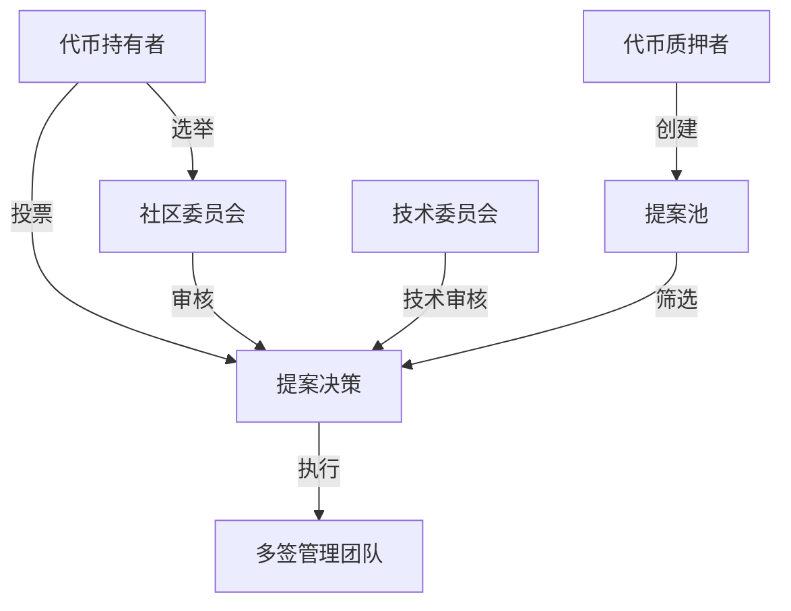
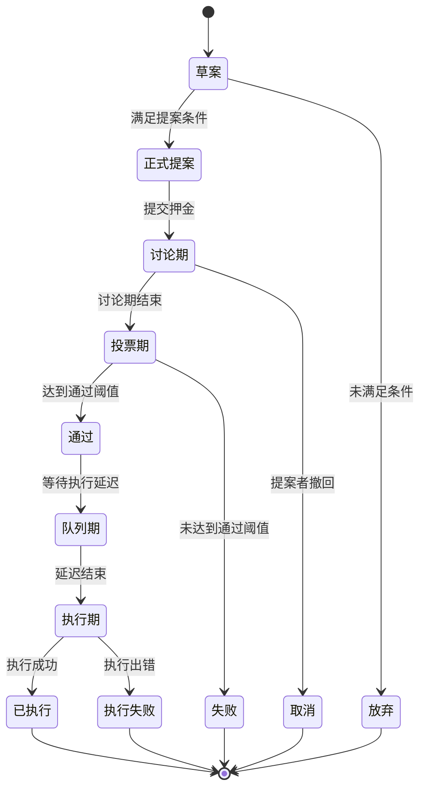

# CultureBridge 治理系统详细设计

## 1. 治理系统概述

本文档详细定义了CultureBridge代币(CBT)生态系统的治理机制，包括治理架构、提案流程、投票机制和执行框架，为智能合约开发和前端实现提供明确指导。

## 2. 治理架构

### 2.1 治理参与者角色

| 角色 | 定义 | 权限 | 责任 |
|------|------|------|------|
| 代币持有者 | 持有CBT代币的用户 | 基础投票权 | 参与投票，监督生态系统 |
| 代币质押者 | 质押CBT代币的用户 | 增强投票权，可获得提案权 | 积极参与治理，长期支持生态系统 |
| 提案发起者 | 满足提案条件的用户 | 创建提案，引导社区讨论 | 提出有价值的改进建议，回应社区反馈 |
| 社区委员会 | 由社区选举产生的代表 | 提案审核，紧急决策权 | 维护生态系统健康，代表社区利益 |
| 技术委员会 | 核心开发团队成员 | 技术提案审核，实施支持 | 确保技术可行性，执行技术升级 |
| 多签管理团队 | 管理关键合约和资金的团队 | 执行已通过提案，紧急安全响应 | 安全管理资金，透明执行决策 |

### 2.2 治理层级结构



### 2.3 治理权力分配

| 决策类型 | 决策机制 | 执行机制 | 监督机制 |
|---------|---------|---------|---------|
| 参数调整 | 社区投票 | 自动执行 | 链上透明记录 |
| 功能升级 | 社区投票+技术委员会审核 | 多签执行 | 链上透明记录+社区监督 |
| 资金分配 | 社区投票+社区委员会审核 | 多签执行 | 链上透明记录+定期审计 |
| 紧急安全措施 | 技术委员会+多签团队 | 多签执行 | 事后社区追认+透明报告 |
| 社区规则 | 社区投票 | 社区委员会执行 | 社区监督 |
| 战略方向 | 社区投票+社区委员会 | 多方协作执行 | 定期进度报告 |

## 3. 提案系统

### 3.1 提案类型与要求

| 提案类型 | 描述 | 提案门槛 | 投票期 | 通过阈值 | 执行延迟 |
|---------|------|---------|--------|---------|---------|
| 参数调整提案 | 调整经济模型参数 | 100,000 CBT | 5天 | 50% | 24小时 |
| 功能升级提案 | 升级合约功能 | 100,000 CBT | 7天 | 67% | 48小时 |
| 资金分配提案 | 分配生态系统资金 | 100,000 CBT | 7天 | 67% | 48小时 |
| 紧急安全提案 | 处理安全问题 | 200,000 CBT | 2天 | 75% | 6小时 |
| 社区活动提案 | 组织社区活动 | 50,000 CBT | 5天 | 50% | 24小时 |
| 合作伙伴提案 | 与外部项目合作 | 100,000 CBT | 7天 | 67% | 48小时 |
| 治理规则修改提案 | 修改治理规则 | 200,000 CBT | 10天 | 75% | 72小时 |

### 3.2 提案生命周期



### 3.3 提案创建流程

1. **草案阶段**
   - 在社区论坛发布草案
   - 收集初步反馈
   - 完善提案内容

2. **提案提交**
   - 确认持有足够代币或满足质押条件
   - 准备提案内容（包括描述、理由、具体实施方案）
   - 提交提案押金

3. **讨论期**
   - 为期48小时的社区讨论
   - 提案者回应问题和关注点
   - 可根据反馈调整提案细节

4. **正式投票**
   - 讨论期结束后自动进入投票期
   - 根据提案类型确定投票期长度
   - 投票期间不可修改提案内容

### 3.4 提案内容模板

```
# 提案标题

## 提案编号
[自动生成]

## 提案类型
[参数调整/功能升级/资金分配/紧急安全/社区活动/合作伙伴/治理规则修改]

## 提案者
[地址]

## 提案摘要
[200字以内的提案概述]

## 背景与动机
[详细说明提案背景和提出的原因]

## 具体方案
[详细的实施方案，包括技术细节、参数变更、资金使用计划等]

## 预期影响
[提案实施后对生态系统的预期影响]

## 替代方案
[考虑过的其他解决方案及其优缺点比较]

## 实施时间表
[提案通过后的具体实施步骤和时间安排]

## 成功指标
[如何衡量提案实施的成功与否]
```

## 4. 投票机制

### 4.1 投票权重计算

基础投票权重计算公式：
```
投票权重 = 持有代币数量 × (1 + 质押乘数 + 持有时间乘数)
```

其中：
- 质押乘数 = 质押状态 ? 0.5 : 0
- 持有时间乘数 = min(持有月数 × 0.033, 1.0)

### 4.2 投票类型

| 投票类型 | 描述 | 适用场景 |
|---------|------|---------|
| 二元投票 | 简单的赞成/反对投票 | 简单参数调整，明确的决策 |
| 多选投票 | 从多个选项中选择 | 多方案比较，资源分配 |
| 加权投票 | 分配投票权重到多个选项 | 复杂决策，偏好排序 |
| 二次投票 | 投票成本按投票数量的平方增加 | 防止鲸鱼操控，公平决策 |

### 4.3 投票激励机制

| 激励类型 | 数量 | 条件 | 目的 |
|---------|------|------|------|
| 基础投票奖励 | 5 CBT | 参与任何提案投票 | 鼓励基本参与 |
| 重要提案奖励 | 20 CBT | 参与重要提案投票 | 提高关键决策参与度 |
| 投票权重奖励 | 总投票代币量的0.1% | 按投票权重比例分配 | 奖励高质量参与 |
| 连续参与奖励 | 基础奖励×(1+连续参与次数×0.1) | 连续参与投票 | 鼓励持续参与 |
| 投票理由奖励 | 额外5 CBT | 提供有意义的投票理由 | 促进深度思考和讨论 |

### 4.4 投票委托机制

1. **委托模式**
   - 全权委托：将全部投票权委托给受托人
   - 部分委托：将部分投票权委托给受托人
   - 条件委托：根据特定条件自动委托

2. **委托规则**
   - 委托人可随时更改或撤销委托
   - 受托人投票时自动使用委托票数
   - 委托关系公开透明，记录在链上
   - 受托人可获得委托票数10%的额外投票奖励

3. **受托人资格**
   - 持有至少50,000 CBT
   - 参与过至少10次投票
   - 社区信誉良好（无恶意行为记录）

## 5. 执行框架

### 5.1 提案执行流程

1. **提案通过确认**
   - 系统自动确认投票结果
   - 验证是否达到通过阈值
   - 进入执行延迟期

2. **执行准备**
   - 技术团队准备实施方案
   - 多签团队准备执行交易
   - 社区公告即将执行的变更

3. **执行操作**
   - 根据提案类型选择执行方式
   - 参数调整：自动执行
   - 合约升级：多签执行
   - 资金分配：多签执行

4. **执行确认**
   - 链上验证执行结果
   - 发布执行成功公告
   - 更新治理记录

### 5.2 多签管理机制

| 多签类型 | 签名要求 | 管理范围 | 成员组成 |
|---------|---------|---------|---------|
| 核心合约多签 | 5/7 | 合约升级，参数调整 | 3开发团队+2社区委员会+2独立审计方 |
| 资金多签 | 4/6 | 生态系统资金分配 | 2开发团队+2社区委员会+2独立财务顾问 |
| 紧急响应多签 | 3/5 | 安全漏洞修复 | 3开发团队+2安全专家 |

### 5.3 执行透明度机制

1. **执行前公示**
   - 提案通过后，执行前公示具体执行计划
   - 包括执行时间、具体操作、预期结果
   - 公示期不少于执行延迟期的50%

2. **执行过程记录**
   - 所有执行操作记录在链上
   - 关键执行步骤实时更新到社区
   - 执行交易哈希公开可查

3. **执行后报告**
   - 执行完成后48小时内发布详细报告
   - 包括执行结果、实际影响、与预期对比
   - 如有偏差，说明原因及应对措施

## 6. 治理界面设计

### 6.1 治理门户功能

| 功能模块 | 主要功能 | 用户交互 |
|---------|---------|---------|
| 提案浏览 | 查看所有提案及状态 | 筛选、排序、搜索 |
| 提案详情 | 查看提案详细内容和投票情况 | 阅读、评论、分享 |
| 投票界面 | 对提案进行投票 | 选择投票类型，提供理由 |
| 提案创建 | 创建新提案 | 填写提案模板，预览 |
| 个人治理中心 | 查看个人投票历史、委托关系 | 管理委托，查看奖励 |
| 治理数据分析 | 查看治理活动统计和趋势 | 图表交互，数据导出 |
| 社区讨论 | 参与提案讨论 | 评论、回复、点赞 |

### 6.2 移动端治理适配

| 功能 | 移动端优化 | 特殊考虑 |
|------|-----------|---------|
| 提案浏览 | 卡片式布局，无限滚动 | 数据预加载，离线缓存 |
| 投票操作 | 简化投票流程，大按钮设计 | 生物识别确认，防误触 |
| 提案通知 | 推送通知，状态更新 | 可自定义通知类型 |
| 快速投票 | 一键投票功能 | 委托投票优先提示 |
| 治理概览 | 数据可视化，关键信息优先 | 适配不同屏幕尺寸 |

### 6.3 用户体验设计原则

1. **简明易懂**
   - 使用通俗语言解释复杂概念
   - 提供交互式教程和帮助
   - 视觉化展示投票影响

2. **透明公正**
   - 所有数据实时更新
   - 投票过程完全透明
   - 提供详细的审计日志

3. **参与便捷**
   - 降低参与门槛
   - 多渠道参与方式
   - 智能推荐相关提案

4. **教育引导**
   - 内置治理知识库
   - 提案影响预测工具
   - 新用户引导流程

## 7. 治理安全与风险控制

### 7.1 治理攻击防御

| 攻击类型 | 防御机制 | 实施方法 |
|---------|---------|---------|
| 闪电贷攻击 | 投票锁定期 | 投票前需锁定代币至少24小时 |
| 鲸鱼操控 | 投票权重上限 | 单一地址最大投票权重不超过总投票权的10% |
| 贿赂攻击 | 匿名投票选项 | 用户可选择匿名投票模式 |
| 女巫攻击 | 最低参与门槛 | 投票需持有至少100 CBT |
| 投票疲劳 | 提案整合机制 | 相似提案自动合并或排队 |

### 7.2 争议解决机制

1. **争议识别**
   - 自动识别高争议提案（赞成/反对接近50%）
   - 社区标记存在争议的提案
   - 委员会审核争议标记

2. **调解流程**
   - 暂停争议提案执行
   - 组织社区圆桌讨论
   - 邀请中立方参与调解

3. **升级处理**
   - 修改提案重新投票
   - 分阶段实施有争议部分
   - 在测试网先行验证

### 7.3 紧急治理机制

| 紧急情况 | 响应机制 | 授权范围 | 后续流程 |
|---------|---------|---------|---------|
| 安全漏洞 | 紧急多签响应 | 暂停受影响功能，部署修复 | 72小时内提交追认提案 |
| 市场异常 | 参数保护机制 | 触发预设保护参数 | 社区紧急会议，提交调整提案 |
| 外部攻击 | 防御模式激活 | 限制敏感操作，增强验证 | 安全评估报告，恢复正常提案 |
| 技术故障 | 回滚机制 | 回滚到最近稳定状态 | 技术分析报告，修复提案 |

## 8. 治理演进路线图

### 8.1 初始治理阶段（上线-6个月）

- **核心特点**：简化治理，开发团队引导
- **主要目标**：建立基础治理框架，培养社区参与习惯
- **关键机制**：
  - 降低提案门槛（50,000 CBT）
  - 简化提案类型（参数调整、功能建议）
  - 开发团队拥有一定否决权
  - 基础投票奖励提高50%

### 8.2 过渡治理阶段（6-12个月）

- **核心特点**：逐步去中心化，社区能力建设
- **主要目标**：培养社区自治能力，建立健全治理流程
- **关键机制**：
  - 标准提案门槛（100,000 CBT）
  - 首次社区委员会选举
  - 引入多样化提案类型
  - 开发团队否决权降低
  - 委托投票机制上线

### 8.3 成熟治理阶段（12个月以后）

- **核心特点**：完全社区自治，专业治理
- **主要目标**：高效、安全、创新的治理生态
- **关键机制**：
  - 分层治理结构完全实施
  - 专业委员会体系建立
  - 高级投票机制（二次投票等）
  - 跨链治理合作探索
  - 治理分析工具与AI辅助

### 8.4 治理创新探索

| 创新方向 | 描述 | 预计实施时间 |
|---------|------|------------|
| 声誉系统 | 基于参与质量建立声誉积分 | 9-12个月 |
| 预测市场 | 结合提案的预测市场机制 | 12-18个月 |
| 流动民主 | 动态委托与专业代表机制 | 18-24个月 |
| 跨链治理 | 与其他项目的治理互操作性 | 24-36个月 |
| AI辅助治理 | 智能提案分析与影响评估 | 18-24个月 |

## 9. 治理智能合约接口

### 9.1 核心治理合约接口

```solidity
// SPDX-License-Identifier: MIT
pragma solidity ^0.8.17;

interface ICultureBridgeGovernance {
    // 提案管理
    function propose(
        string calldata title,
        string calldata description,
        bytes[] calldata calldatas,
        address[] calldata targets,
        uint8 proposalType
    ) external returns (uint256 proposalId);
    
    function cancelProposal(uint256 proposalId) external;
    
    // 投票功能
    function castVote(uint256 proposalId, uint8 support) external;
    function castVoteWithReason(uint256 proposalId, uint8 support, string calldata reason) external;
    function castVoteBySignature(uint256 proposalId, uint8 support, uint8 v, bytes32 r, bytes32 s) external;
    
    // 提案执行
    function queueProposal(uint256 proposalId) external;
    function executeProposal(uint256 proposalId) external;
    
    // 查询功能
    function getProposalState(uint256 proposalId) external view returns (uint8);
    function getProposalDetails(uint256 proposalId) external view returns (
        address proposer,
        string memory title,
        string memory description,
        uint256 startBlock,
        uint256 endBlock,
        uint256 forVotes,
        uint256 againstVotes,
        uint256 abstainVotes,
        bool executed,
        bool canceled
    );
    function getVotingPower(address account) external view returns (uint256);
    function hasVoted(uint256 proposalId, address account) external view returns (bool);
    
    // 治理参数管理
    function setVotingDelay(uint256 newVotingDelay) external;
    function setVotingPeriod(uint256 newVotingPeriod) external;
    function setProposalThreshold(uint256 newProposalThreshold) external;
    function setQuorumVotes(uint256 newQuorumVotes) external;
    
    // 事件
    event ProposalCreated(
        uint256 indexed proposalId,
        address indexed proposer,
        string title,
        string description,
        uint8 proposalType,
        uint256 startBlock,
        uint256 endBlock
    );
    event VoteCast(
        address indexed voter,
        uint256 indexed proposalId,
        uint8 support,
        uint256 weight,
        string reason
    );
    event ProposalCanceled(uint256 indexed proposalId);
    event ProposalQueued(uint256 indexed proposalId, uint256 eta);
    event ProposalExecuted(uint256 indexed proposalId);
    event GovernanceParameterUpdated(string paramName, uint256 oldValue, uint256 newValue);
}
```

### 9.2 投票委托合约接口

```solidity
// SPDX-License-Identifier: MIT
pragma solidity ^0.8.17;

interface IVotingDelegation {
    // 委托管理
    function delegate(address delegatee) external;
    function delegateBySig(address delegatee, uint256 nonce, uint256 expiry, uint8 v, bytes32 r, bytes32 s) external;
    
    // 部分委托
    function delegatePartial(address delegatee, uint256 amount) external;
    function undelegatePartial(address delegatee, uint256 amount) external;
    
    // 条件委托
    function delegateWithCondition(
        address delegatee,
        uint8 proposalType,
        bool active,
        uint256 expiryBlock
    ) external;
    
    // 查询功能
    function delegates(address delegator) external view returns (address);
    function getPartialDelegation(address delegator, address delegatee) external view returns (uint256);
    function getConditionalDelegation(
        address delegator,
        address delegatee,
        uint8 proposalType
    ) external view returns (bool active, uint256 expiryBlock);
    function getCurrentVotes(address account) external view returns (uint256);
    function getPriorVotes(address account, uint256 blockNumber) external view returns (uint256);
    
    // 事件
    event DelegateChanged(address indexed delegator, address indexed fromDelegate, address indexed toDelegate);
    event PartialDelegateChanged(
        address indexed delegator,
        address indexed delegatee,
        uint256 previousAmount,
        uint256 newAmount
    );
    event ConditionalDelegateChanged(
        address indexed delegator,
        address indexed delegatee,
        uint8 proposalType,
        bool active,
        uint256 expiryBlock
    );
    event DelegateVotesChanged(address indexed delegate, uint256 previousBalance, uint256 newBalance);
}
```

### 9.3 治理时间锁合约接口

```solidity
// SPDX-License-Identifier: MIT
pragma solidity ^0.8.17;

interface IGovernanceTimelock {
    // 队列和执行
    function queueTransaction(
        address target,
        uint256 value,
        string calldata signature,
        bytes calldata data,
        uint256 eta
    ) external returns (bytes32 txHash);
    
    function executeTransaction(
        address target,
        uint256 value,
        string calldata signature,
        bytes calldata data,
        uint256 eta
    ) external payable returns (bytes memory);
    
    function cancelTransaction(
        address target,
        uint256 value,
        string calldata signature,
        bytes calldata data,
        uint256 eta
    ) external;
    
    // 紧急操作
    function emergencyExecute(
        address target,
        uint256 value,
        string calldata signature,
        bytes calldata data
    ) external payable returns (bytes memory);
    
    // 管理功能
    function setDelay(uint256 newDelay) external;
    function acceptAdmin() external;
    function setPendingAdmin(address newPendingAdmin) external;
    function addEmergencySigner(address signer) external;
    function removeEmergencySigner(address signer) external;
    
    // 查询功能
    function getDelay() external view returns (uint256);
    function getAdmin() external view returns (address);
    function getPendingAdmin() external view returns (address);
    function isEmergencySigner(address signer) external view returns (bool);
    function isQueuedTransaction(bytes32 txHash) external view returns (bool);
    
    // 事件
    event QueueTransaction(bytes32 indexed txHash, address indexed target, uint256 value, string signature, bytes data, uint256 eta);
    event ExecuteTransaction(bytes32 indexed txHash, address indexed target, uint256 value, string signature, bytes data);
    event CancelTransaction(bytes32 indexed txHash, address indexed target, uint256 value, string signature, bytes data);
    event EmergencyExecute(address indexed target, uint256 value, string signature, bytes data);
    event NewDelay(uint256 indexed newDelay);
    event NewAdmin(address indexed newAdmin);
    event NewPendingAdmin(address indexed newPendingAdmin);
    event EmergencySignerAdded(address indexed signer);
    event EmergencySignerRemoved(address indexed signer);
}
```

## 10. 治理实施计划

### 10.1 开发阶段计划

| 阶段 | 时间 | 主要任务 | 负责账号 |
|------|------|---------|---------|
| 设计阶段 | 第1-3天 | 完成治理系统详细设计 | CB-DESIGN |
| 合约开发 | 第4-10天 | 开发核心治理合约 | CB-BACKEND |
| 前端开发 | 第7-14天 | 开发治理界面 | CB-FRONTEND |
| 测试阶段 | 第11-17天 | 合约测试与审计 | CB-AI-TEST |
| 部署准备 | 第18-20天 | 部署准备与文档 | CB-BACKEND |
| 上线准备 | 第21-24天 | 社区教育与宣传 | CB-DESIGN |
| 正式上线 | 第25天 | 治理系统上线 | 所有账号 |

### 10.2 多账号协作计划

| 账号 | 主要职责 | 协作点 |
|------|---------|-------|
| CB-DESIGN | 治理系统设计，参数确定，社区教育 | 与CB-BACKEND协调合约接口，与CB-FRONTEND协调UI设计 |
| CB-BACKEND | 治理合约开发，安全机制实现 | 与CB-AI-TEST协调测试计划，与CB-DESIGN确认参数 |
| CB-FRONTEND | 治理界面开发，用户体验优化 | 与CB-MOBILE协调移动适配，与CB-DESIGN确认UI流程 |
| CB-MOBILE | 移动端治理适配，推送系统 | 与CB-FRONTEND协调组件共享，与CB-FEATURES协调功能集成 |
| CB-AI-TEST | 治理合约测试，安全审计 | 与CB-BACKEND协调测试用例，与CB-FEATURES协调功能测试 |
| CB-FEATURES | 治理与其他功能集成 | 与所有账号协调功能边界和接口 |

### 10.3 上线后运营计划

| 阶段 | 活动 | 目标 | 负责账号 |
|------|------|------|---------|
| 第1个月 | 治理教育活动 | 提高用户参与度 | CB-DESIGN |
| 第2个月 | 首次社区提案活动 | 测试治理流程 | CB-DESIGN, CB-FEATURES |
| 第3个月 | 治理参与激励活动 | 扩大参与基础 | CB-FEATURES, CB-FRONTEND |
| 第4-6个月 | 治理数据分析与优化 | 改进治理效率 | CB-AI-TEST, CB-BACKEND |
| 第6个月 | 首次社区委员会选举 | 推进去中心化 | 所有账号 |

## 11. 结论

本文档详细定义了CultureBridge代币生态系统的治理机制，为智能合约开发和前端实现提供明确指导。通过精心设计的治理架构、提案系统、投票机制和执行框架，CultureBridge将建立一个透明、公正、高效的社区自治系统，确保项目的长期健康发展。

治理系统将随着项目的发展逐步演进，从初始的简化治理到最终的完全社区自治，培养社区的治理能力，并不断探索创新的治理机制。开发团队将基于这些设计实现相应的智能合约和前端功能，并在测试网进行充分验证后部署到主网。
