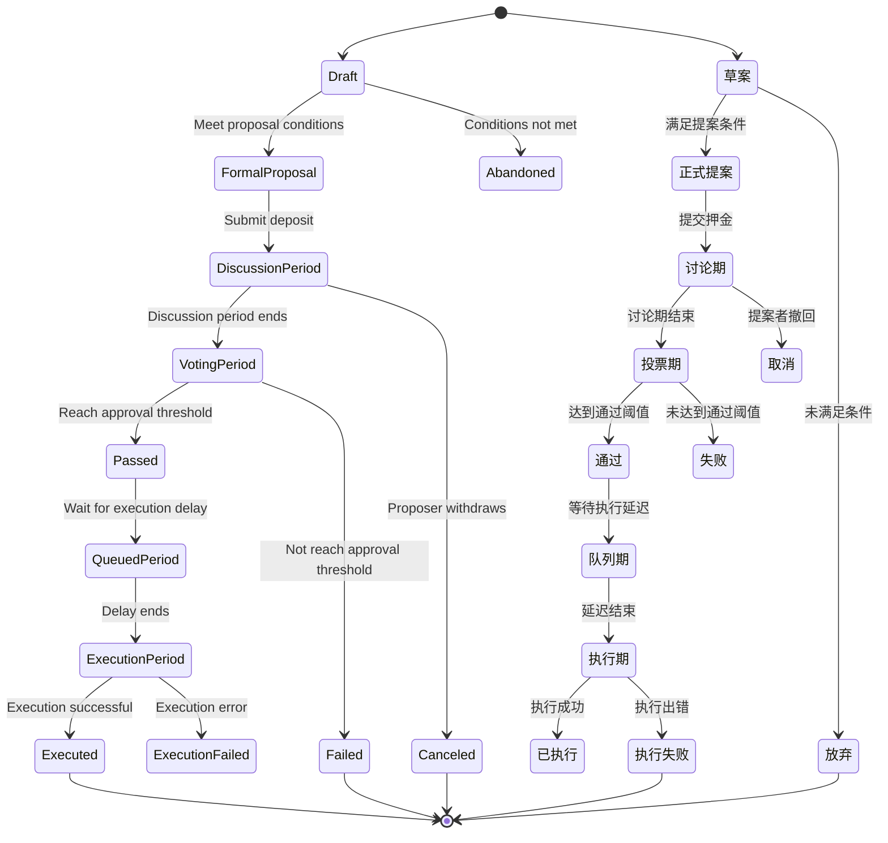

# CultureBridge Governance System Detailed Design
# CultureBridge 治理系统详细设计

## 1. Governance System Overview
## 1. 治理系统概述

This document defines in detail the governance mechanism of the CultureBridge Token (CBT) ecosystem, including governance architecture, proposal process, voting mechanism, and execution framework, providing clear guidance for smart contract development and frontend implementation.
本文档详细定义了CultureBridge代币(CBT)生态系统的治理机制，包括治理架构、提案流程、投票机制和执行框架，为智能合约开发和前端实现提供明确指导。

## 2. Governance Architecture
## 2. 治理架构

### 2.1 Governance Participant Roles
### 2.1 治理参与者角色

| Role | Definition | Permissions | Responsibilities |
|------|------------|-------------|------------------|
| Token Holder | Users holding CBT tokens | Basic voting rights | Participate in voting, oversee the ecosystem |
| 代币持有者 | 持有CBT代币的用户 | 基础投票权 | 参与投票，监督生态系统 |
| Token Staker | Users staking CBT tokens | Enhanced voting rights, can propose | Actively participate in governance, long-term support for the ecosystem |
| 代币质押者 | 质押CBT代币的用户 | 增强投票权，可获得提案权 | 积极参与治理，长期支持生态系统 |
| Proposer | Users meeting proposal conditions | Create proposals, guide community discussion | Propose valuable improvements, respond to community feedback |
| 提案发起者 | 满足提案条件的用户 | 创建提案，引导社区讨论 | 提出有价值的改进建议，回应社区反馈 |
| Community Committee | Representatives elected by the community | Proposal review, emergency decision-making power | Maintain ecosystem health, represent community interests |
| 社区委员会 | 由社区选举产生的代表 | 提案审核，紧急决策权 | 维护生态系统健康，代表社区利益 |
| Technical Committee | Core development team members | Technical proposal review, implementation support | Ensure technical feasibility, execute technical upgrades |
| 技术委员会 | 核心开发团队成员 | 技术提案审核，实施支持 | 确保技术可行性，执行技术升级 |
| Multi-sig Management Team | Team managing key contracts and funds | Execute approved proposals, emergency security response | Securely manage funds, transparently execute decisions |
| 多签管理团队 | 管理关键合约和资金的团队 | 执行已通过提案，紧急安全响应 | 安全管理资金，透明执行决策 |

### 2.2 Governance Hierarchy
### 2.2 治理层级结构


### 2.3 Governance Power Distribution
### 2.3 治理权力分配

| Decision Type | Decision Mechanism | Execution Mechanism | Oversight Mechanism |
|---------------|--------------------|---------------------|--------------------|
| Parameter Adjustment | Community Vote | Automatic Execution | On-chain transparent record |
| 参数调整 | 社区投票 | 自动执行 | 链上透明记录 |
| Feature Upgrade | Community Vote + Technical Committee Review | Multi-sig Execution | On-chain transparent record + Community oversight |
| 功能升级 | 社区投票+技术委员会审核 | 多签执行 | 链上透明记录+社区监督 |
| Fund Allocation | Community Vote + Community Committee Review | Multi-sig Execution | On-chain transparent record + Regular audit |
| 资金分配 | 社区投票+社区委员会审核 | 多签执行 | 链上透明记录+定期审计 |
| Emergency Security Measures | Technical Committee + Multi-sig Team | Multi-sig Execution | Post-hoc community ratification + Transparent report |
| 紧急安全措施 | 技术委员会+多签团队 | 多签执行 | 事后社区追认+透明报告 |
| Community Rules | Community Vote | Community Committee Execution | Community oversight |
| 社区规则 | 社区投票 | 社区委员会执行 | 社区监督 |
| Strategic Direction | Community Vote + Community Committee | Multi-party collaborative execution | Regular progress reports |
| 战略方向 | 社区投票+社区委员会 | 多方协作执行 | 定期进度报告 |

## 3. Proposal System
## 3. 提案系统

### 3.1 Proposal Types and Requirements
### 3.1 提案类型与要求

| Proposal Type | Description | Proposal Threshold | Voting Period | Approval Threshold | Execution Delay |
|---------------|-------------|--------------------|---------------|--------------------|-----------------|
| Parameter Adjustment Proposal | Adjust economic model parameters | 100,000 CBT | 5 days | 50% | 24 hours |
| 参数调整提案 | 调整经济模型参数 | 100,000 CBT | 5天 | 50% | 24小时 |
| Feature Upgrade Proposal | Upgrade contract functionality | 100,000 CBT | 7 days | 67% | 48 hours |
| 功能升级提案 | 升级合约功能 | 100,000 CBT | 7天 | 67% | 48小时 |
| Fund Allocation Proposal | Allocate ecosystem funds | 100,000 CBT | 7 days | 67% | 48 hours |
| 资金分配提案 | 分配生态系统资金 | 100,000 CBT | 7天 | 67% | 48小时 |
| Emergency Security Proposal | Handle security issues | 200,000 CBT | 2 days | 75% | 6 hours |
| 紧急安全提案 | 处理安全问题 | 200,000 CBT | 2天 | 75% | 6小时 |
| Community Activity Proposal | Organize community activities | 50,000 CBT | 5 days | 50% | 24 hours |
| 社区活动提案 | 组织社区活动 | 50,000 CBT | 5天 | 50% | 24小时 |
| Partnership Proposal | Partner with external projects | 100,000 CBT | 7 days | 67% | 48 hours |
| 合作伙伴提案 | 与外部项目合作 | 100,000 CBT | 7天 | 67% | 48小时 |
| Governance Rule Modification Proposal | Modify governance rules | 200,000 CBT | 10 days | 75% | 72 hours |
| 治理规则修改提案 | 修改治理规则 | 200,000 CBT | 10天 | 75% | 72小时 |

### 3.2 Proposal Lifecycle
### 3.2 提案生命周期



### 3.3 Proposal Creation Process
### 3.3 提案创建流程

1. **Draft Stage**
1. **草案阶段**
   - Publish draft in community forum
   - 在社区论坛发布草案
   - Collect initial feedback
   - 收集初步反馈
   - Refine proposal content
   - 完善提案内容

2. **Proposal Submission**
2. **提案提交**
   - Confirm holding enough tokens or meeting staking conditions
   - 确认持有足够代币或满足质押条件
   - Prepare proposal content (including description, rationale, specific implementation plan)
   - 准备提案内容（包括描述、理由、具体实施方案）
   - Submit proposal deposit
   - 提交提案押金

3. **Discussion Period**
3. **讨论期**
   - 48-hour community discussion
   - 为期48小时的社区讨论
   - Proposer responds to questions and concerns
   - 提案者回应问题和关注点
   - Proposal details can be adjusted based on feedback
   - 可根据反馈调整提案细节

4. **Formal Voting**
4. **正式投票**
   - Automatically enters voting period after discussion period ends
   - 讨论期结束后自动进入投票期
   - Voting period length determined by proposal type
   - 根据提案类型确定投票期长度
   - Proposal content cannot be modified during voting period
   - 投票期间不可修改提案内容

### 3.4 Proposal Content Template
### 3.4 提案内容模板

```
# Proposal Title
# 提案标题

## Proposal ID
## 提案编号
[Auto-generated]
[自动生成]

## Proposal Type
## 提案类型
[Parameter Adjustment/Feature Upgrade/Fund Allocation/Emergency Security/Community Activity/Partnership/Governance Rule Modification]
[参数调整/功能升级/资金分配/紧急安全/社区活动/合作伙伴/治理规则修改]

## Proposer
## 提案者
[Address]
[地址]

## Proposal Summary
## 提案摘要
[Proposal overview within 200 words]
[200字以内的提案概述]

## Background and Motivation
## 背景与动机
[Detailed explanation of proposal background and reasons for proposing]
[详细说明提案背景和提出的原因]

## Specific Plan
## 具体方案
[Detailed implementation plan, including technical details, parameter changes, fund usage plan, etc.]
[详细的实施方案，包括技术细节、参数变更、资金使用计划等]

## Expected Impact
## 预期影响
[Expected impact on the ecosystem after proposal implementation]
[提案实施后对生态系统的预期影响]

## Alternatives
## 替代方案
[Other considered solutions and their pros and cons comparison]
[考虑过的其他解决方案及其优缺点比较]

## Implementation Timeline
## 实施时间表
[Specific implementation steps and timeline after proposal approval]
[提案通过后的具体实施步骤和时间安排]

## Success Metrics
## 成功指标
[How to measure the success of proposal implementation]
[如何衡量提案实施的成功与否]
```

## 4. Voting Mechanism
## 4. 投票机制

### 4.1 Voting Weight Calculation
### 4.1 投票权重计算

Basic voting weight calculation formula:
基础投票权重计算公式：
```
Voting Weight = Number of tokens held × (1 + Staking Multiplier + Holding Time Multiplier)
投票权重 = 持有代币数量 × (1 + 质押乘数 + 持有时间乘数)
```

Where:
其中：
- Staking Multiplier = Staking status ? 0.5 : 0
- 质押乘数 = 质押状态 ? 0.5 : 0
- Holding Time Multiplier = min(Number of holding months × 0.033, 1.0)
- 持有时间乘数 = min(持有月数 × 0.033, 1.0)

### 4.2 Voting Types
### 4.2 投票类型

| Voting Type | Description | Applicable Scenarios |
|-------------|-------------|----------------------|
| Binary Voting | Simple yes/no vote | Simple parameter adjustment, clear decisions |
| 二元投票 | 简单的赞成/反对投票 | 简单参数调整，明确的决策 |
| Multiple Choice Voting | Choose from multiple options | Multi-option comparison, resource allocation |
| 多选投票 | 从多个选项中选择 | 多方案比较，资源分配 |
| Weighted Voting | Allocate voting weight to multiple options | Complex decisions, preference ranking |
| 加权投票 | 分配投票权重到多个选项 | 复杂决策，偏好排序 |
| Quadratic Voting | Voting cost increases quadratically with vote quantity | Prevent whale manipulation, fair decision-making |
| 二次投票 | 投票成本按投票数量的平方增加 | 防止鲸鱼操控，公平决策 |

### 4.3 Voting Incentive Mechanism
### 4.3 投票激励机制

| Incentive Type | Amount | Conditions | Purpose |
|----------------|--------|------------|---------|
| Basic Voting Reward | 5 CBT | Participate in any proposal vote | Encourage basic participation |
| 基础投票奖励 | 5 CBT | 参与任何提案投票 | 鼓励基本参与 |
| Important Proposal Reward | 20 CBT | Participate in important proposal vote | Increase participation in key decisions |
| 重要提案奖励 | 20 CBT | 参与重要提案投票 | 提高关键决策参与度 |
| Voting Weight Reward | 0.1% of total voted tokens | Distributed proportionally by voting weight | Reward high-quality participation |
| 投票权重奖励 | 总投票代币量的0.1% | 按投票权重比例分配 | 奖励高质量参与 |
| Continuous Participation Reward | Basic reward × (1 + number of continuous participations × 0.1) | Continuous participation in voting | Encourage continuous participation |
| 连续参与奖励 | 基础奖励×(1+连续参与次数×0.1) | 连续参与投票 | 鼓励持续参与 |
| Voting Reason Reward | Additional 5 CBT | Provide meaningful voting reasons | Promote in-depth thinking and discussion |
| 投票理由奖励 | 额外5 CBT | 提供有意义的投票理由 | 促进深度思考和讨论 |

### 4.4 Voting Delegation Mechanism
### 4.4 投票委托机制

1. **Delegation Modes**
1. **委托模式**
   - Full Delegation: Delegate all voting rights to the delegatee
   - 全权委托：将全部投票权委托给受托人
   - Partial Delegation: Delegate part of the voting rights to the delegatee
   - 部分委托：将部分投票权委托给受托人
   - Conditional Delegation: Automatically delegate based on specific conditions
   - 条件委托：根据特定条件自动委托

2. **Delegation Rules**
2. **委托规则**
   - Delegators can change or revoke delegation at any time
   - 委托人可随时更改或撤销委托
   - Delegatees automatically use delegated votes when voting
   - 受托人投票时自动使用委托票数
   - Delegation relationships are public and transparent, recorded on-chain
   - 委托关系公开透明，记录在链上
   - Delegatees can receive an additional 10% voting reward for delegated votes
   - 受托人可获得委托票数10%的额外投票奖励

3. **Delegate Qualifications**
3. **受托人资格**
   - Hold at least 50,000 CBT
   - 持有至少50,000 CBT
   - Participated in at least 10 votes
   - 参与过至少10次投票
   - Good community reputation (no record of malicious behavior)
   - 社区信誉良好（无恶意行为记录）

## 5. Execution Framework
## 5. 执行框架

### 5.1 Proposal Execution Process
### 5.1 提案执行流程

1. **Proposal Approval Confirmation**
1. **提案通过确认**
   - System automatically confirms voting results
   - 系统自动确认投票结果
   - Verify if approval threshold is met
   - 验证是否达到通过阈值
   - Enter execution delay period
   - 进入执行延迟期

2. **Execution Preparation**
2. **执行准备**
   - Technical team prepares implementation plan
   - 技术团队准备实施方案
   - Multi-sig team prepares execution transaction
   - 多签团队准备执行交易
   - Community announcement of upcoming changes
   - 社区公告即将执行的变更

3. **Execution Operation**
3. **执行操作**
   - Select execution method based on proposal type
   - 根据提案类型选择执行方式
   - Parameter adjustment: automatic execution
   - 参数调整：自动执行
   - Contract upgrade: multi-sig execution
   - 合约升级：多签执行
   - Fund allocation: multi-sig execution
   - 资金分配：多签执行

4. **Execution Confirmation**
4. **执行确认**
   - On-chain verification of execution results
   - 链上验证执行结果
   - Publish execution success announcement
   - 发布执行成功公告
   - Update governance records
   - 更新治理记录

### 5.2 Multi-sig Management Mechanism
### 5.2 多签管理机制

| Multi-sig Type | Signature Requirements | Management Scope | Member Composition |
|----------------|------------------------|------------------|--------------------|
| Core Contract Multi-sig | 5/7 | Contract upgrade, parameter adjustment | 3 Dev Team + 2 Community Committee + 2 Independent Auditors |
| 核心合约多签 | 5/7 | 合约升级，参数调整 | 3开发团队+2社区委员会+2独立审计方 |
| Fund Multi-sig | 4/6 | Ecosystem fund allocation | 2 Dev Team + 2 Community Committee + 2 Independent Financial Advisors |
| 资金多签 | 4/6 | 生态系统资金分配 | 2开发团队+2社区委员会+2独立财务顾问 |
| Emergency Response Multi-sig | 3/5 | Security vulnerability fix | 3 Dev Team + 2 Security Experts |
| 紧急响应多签 | 3/5 | 安全漏洞修复 | 3开发团队+2安全专家 |

### 5.3 Execution Transparency Mechanism
### 5.3 执行透明度机制

1. **Pre-execution Public Notice**
1. **执行前公示**
   - After proposal approval, public notice of specific execution plan before execution
   - 提案通过后，执行前公示具体执行计划
   - Includes execution time, specific operations, expected results
   - 包括执行时间、具体操作、预期结果
   - Public notice period no less than 50% of execution delay period
   - 公示期不少于执行延迟期的50%

2. **Execution Process Recording**
2. **执行过程记录**
   - All execution operations recorded on-chain
   - 所有执行操作记录在链上
   - Key execution steps updated to community in real-time
   - 关键执行步骤实时更新到社区
   - Execution transaction hash publicly verifiable
   - 执行交易哈希公开可查

3. **Post-execution Report**
3. **执行后报告**
   - Detailed report published within 48 hours after execution
   - 执行完成后48小时内发布详细报告
   - Includes execution results, actual impact, comparison with expectations
   - 包括执行结果、实际影响、与预期对比
   - If there is a deviation, explain reasons and countermeasures
   - 如有偏差，说明原因及应对措施

## 6. Governance Interface Design
## 6. 治理界面设计

### 6.1 Governance Portal Functions
### 6.1 治理门户功能

| Function Module | Main Functions | User Interaction |
|-----------------|----------------|------------------|
| Proposal Browsing | View all proposals and their status | Filter, sort, search |
| 提案浏览 | 查看所有提案及状态 | 筛选、排序、搜索 |
| Proposal Details | View detailed proposal content and voting status | Read, comment, share |
| 提案详情 | 查看提案详细内容和投票情况 | 阅读、评论、分享 |
| Voting Interface | Vote on proposals | Select voting type, provide reasons |
| 投票界面 | 对提案进行投票 | 选择投票类型，提供理由 |
| Proposal Creation | Create new proposals | Fill in proposal template, preview |
| 提案创建 | 创建新提案 | 填写提案模板，预览 |
| Personal Governance Center | View personal voting history, delegation relationships | Manage delegations, view rewards |
| 个人治理中心 | 查看个人投票历史、委托关系 | 管理委托，查看奖励 |
| Governance Data Analysis | View governance activity statistics and trends | Chart interaction, data export |
| 治理数据分析 | 查看治理活动统计和趋势 | 图表交互，数据导出 |
| Community Discussion | Participate in proposal discussion | Comment, reply, like |
| 社区讨论 | 参与提案讨论 | 评论、回复、点赞 |

### 6.2 Mobile Governance Adaptation
### 6.2 移动端治理适配

| Function | Mobile Optimization | Special Considerations |
|----------|---------------------|------------------------|
| Proposal Browsing | Card layout, infinite scrolling | Data preloading, offline caching |
| 提案浏览 | 卡片式布局，无限滚动 | 数据预加载，离线缓存 |
| Voting Operations | Simplified voting process, large button design | Biometric confirmation, anti-mistouch |
| 投票操作 | 简化投票流程，大按钮设计 | 生物识别确认，防误触 |
| Proposal Notifications | Push notifications, status updates | Customizable notification types |
| 提案通知 | 推送通知，状态更新 | 可自定义通知类型 |
| Quick Voting | One-click voting function | Priority prompt for delegated voting |
| 快速投票 | 一键投票功能 | 委托投票优先提示 |
| Governance Overview | Data visualization, key information priority | Adapt to different screen sizes |
| 治理概览 | 数据可视化，关键信息优先 | 适配不同屏幕尺寸 |

### 6.3 User Experience Design Principles
### 6.3 用户体验设计原则

1. **Simple and Easy to Understand**
1. **简明易懂**
   - Use plain language to explain complex concepts
   - 使用通俗语言解释复杂概念
   - Provide interactive tutorials and help
   - 提供交互式教程和帮助
   - Visualize voting impact
   - 视觉化展示投票影响

2. **Transparent and Fair**
2. **透明公正**
   - All data updated in real-time
   - 所有数据实时更新
   - Voting process fully transparent
   - 投票过程完全透明
   - Provide detailed audit logs
   - 提供详细的审计日志

3. **Convenient Participation**
3. **参与便捷**
   - Lower participation threshold
   - 降低参与门槛
   - Multiple channels for participation
   - 多渠道参与方式
   - Smart recommendation of relevant proposals
   - 智能推荐相关提案

4. **Education and Guidance**
4. **教育引导**
   - Built-in governance knowledge base
   - 内置治理知识库
   - Proposal impact prediction tool
   - 提案影响预测工具
   - New user onboarding process
   - 新用户引导流程

## 7. Governance Security and Risk Control
## 7. 治理安全与风险控制

### 7.1 Governance Attack Defense
### 7.1 治理攻击防御

| Attack Type | Defense Mechanism | Implementation Method |
|-------------|-------------------|-----------------------|
| Flash Loan Attack | Voting lock-up period | Tokens must be locked for at least 24 hours before voting |
| 闪电贷攻击 | 投票锁定期 | 投票前需锁定代币至少24小时 |
| Whale Manipulation | Voting weight cap | Maximum voting weight of a single address not exceeding 10% of total votes |
| 鲸鱼操控 | 投票权重上限 | 单一地址最大投票权重不超过总投票权的10% |
| Bribery Attack | Anonymous voting option | Users can choose anonymous voting mode |
| 贿赂攻击 | 匿名投票选项 | 用户可选择匿名投票模式 |
| Sybil Attack | Minimum participation threshold | Voting requires holding at least 100 CBT |
| 女巫攻击 | 最低参与门槛 | 投票需持有至少100 CBT |
| Voting Fatigue | Proposal integration mechanism | Similar proposals automatically merged or queued |
| 投票疲劳 | 提案整合机制 | 相似提案自动合并或排队 |

### 7.2 Dispute Resolution Mechanism
### 7.2 争议解决机制

1. **Dispute Identification**
1. **争议识别**
   - Automatically identify highly controversial proposals (pro/con close to 50%)
   - 自动识别高争议提案（赞成/反对接近50%）
   - Community flags disputed proposals
   - 社区标记存在争议的提案
   - Committee reviews dispute flags
   - 委员会审核争议标记

2. **Mediation Process**
2. **调解流程**
   - Pause execution of disputed proposals
   - 暂停争议提案执行
   - Organize community round table discussions
   - 组织社区圆桌讨论
   - Invite neutral parties to mediate
   - 邀请中立方参与调解

3. **Escalation Handling**
3. **升级处理**
   - Modify proposal and re-vote
   - 修改提案重新投票
   - Implement controversial parts in phases
   - 分阶段实施有争议部分
   - Verify on testnet first
   - 在测试网先行验证

### 7.3 Emergency Governance Mechanism
### 7.3 紧急治理机制

| Emergency Situation | Response Mechanism | Authorization Scope | Follow-up Process |
|---------------------|--------------------|---------------------|--------------------|
| Security Vulnerability | Emergency multi-sig response | Pause affected functions, deploy fix | Submit ratification proposal within 72 hours |
| 安全漏洞 | 紧急多签响应 | 暂停受影响功能，部署修复 | 72小时内提交追认提案 |
| Market Anomaly | Parameter protection mechanism | Trigger preset protection parameters | Community emergency meeting, submit adjustment proposal |
| 市场异常 | 参数保护机制 | 触发预设保护参数 | 社区紧急会议，提交调整提案 |
| External Attack | Defense mode activation | Restrict sensitive operations, enhance verification | Security assessment report, resume normal proposals |
| 外部攻击 | 防御模式激活 | 限制敏感操作，增强验证 | 安全评估报告，恢复正常提案 |
| Technical Glitch | Rollback mechanism | Rollback to most recent stable state | Technical analysis report, fix proposal |
| 技术故障 | 回滚机制 | 回滚到最近稳定状态 | 技术分析报告，修复提案 |

## 8. Governance Evolution Roadmap
## 8. 治理演进路线图

### 8.1 Initial Governance Phase (Launch - 6 months)
### 8.1 初始治理阶段（上线-6个月）

- **Core Features**: Simplified governance, development team guidance
- **核心特点**：简化治理，开发团队引导
- **Main Goals**: Establish basic governance framework, cultivate community participation habits
- **主要目标**：建立基础治理框架，培养社区参与习惯
- **Key Mechanisms**:
- **关键机制**：
  - Lower proposal threshold (50,000 CBT)
  - 降低提案门槛（50,000 CBT）
  - Simplified proposal types (parameter adjustment, feature suggestions)
  - 简化提案类型（参数调整、功能建议）
  - Development team has certain veto power
  - 开发团队拥有一定否决权
  - Basic voting rewards increased by 50%
  - 基础投票奖励提高50%

### 8.2 Transition Governance Phase (6-12 months)
### 8.2 过渡治理阶段（6-12个月）

- **Core Features**: Gradual decentralization, community capacity building
- **核心特点**：逐步去中心化，社区能力建设
- **Main Goals**: Cultivate community autonomy, establish sound governance processes
- **主要目标**：培养社区自治能力，建立健全治理流程
- **Key Mechanisms**:
- **关键机制**：
  - Standard proposal threshold (100,000 CBT)
  - 标准提案门槛（100,000 CBT）
  - First community committee election
  - 首次社区委员会选举
  - Introduce diversified proposal types
  - 引入多样化提案类型
  - Development team veto power reduced
  - 开发团队否决权降低
  - Delegation voting mechanism launched
  - 委托投票机制上线

### 8.3 Mature Governance Phase (After 12 months)
### 8.3 成熟治理阶段（12个月以后）

- **Core Features**: Full community autonomy, professional governance
- **核心特点**：完全社区自治，专业治理
- **Main Goals**: Efficient, secure, and innovative governance ecosystem
- **主要目标**：高效、安全、创新的治理生态
- **Key Mechanisms**:
- **关键机制**：
  - Layered governance structure fully implemented
  - 分层治理结构完全实施
  - Professional committee system established
  - 专业委员会体系建立
  - Advanced voting mechanisms (quadratic voting, etc.)
  - 高级投票机制（二次投票等）
  - Cross-chain governance cooperation exploration
  - 跨链治理合作探索
  - Governance analysis tools and AI assistance
  - 治理分析工具与AI辅助

### 8.4 Governance Innovation Exploration
### 8.4 治理创新探索

| Innovation Direction | Description | Estimated Implementation Time |
|----------------------|-------------|-----------------------------|
| Reputation System | Build reputation scores based on participation quality | 9-12 months |
| 声誉系统 | 基于参与质量建立声誉积分 | 9-12个月 |
| Prediction Market | Prediction market mechanism combined with proposals | 12-18 months |
| 预测市场 | 结合提案的预测市场机制 | 12-18个月 |
| Liquid Democracy | Dynamic delegation and professional delegate mechanism | 18-24 months |
| 流动民主 | 动态委托与专业代表机制 | 18-24个月 |
| Cross-chain Governance | Interoperability with other projects' governance | 24-36 months |
| 跨链治理 | 与其他项目的治理互操作性 | 24-36个月 |
| AI-assisted Governance | Intelligent proposal analysis and impact assessment | 18-24 months |
| AI辅助治理 | 智能提案分析与影响评估 | 18-24个月 |

## 9. Governance Smart Contract Interfaces
## 9. 治理智能合约接口

### 9.1 Core Governance Contract Interface
### 9.1 核心治理合约接口

```solidity
// SPDX-License-Identifier: MIT
pragma solidity ^0.8.17;

interface ICultureBridgeGovernance {
    // Proposal Management
    // 提案管理
    function propose(
        string calldata title,
        string calldata description,
        bytes[] calldata calldatas,
        address[] calldata targets,
        uint8 proposalType
    ) external returns (uint256 proposalId);
    
    function cancelProposal(uint256 proposalId) external;
    
    // Voting Functions
    // 投票功能
    function castVote(uint256 proposalId, uint8 support) external;
    function castVoteWithReason(uint256 proposalId, uint8 support, string calldata reason) external;
    function castVoteBySignature(uint256 proposalId, uint8 support, uint8 v, bytes32 r, bytes32 s) external;
    
    // Proposal Execution
    // 提案执行
    function queueProposal(uint256 proposalId) external;
    function executeProposal(uint256 proposalId) external;
    
    // Query Functions
    // 查询功能
    function getProposalState(uint256 proposalId) external view returns (uint8);
    function getProposalDetails(uint256 proposalId) external view returns (
        address proposer,
        string memory title,
        string memory description,
        uint256 startBlock,
        uint256 endBlock,
        uint256 forVotes,
        uint256 againstVotes,
        uint256 abstainVotes,
        bool executed,
        bool canceled
    );
    function getVotingPower(address account) external view returns (uint256);
    function hasVoted(uint256 proposalId, address account) external view returns (bool);
    
    // Governance Parameter Management
    // 治理参数管理
    function setVotingDelay(uint256 newVotingDelay) external;
    function setVotingPeriod(uint256 newVotingPeriod) external;
    function setProposalThreshold(uint256 newProposalThreshold) external;
    function setQuorumVotes(uint256 newQuorumVotes) external;
    
    // Events
    // 事件
    event ProposalCreated(
        uint256 indexed proposalId,
        address indexed proposer,
        string title,
        string description,
        uint8 proposalType,
        uint256 startBlock,
        uint256 endBlock
    );
    event VoteCast(
        address indexed voter,
        uint256 indexed proposalId,
        uint8 support,
        uint256 weight,
        string reason
    );
    event ProposalCanceled(uint256 indexed proposalId);
    event ProposalQueued(uint256 indexed proposalId, uint256 eta);
    event ProposalExecuted(uint256 indexed proposalId);
    event GovernanceParameterUpdated(string paramName, uint256 oldValue, uint256 newValue);
}
```

### 9.2 Voting Delegation Contract Interface
### 9.2 投票委托合约接口

```solidity
// SPDX-License-Identifier: MIT
pragma solidity ^0.8.17;

interface IVotingDelegation {
    // Delegation Management
    // 委托管理
    function delegate(address delegatee) external;
    function delegateBySig(address delegatee, uint256 nonce, uint256 expiry, uint8 v, bytes32 r, bytes32 s) external;
    
    // Partial Delegation
    // 部分委托
    function delegatePartial(address delegatee, uint256 amount) external;
    function undelegatePartial(address delegatee, uint256 amount) external;
    
    // Conditional Delegation
    // 条件委托
    function delegateWithCondition(
        address delegatee,
        uint8 proposalType,
        bool active,
        uint256 expiryBlock
    ) external;
    
    // Query Functions
    // 查询功能
    function delegates(address delegator) external view returns (address);
    function getPartialDelegation(address delegator, address delegatee) external view returns (uint256);
    function getConditionalDelegation(
        address delegator,
        address delegatee,
        uint8 proposalType
    ) external view returns (bool active, uint256 expiryBlock);
    function getCurrentVotes(address account) external view returns (uint256);
    function getPriorVotes(address account, uint256 blockNumber) external view returns (uint256);
    
    // Events
    // 事件
    event DelegateChanged(address indexed delegator, address indexed fromDelegate, address indexed toDelegate);
    event PartialDelegateChanged(
        address indexed delegator,
        address indexed delegatee,
        uint256 previousAmount,
        uint256 newAmount
    );
    event ConditionalDelegateChanged(
        address indexed delegator,
        address indexed delegatee,
        uint8 proposalType,
        bool active,
        uint256 expiryBlock
    );
    event DelegateVotesChanged(address indexed delegate, uint256 previousBalance, uint256 newBalance);
}
```

### 9.3 Governance Timelock Contract Interface
### 9.3 治理时间锁合约接口

```solidity
// SPDX-License-Identifier: MIT
pragma solidity ^0.8.17;

interface IGovernanceTimelock {
    // Queue and Execute
    // 队列和执行
    function queueTransaction(
        address target,
        uint256 value,
        string calldata signature,
        bytes calldata data,
        uint256 eta
    ) external returns (bytes32 txHash);
    
    function executeTransaction(
        address target,
        uint256 value,
        string calldata signature,
        bytes calldata data,
        uint256 eta
    ) external payable returns (bytes memory);
    
    function cancelTransaction(
        address target,
        uint256 value,
        string calldata signature,
        bytes calldata data,
        uint256 eta
    ) external;
    
    // Emergency Operations
    // 紧急操作
    function emergencyExecute(
        address target,
        uint256 value,
        string calldata signature,
        bytes calldata data
    ) external payable returns (bytes memory);
    
    // Management Functions
    // 管理功能
    function setDelay(uint256 newDelay) external;
    function acceptAdmin() external;
    function setPendingAdmin(address newPendingAdmin) external;
    function addEmergencySigner(address signer) external;
    function removeEmergencySigner(address signer) external;
    
    // Query Functions
    // 查询功能
    function getDelay() external view returns (uint256);
    function getAdmin() external view returns (address);
    function getPendingAdmin() external view returns (address);
    function isEmergencySigner(address signer) external view returns (bool);
    function isQueuedTransaction(bytes32 txHash) external view returns (bool);
    
    // Events
    // 事件
    event QueueTransaction(bytes32 indexed txHash, address indexed target, uint256 value, string signature, bytes data, uint256 eta);
    event ExecuteTransaction(bytes32 indexed txHash, address indexed target, uint256 value, string signature, bytes data);
    event CancelTransaction(bytes32 indexed txHash, address indexed target, uint256 value, string signature, bytes data);
    event EmergencyExecute(address indexed target, uint256 value, string signature, bytes data);
    event NewDelay(uint256 indexed newDelay);
    event NewAdmin(address indexed newAdmin);
    event NewPendingAdmin(address indexed newPendingAdmin);
    event EmergencySignerAdded(address indexed signer);
    event EmergencySignerRemoved(address indexed signer);
}
```

## 10. Governance Implementation Plan
## 10. 治理实施计划

### 10.1 Development Phase Plan
### 10.1 开发阶段计划

| Phase | Time | Main Tasks | Responsible Account |
|-------|------|------------|---------------------|
| Design Phase | Day 1-3 | Complete detailed governance system design | CB-DESIGN |
| 设计阶段 | 第1-3天 | 完成治理系统详细设计 | CB-DESIGN |
| Contract Development | Day 4-10 | Develop core governance contracts | CB-BACKEND |
| 合约开发 | 第4-10天 | 开发核心治理合约 | CB-BACKEND |
| Frontend Development | Day 7-14 | Develop governance interface | CB-FRONTEND |
| 前端开发 | 第7-14天 | 开发治理界面 | CB-FRONTEND |
| Testing Phase | Day 11-17 | Contract testing and auditing | CB-AI-TEST |
| 测试阶段 | 第11-17天 | 合约测试与审计 | CB-AI-TEST |
| Deployment Preparation | Day 18-20 | Deployment preparation and documentation | CB-BACKEND |
| 部署准备 | 第18-20天 | 部署准备与文档 | CB-BACKEND |
| Launch Preparation | Day 21-24 | Community education and promotion | CB-DESIGN |
| 上线准备 | 第21-24天 | 社区教育与宣传 | CB-DESIGN |
| Official Launch | Day 25 | Governance system launch | All accounts |
| 正式上线 | 第25天 | 治理系统上线 | 所有账号 |

### 10.2 Multi-account Collaboration Plan
### 10.2 多账号协作计划

| Account | Main Responsibilities | Collaboration Points |
|---------|-----------------------|----------------------|
| CB-DESIGN | Governance system design, parameter determination, community education | Coordinate contract interfaces with CB-BACKEND, coordinate UI design with CB-FRONTEND |
| CB-DESIGN | 治理系统设计，参数确定，社区教育 | 与CB-BACKEND协调合约接口，与CB-FRONTEND协调UI设计 |
| CB-BACKEND | Governance contract development, security mechanism implementation | Coordinate testing plan with CB-AI-TEST, confirm parameters with CB-DESIGN |
| CB-BACKEND | 治理合约开发，安全机制实现 | 与CB-AI-TEST协调测试计划，与CB-DESIGN确认参数 |
| CB-FRONTEND | Governance interface development, user experience optimization | Coordinate mobile adaptation with CB-MOBILE, confirm UI flow with CB-DESIGN |
| CB-FRONTEND | 治理界面开发，用户体验优化 | 与CB-MOBILE协调移动适配，与CB-DESIGN确认UI流程 |
| CB-MOBILE | Mobile governance adaptation, push system | Coordinate component sharing with CB-FRONTEND, integrate functions with CB-FEATURES |
| CB-MOBILE | 移动端治理适配，推送系统 | 与CB-FRONTEND协调组件共享，与CB-FEATURES协调功能集成 |
| CB-AI-TEST | Governance contract testing, security auditing | Coordinate test cases with CB-BACKEND, coordinate function testing with CB-FEATURES |
| CB-AI-TEST | 治理合约测试，安全审计 | 与CB-BACKEND协调测试用例，与CB-FEATURES协调功能测试 |
| CB-FEATURES | Governance and other function integration | Coordinate function boundaries and interfaces with all accounts |
| CB-FEATURES | 治理与其他功能集成 | 与所有账号协调功能边界和接口 |

### 10.3 Post-launch Operation Plan
### 10.3 上线后运营计划

| Phase | Activity | Goal | Responsible Account |
|-------|----------|------|---------------------|
| Month 1 | Governance education activities | Increase user participation | CB-DESIGN |
| 第1个月 | 治理教育活动 | 提高用户参与度 | CB-DESIGN |
| Month 2 | First community proposal activity | Test governance process | CB-DESIGN, CB-FEATURES |
| 第2个月 | 首次社区提案活动 | 测试治理流程 | CB-DESIGN, CB-FEATURES |
| Month 3 | Governance participation incentive activities | Expand participation base | CB-FEATURES, CB-FRONTEND |
| 第3个月 | 治理参与激励活动 | 扩大参与基础 | CB-FEATURES, CB-FRONTEND |
| Month 4-6 | Governance data analysis and optimization | Improve governance efficiency | CB-AI-TEST, CB-BACKEND |
| 第4-6个月 | 治理数据分析与优化 | 改进治理效率 | CB-AI-TEST, CB-BACKEND |
| Month 6 | First community committee election | Promote decentralization | All accounts |
| 第6个月 | 首次社区委员会选举 | 推进去中心化 | 所有账号 |

## 11. Conclusion
## 11. 结论

This document details the governance mechanism of the CultureBridge token ecosystem, providing clear guidance for smart contract development and frontend implementation. Through a well-designed governance architecture, proposal system, voting mechanism, and execution framework, CultureBridge will establish a transparent, fair, and efficient community self-governance system, ensuring the long-term healthy development of the project.
本文档详细定义了CultureBridge代币生态系统的治理机制，为智能合约开发和前端实现提供明确指导。通过精心设计的治理架构、提案系统、投票机制和执行框架，CultureBridge将建立一个透明、公正、高效的社区自治系统，确保项目的长期健康发展。

The governance system will evolve gradually with the project's development, from initial simplified governance to eventual full community autonomy, cultivating the community's governance capabilities, and continuously exploring innovative governance mechanisms. The development team will implement corresponding smart contracts and frontend functions based on these designs, and deploy them to the mainnet after full verification on the testnet.
治理系统将随着项目的发展逐步演进，从初始的简化治理到最终的完全社区自治，培养社区的治理能力，并不断探索创新的治理机制。开发团队将基于这些设计实现相应的智能合约和前端功能，并在测试网进行充分验证后部署到主网。


